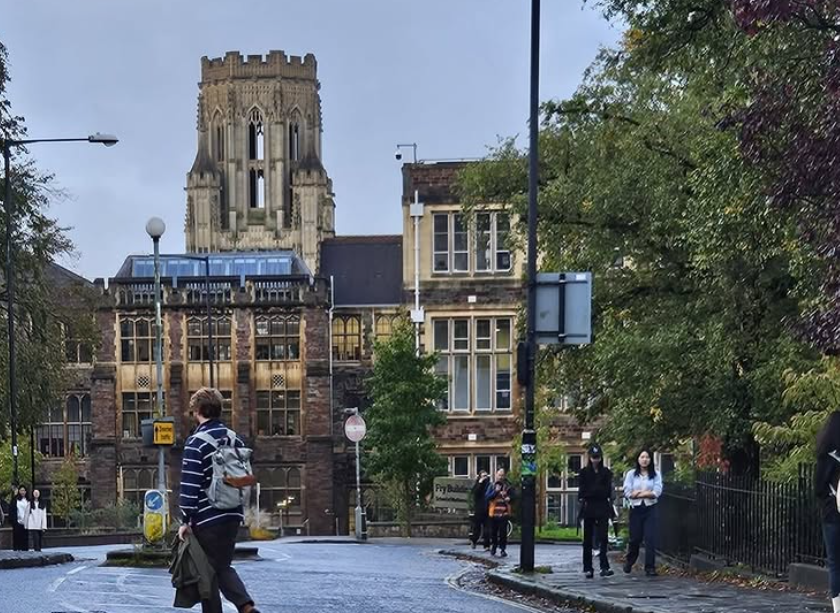

[← Previous post: *Exorcising a Demon II: From London to Bristol*](../exorcising-a-demon-london-to-bristol/){.btn .btn-outline-primary}

{fig-alt="The Fry Building at the University of Bristol, viewed from a nearby street with pedestrians in the foreground."}

> ***“When the soul suffers too much, it develops a taste for misfortune.”*** — *Albert Camus, The First Man*

By the time Year 2 began, I had largely adjusted to a university system that was starkly different from the one I had known in the Philippines. For most of Year 1, I had felt like a fish out of water.

The most difficult adjustment had been the marking system. When I studied mathematics at UP Diliman, final examinations accounted for about 30 per cent of the final mark; most of the remainder came from substantial tests held throughout the term. At Bristol, by contrast, 80 to 90 per cent of the mark in many modules came from the final examination. In short, it was very much a make-or-break affair: an entire term’s work could depend on how well you performed during a few hours in an examination hall.

That comparison needs one qualification. I first entered UP Diliman in 2001—a full quarter of a century before I wrote this, and long before senior high school became part of Philippine basic education. The material I covered during my two years there was therefore roughly comparable in scope to A-level study in England. I had technically been a university student, but I had not yet progressed very far into university-level mathematics.

I also initially found it odd that bachelor’s degrees in England usually last three years rather than the four that are more common in the Philippines and the United States. It began to make more sense when I realised that English degrees are generally much more specialised. They typically include far fewer broad general education requirements than American or Philippine degrees. If you are studying single-honours mathematics, almost all your modules are mathematics. It can be quite heavy.

That was very much on my mind when I left the joint Mathematics and Economics programme for single-honours Mathematics.

For what it is worth, however, I think the English system suited me better. The students around me took their marks seriously, and so did I.

Even so, I studied as though my life depended on it. By then, I had already acclimatised to the local academic culture, so I was no longer as paranoid as I had been in Year 1.

In fact, it was the first time I felt that I had a little spare time. Unfortunately, it was also when I became much more conscious of my age.

University students usually socialise with their classmates. They go on trips, drink in pubs and generally do the things people in their late teens and early twenties are expected to do. I could not quite do the same. My classmates were so much younger than I was that joining them often felt inappropriate, even if nobody else seemed particularly bothered by it. I was always conscious that I was a man approaching forty among students who were barely out of school, and I did not want to put myself in any situation that could be misunderstood.

Truth be told, I am convinced that I was the oldest mathematics undergraduate ever to graduate from Bristol. The next-oldest student I knew was more than a decade younger than I was. I cannot prove the record, but until somebody produces a counterexample, I am keeping the title.

So I remained mostly cooped up in my flat, studying. I had already come too far to risk losing focus. As a result, I had very little social life in Bristol. It was not that I did not want one; I simply felt more comfortable keeping to myself and using the extra time to study.

I kept reminding myself that I had come to England to get a degree. I wanted a social life, but I wanted the degree more.

That did not make the isolation easy. During one meeting with my senior tutor, Dr Skevi Michael, I was telling her how the term had been going when I inadvertently broke down in tears. It was only then, I think, that I fully admitted how lonely the whole experience had become and how often I felt that I was merely pretending I could do mathematics. I sincerely owe her at least half of my degree. Without her advice and support, I might have given up halfway through.

Much of that extra time went into reading the lecture-note PDFs more closely. Some of the proofs were too terse for my brain, so I would take them apart and rewrite them in my own words. I was not trying to improve the originals. I was trying to produce versions that I could actually understand.

I still had serious doubts about my mathematical ability, however, so I would send some of these rewrites to my lecturers and ask whether I had botched them. One of them was Dr Charles Cox, who taught me Linear Algebra. He was remarkably patient and accommodating. He even incorporated some of my rewrites into the official lecture notes and credited me for them.

That gesture meant more to me than he probably realised. It gave my badly damaged mathematical confidence something to hold on to. Perhaps I was not stupid after all.

Year 2 ended, and my average was much better than it had been in Year 1. By my calculation, an average in the low sixties in Year 3 would be enough for me to graduate with first-class honours.

Still, I could not afford to become complacent. If there is one thing I have learnt over the past four decades, it is that misfortune enjoys dropping by to say hello.

Year 3 was approaching, and with it the final-year project—the closest equivalent in my programme to an undergraduate thesis. We were given around a hundred topics from which to choose. It was only then that I realised quite how large Bristol’s School of Mathematics was.

I chose a project advertised as *Data and Topology: Persistent Homology*. To be perfectly honest, part of the attraction was that it sounded cool. The description listed Linear Algebra or Matrix Algebra as the prerequisite; Metric Spaces might be useful, it said, but was not required. That made the project appear reasonably accessible.

It also helped that the project supervisor was Dr Andrew Donald, one of the coolest lecturers I encountered at Bristol. He had taught me in both Years 1 and 2. He was so chill in class that I sometimes forgot how difficult the mathematics actually was.

By then, I had begun to realise that, yes, I was alone, but not quite as alone as I had imagined. I was used to doing everything by myself. Between Dr Michael, Dr Cox and now Dr Donald, I began to see that there were people in the School willing to support me. I no longer had to do everything alone. All three also seemed to genuinely love what they did, and some of that enthusiasm rubbed off on me. Their support, and their obvious affection for their work, helped keep me sane.

The advert described homology, informally, as counting holes in a space. That caught my attention. In [Part I](../exorcising-a-demon-manila-to-london/), I wrote that the financial difficulties following my father’s death eventually forced me to leave university. He had suffered from diabetes, and the first serious complication he developed was diabetic retinopathy, a condition that damages the blood vessels of the retina. Suddenly, TDA seemed to offer a way of studying the shapes and structures found in retinal images. It felt as though the project had given me an opportunity to speak to my younger self.

The advert left plenty of room to choose a direction. One could concentrate on the algebraic structures or investigate the shape of particular data sets, with the option of adding a computational element. I chose the latter route. I did not want the dissertation to amount to, “Wow, this looks cute—but so what?” I wanted to use persistent homology on a concrete problem, turning patterns in images into something that could be defined, computed and compared.

At the algorithmic level, persistent homology can look like a sequence of matrix reductions. Without the underlying theory, however, the procedure felt uncomfortably hand-wavy. This was algebraic territory, and my algebraic preparation from Years 1 and 2 was much weaker than my background in probability and analysis. The advertised prerequisites were fair; I had simply chosen a direction that demanded rather more from me.

To understand it properly, I had to teach myself elementary algebraic topology from the ground up. I also ended up studying category theory and statistical machine learning—or at least the parts that the project demanded. Suffice it to say that I bade my summer holiday goodbye.

By September 2025, when my final year began, I had already drafted more than half of what would become my dissertation. I had not, however, run a single experiment. My plan was simple: settle the theory first and deal with the application afterwards.

Oh boy, was I wrong.

**Share this post**

~~~{=html}

  <a class="btn btn-outline-primary" href="https://www.facebook.com/sharer/sharer.php?u=https%3A%2F%2Frjnieto.com%2Fblog%2Fposts%2Fexorcising-a-demon-bristol-to-bristol%2F" target="_blank" rel="noopener noreferrer">Facebook</a>
  <a class="btn btn-outline-primary" href="https://twitter.com/intent/tweet?url=https%3A%2F%2Frjnieto.com%2Fblog%2Fposts%2Fexorcising-a-demon-bristol-to-bristol%2F&amp;text=Exorcising%20a%20Demon%20III%3A%20From%20Bristol%20to%20Bristol" target="_blank" rel="noopener noreferrer">Twitter</a>
  <a class="btn btn-outline-primary" href="https://www.linkedin.com/sharing/share-offsite/?url=https%3A%2F%2Frjnieto.com%2Fblog%2Fposts%2Fexorcising-a-demon-bristol-to-bristol%2F" target="_blank" rel="noopener noreferrer">LinkedIn</a>
  <button type="button" class="btn btn-outline-primary" data-copy-url="https://rjnieto.com/blog/posts/exorcising-a-demon-bristol-to-bristol/" aria-label="Copy a link to this post" onclick="navigator.clipboard.writeText(this.dataset.copyUrl); this.textContent='Copied!'">Copy link</button>

~~~
