Computational topology replaces continuous shapes with finite collections of
simple pieces. Cubical complexes use vertices, edges, squares, and cubes.
Simplicial complexes use vertices, edges, triangles, tetrahedra, and their
higher-dimensional analogues [@kaczynski2006computational].

::: {.callout-note title="The main idea before the notation"}
A complex is a construction kit with one consistency rule: whenever a piece
is included, all pieces on its boundary must also be included. A filled pixel
therefore brings along four edges and four corner vertices. This **face
closure** rule is the organising idea of the chapter.

The cubical development is essential for the image pipeline. The simplicial
sections explain how this choice connects with the more common language of
triangles and tetrahedra. On a first reading, it is enough to understand
cubical complexes, face closure, and filtrations; the coordinate model of
geometric realisation can be revisited later.
:::

## Elementary cubes

::: {#def-elementary-cube name="Elementary cube"}
An **elementary interval** is either

$$
[k,k+1]\qquad\text{or}\qquad[k,k]
$$

for some $k\in\mathbb Z$. The first is non-degenerate; the second is a single
point.

An **elementary cube** in $\mathbb R^n$ is a product

$$
\kappa=I_1\times\cdots\times I_n
$$

of elementary intervals. Its dimension is the number of non-degenerate
factors.
:::

The product notation lists the allowed coordinate ranges independently. For
example,

$$
[2,3]\times[5,5]
=\{(x,5):2\leq x\leq3\}
$$

is a horizontal edge: the first coordinate varies and the second is fixed.
By contrast, $[2,3]\times[5,6]$ is a square because both coordinates vary.

Thus:

- a $0$-cube is a vertex;
- a $1$-cube is an edge;
- a $2$-cube is a square; and
- a $3$-cube is an ordinary solid cube.

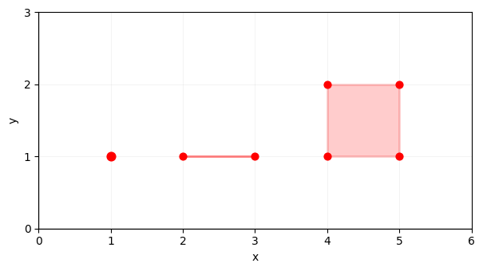{fig-alt="A point labelled zero-cube, a line segment labelled one-cube, and a square labelled two-cube." width=72%}

## Faces and facets

A cube $\gamma$ is a **face** of $\kappa$, written $\gamma\preceq\kappa$, if
$\gamma\subseteq\kappa$. A face of codimension one is a **facet**.

Conversely, $\kappa$ is a **coface** of $\gamma$. The codimension of
$\gamma\preceq\kappa$ is

$$
\operatorname{codim}_\kappa\gamma
=\dim\kappa-\dim\gamma.
$$

This language becomes important when assigning values to cells: a pixel is a
coface of each of its four edges and four vertices.

For the unit square

$$
\kappa=[0,1]\times[0,1],
$$

the four facets are obtained by fixing one coordinate to $0$ or $1$:

$$
\begin{aligned}
\delta_1^-\kappa&=[0]\times[0,1],&
\delta_1^+\kappa&=[1]\times[0,1],\\
\delta_2^-\kappa&=[0,1]\times[0],&
\delta_2^+\kappa&=[0,1]\times[1].
\end{aligned}
$$

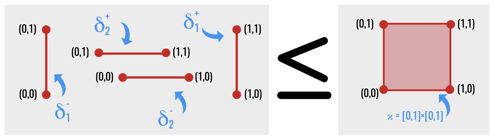{fig-alt="Four oriented edges labelled as lower and upper faces are shown beside the square whose boundary they form." width=80%}

Here the superscripts \(+\) and \(-\) identify the upper and lower endpoint of
a coordinate interval; they are not yet coefficients in a chain. The next
drawing suppresses that bookkeeping and displays the complete face inventory.

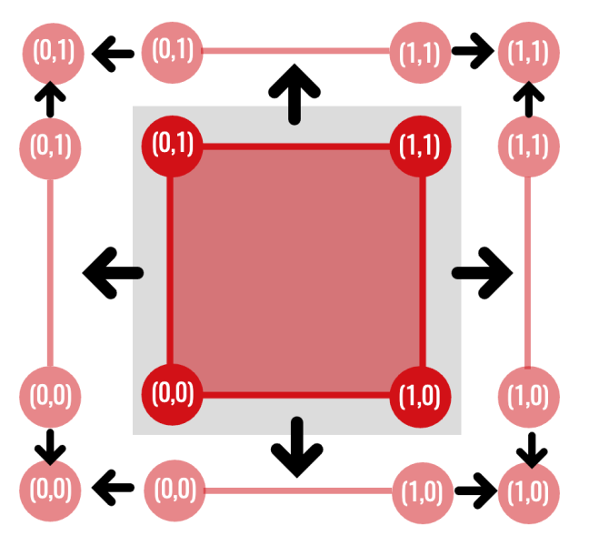{fig-alt="A square with its four vertices and four edges shown as faces." width=65%}

## Cubical complexes

::: {#def-cubical-complex name="Cubical complex"}
A **cubical complex** $K$ is a finite collection of elementary cubes satisfying
**face closure**:

$$
\kappa\in K\text{ and }\gamma\preceq\kappa
\quad\Longrightarrow\quad
\gamma\in K.
$$

If a square belongs to the complex, all four edges and all four vertices must
also belong. A **subcomplex** $L\subseteq K$ is a subset that also satisfies
face closure.
:::

::: {#def-cubical-map name="Cubical map"}
Let $K$ and $L$ be cubical complexes. A map $f\colon K\to L$ is **cubical** if
it sends vertices to vertices and preserves face relations:

$$
\gamma\preceq\sigma
\quad\Longrightarrow\quad
f(\gamma)\preceq f(\sigma).
$$
:::

The inclusions in a filtration are the simplest cubical maps. More general
maps may collapse a square onto an edge or an edge onto a vertex. This is why
degenerate cubes remain useful even if the input image consists only of
non-degenerate pixel squares: the domain cells have positive area, but their
images under a structure-preserving map need not.

::: {.callout-tip title="First-reading priority"}
The later persistence chapters mainly use **inclusion maps**
$K_s\hookrightarrow K_t$: every cell already present at threshold $s$ is
also present at threshold $t$. General cubical maps are introduced now so the
advanced functoriality chapter has the correct language, but they need not be
mastered before continuing.
:::

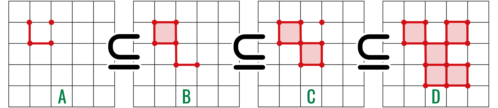{fig-alt="Four increasingly large cubical complexes, each contained in the next."}

### Images as cubical complexes

Treat each pixel as a closed $2$-cube rather than a dimensionless point. The
**ambient cubical complex** contains those pixel squares and all their edges
and vertices.

This model distinguishes a boundary from a filled region. Four edges forming a
square enclose a $1$-dimensional hole; adding the $2$-cube fills that hole.

### From pixel values to a cubical filtration

Recall that a **filtration** is a nested sequence of subcomplexes

$$
K_0\subseteq K_1\subseteq\cdots\subseteq K_m.
$$

It represents one shape growing with a parameter. We now construct such a
sequence from the image-level sets introduced in the previous chapter.

The previous chapter assigned an intensity only to each pixel coordinate.
After identifying a pixel with a closed $2$-cube, we must also decide when its
edges and vertices enter. Those lower-dimensional faces cannot appear later
than the pixel, because every threshold stage must satisfy face closure.

Let $\kappa_z$ be the closed pixel square associated with $z\in\Omega$, and
define the ambient cubical complex

$$
K(\Omega)
=
\{\gamma:\gamma\preceq\kappa_z
\text{ for some }z\in\Omega\}.
$$

Thus $K(\Omega)$ contains every pixel square and all of their edges and
vertices. Extend the image intensity from pixels to every cell
$\gamma\in K(\Omega)$ by

$$
\widehat I(\gamma)
=
\min\{I(z):\gamma\preceq\kappa_z\}.
$$

For a pixel square, this returns that pixel's own value. For a shared edge or
vertex, it returns the smallest value among the incident pixels. This is the
cubical lower-star convention used in the thesis
[@wagner2011cubical].

::: {#prp-intensity-extension name="The minimum-coface extension is face-monotone"}
If $\tau\preceq\sigma$ are cells of $K(\Omega)$, then

$$
\widehat I(\tau)\leq\widehat I(\sigma).
$$
:::

::: {.proof}
Every pixel coface of $\sigma$ is also a pixel coface of $\tau$, because
$\tau\preceq\sigma\preceq\kappa_z$. Thus the set over which the minimum for
$\widehat I(\tau)$ is taken contains the set used for
$\widehat I(\sigma)$. A minimum over a larger set cannot be greater.
:::

The inequality is exactly what face closure needs. For every threshold $t$,

$$
K_t(I)=\{\gamma\in K(\Omega):\widehat I(\gamma)\leq t\}
$$

is a cubical subcomplex. Moreover, $s\leq t$ gives
$K_s(I)\subseteq K_t(I)$, so an 8-bit image produces the filtration

$$
\varnothing\subseteq K_0(I)\subseteq K_1(I)
\subseteq\cdots\subseteq K_{255}(I)=K(\Omega).
$$

The minimum may initially appear backwards: why should a shared edge inherit
the darker incident value? Because when the first incident square enters, the
edge must already be present as one of its faces. Choosing the minimum inserts
the edge at exactly that earliest permissible threshold.

### Dark and bright filtrations

The ordinary sublevel filtration prioritises low intensities. Dark structures
such as vessels and haemorrhages therefore appear early. To prioritise bright
structures, define the inverted image

$$
\widetilde I(z)=255-I(z)
$$

and take its sublevel filtration. This is equivalent, after reversing the
threshold parameter, to a superlevel filtration of $I$. Bright exudates and
the optic disc now appear early rather than late.

![Sublevel and inverted-image filtrations across the 8-bit intensity range. Dark structures enter early in the top row, while bright structures enter early after inversion in the bottom row. The image is from the FIVES-based thesis case study [@jin2022fives].](../assets/filtration-duality.png){fig-alt="Two rows of retinal threshold images: ordinary sublevel sets above and inverted-image sublevel sets below."}

The two filtrations answer different questions. They should not be merged
prematurely: a low-intensity component and a high-intensity component may have
the same abstract topology but different physical interpretations.

## Simplices

Why introduce a second family of building blocks? Cubes are tied to a grid,
whereas a triangle can join any three suitably positioned vertices. Simplices
therefore adapt more easily to meshes, point clouds, and irregular domains.
The change of language broadens the theory; it does not invalidate the
cubical model already built.

Points $v_0,\ldots,v_k\in\mathbb R^n$ are **affinely independent** when the
vectors

$$
v_1-v_0,\ldots,v_k-v_0
$$

are linearly independent.

Geometrically, affine independence prevents collapse: two distinct points
span an edge, three non-collinear points span a triangle, and four
non-coplanar points span a tetrahedron. The next chapter defines linear
independence formally; this geometric reading is enough for the present
construction.

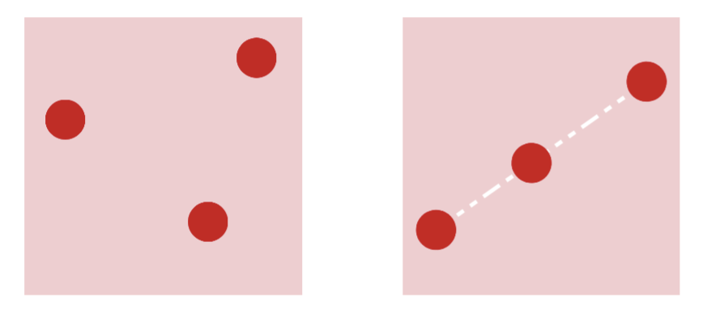{fig-alt="Three points forming a triangle beside three points lying on one straight line." width=58%}

Their convex hull is a **geometric $k$-simplex**:

$$
[v_0,\ldots,v_k]
=
\left\{
\sum_{i=0}^k\lambda_i v_i:
\lambda_i\geq0,\ 
\sum_{i=0}^k\lambda_i=1
\right\}.
$$

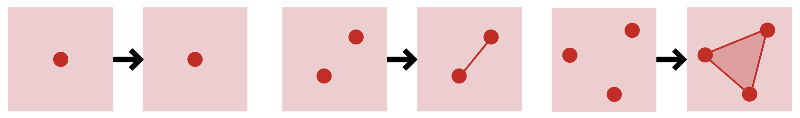{fig-alt="One point, two endpoints with the segment between them, and three vertices with the triangular region between them shaded." width=90%}

The first few simplices are:

| Dimension | Simplex |
|---:|---|
| 0 | vertex |
| 1 | edge |
| 2 | triangle |
| 3 | tetrahedron |

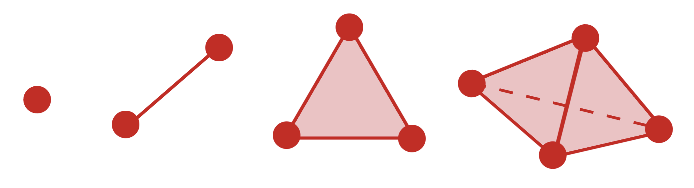{fig-alt="A vertex, edge, filled triangle, and solid tetrahedron arranged from left to right." width=82%}

Every subset of the vertex set spans a face.

For example, the tetrahedron \([v_0,v_1,v_2,v_3]\) contains four triangular
facets, six edges, and four vertices. The dashed edge in the drawing is not
absent; it is merely hidden behind the two visible faces.

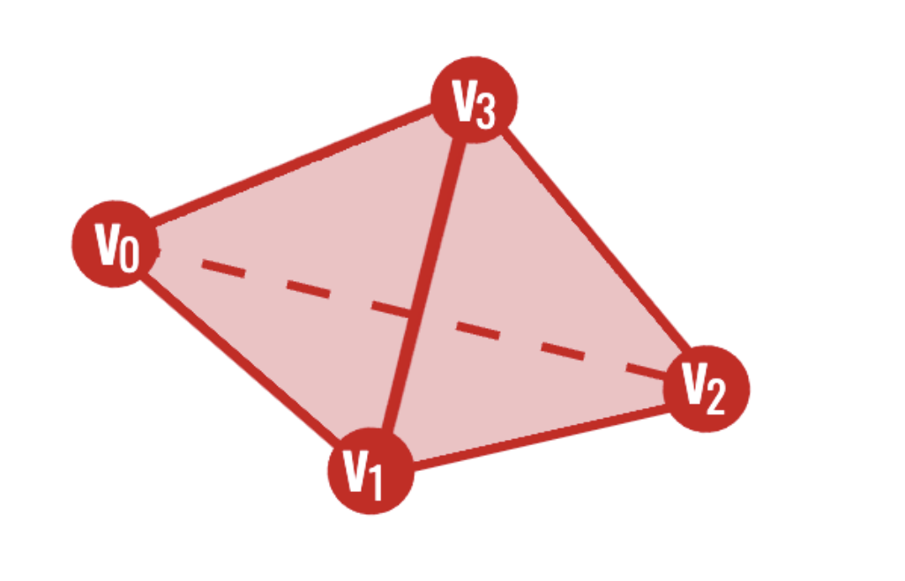{fig-alt="A shaded tetrahedron with vertices v zero through v three and one hidden edge drawn as a dashed segment." width=50%}

## Abstract simplicial complexes

::: {#def-simplicial-complex name="Abstract simplicial complex"}
An **abstract simplicial complex** on a vertex set $V$ is a collection $K$ of
finite subsets of $V$ such that

$$
\sigma\in K,\ \tau\subseteq\sigma
\quad\Longrightarrow\quad
\tau\in K.
$$
:::

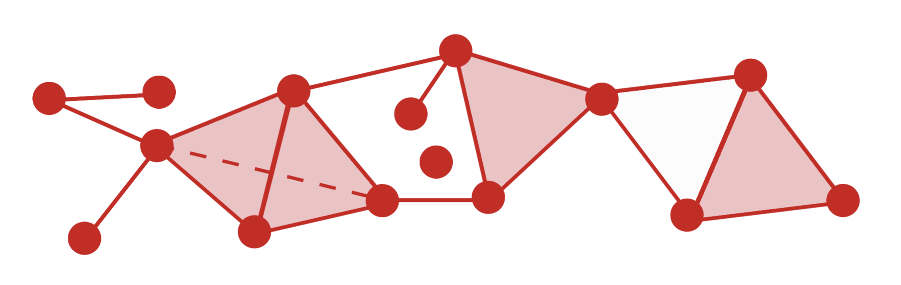{fig-alt="An irregular chain of red vertices and edges with several triangular regions filled in pink." width=86%}

Again, the essential rule is face closure. The **geometric realisation**
$|K|$ turns the abstract combinatorial data into a topological space by
realising each vertex set as a simplex and gluing common faces.

Abstract complexes are convenient for computation because a simplex can be
stored simply as an ordered tuple of vertex identifiers.

A **simplicial subcomplex** is a subcollection that is itself closed under
faces. Consequently, a filtration of simplicial complexes is not an arbitrary
sequence of growing drawings: every intermediate drawing must still contain
the faces of each simplex already present.

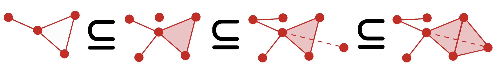{fig-alt="Four increasingly large red simplicial complexes linked by subset symbols." width=94%}

### A deeper look: geometric realisation in coordinates

::: {.callout-note title="Optional on a first reading"}
The next coordinate construction makes the phrase “glue the simplices along
common faces” completely precise. If this is your first encounter with
abstract simplicial complexes, you may instead retain the intuitive gluing
description and continue to the cubical-versus-simplicial comparison.
:::

The phrase “gluing simplices” can be made precise without requiring a
particular drawing. Give each vertex $v\in V$ a coordinate vector $e_v$ in
the vector space of finitely supported real functions on $V$. Then

$$
|K|
=
\left\{
\sum_{v\in V}\lambda_v e_v:
\lambda_v\geq0,\ 
\sum_v\lambda_v=1,\ 
\{v:\lambda_v>0\}\in K
\right\}.
$$

The coefficients $\lambda_v$ are **barycentric coordinates**. Their positive
support specifies the simplex containing the point. Two simplices meet
exactly in the realisation of their common face, so this construction
performs the required gluing automatically.

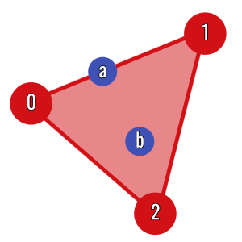{fig-alt="A filled triangle with vertices zero, one, and two; point a lies on an edge and point b lies in the interior." width=46%}

::: {#def-simplicial-map name="Simplicial map"}
Let $K$ and $L$ be abstract simplicial complexes. A vertex map
$f\colon V(K)\to V(L)$ is **simplicial** if

$$
\sigma\in K
\quad\Longrightarrow\quad
f(\sigma)=\{f(v):v\in\sigma\}\in L.
$$

Distinct vertices may have the same image, so a simplex is allowed to
collapse to a lower-dimensional simplex.
:::

A simplicial map extends affinely over each simplex:

$$
|f|\left(\sum_v\lambda_v e_v\right)
=\sum_v\lambda_v e_{f(v)}.
$$

The definition is consistent on shared faces because the same vertex map is
used on every simplex.

## Cubical or simplicial?

| Cubical complexes | Simplicial complexes |
|---|---|
| Natural for images and voxel data | Natural for point clouds and meshes |
| Preserve the original grid | Work in arbitrary combinatorial settings |
| A pixel is already a cell | Higher cells are assembled from vertices |
| Often fewer top-dimensional cells | Supported by broad general theory |

Neither representation is universally superior. The right choice is the one
that respects the structure of the data.

## Triangulating a cube

A cubical complex can be converted into a simplicial complex. In two
dimensions, the Coxeter–Freudenthal–Kuhn construction splits every square along
a consistent diagonal.

{fig-alt="A square is split along a diagonal into an upper and lower triangle." width=75%}

The two triangles meet along the new diagonal, while their outer edges are
exactly the four edges of the original square. Applying the same diagonal
convention consistently across a grid makes neighbouring squares agree on
their shared faces.

After chains and boundaries have been introduced, this geometric observation
becomes an algebraic statement: the shared diagonal cancels when the two
triangle boundaries are combined, leaving the square's outer boundary. The
advanced chapter on
[functoriality and triangulation](../functoriality-triangulation/index.qmd)
states and proves the resulting chain-map identity.

## Filtrations of complexes

We have already constructed one particular filtration from pixel intensity.
We now step back and isolate the general property shared by that construction
and by filtrations on simplicial complexes.

More generally, a **filtration** is any nested sequence of subcomplexes

$$
K_0\subseteq K_1\subseteq\cdots\subseteq K_m.
$$

Face closure must hold at every stage. For image data, a cell is assigned a
filtration value no earlier than any of its faces. This guarantees that each
$K_t$ is a valid complex.

::: {#prp-sublevel-subcomplex name="Face-monotone sublevel sets are subcomplexes"}
Let $K$ be a cell complex and let $f\colon K\to\mathbb R$ satisfy
$f(\tau)\leq f(\sigma)$ whenever $\tau$ is a face of $\sigma$. Then, for every
$t\in\mathbb R$,

$$
K_t=\{\sigma\in K:f(\sigma)\leq t\}
$$

is a subcomplex of $K$.
:::

::: {.proof}
Take $\sigma\in K_t$ and let $\tau$ be any face of $\sigma$. Face monotonicity
gives $f(\tau)\leq f(\sigma)\leq t$, so $\tau\in K_t$. Hence $K_t$ is closed
under faces and is a subcomplex.
:::

Filtrations change a static shape into an evolving one. Persistent homology
will record when its features appear and disappear.

::: {.callout-tip title="What to carry forward"}
- Pixels are treated as filled squares, not merely as graph vertices.
- Face closure requires every cell to arrive with all of its faces.
- Cubical complexes fit image grids; simplicial complexes provide a more
  flexible general language.
- A filtration is a nested sequence of face-closed complexes.

The next chapter supplies the linear algebra used to turn these finite shapes
into computable invariants.
:::

## Exercises

1. List every face of the square $[0,1]^2$ by dimension.
2. Explain why a collection containing a triangle but not its edges is not a
   simplicial complex.
3. How many vertices does a $k$-simplex have?
4. How many triangular $2$-simplices result from triangulating one square?
5. Explain why adding a cell before one of its faces violates face closure.

[Previous: Graphs and Digital Images](../graphs-digital-images/index.qmd) ·
[Course contents](../index.qmd) ·
[Next: Linear Algebra for Homology](../linear-algebra/index.qmd)
