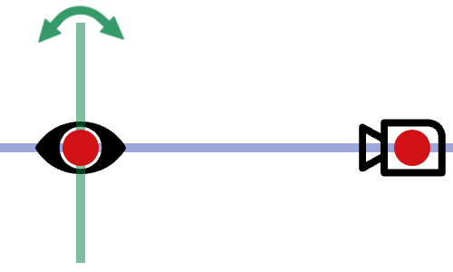
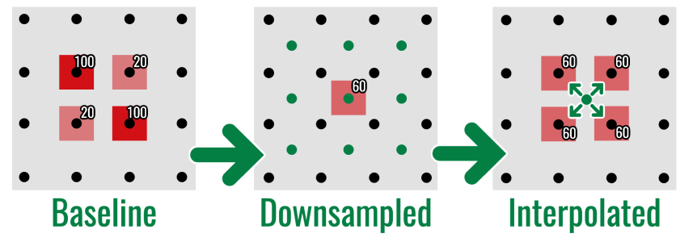
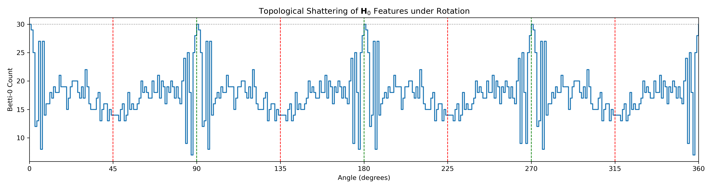
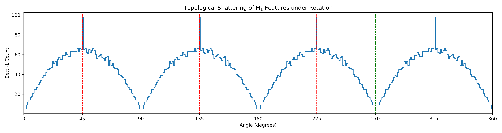
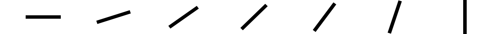
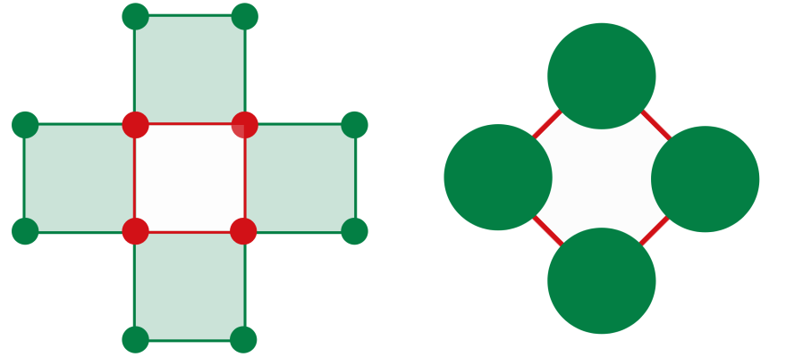
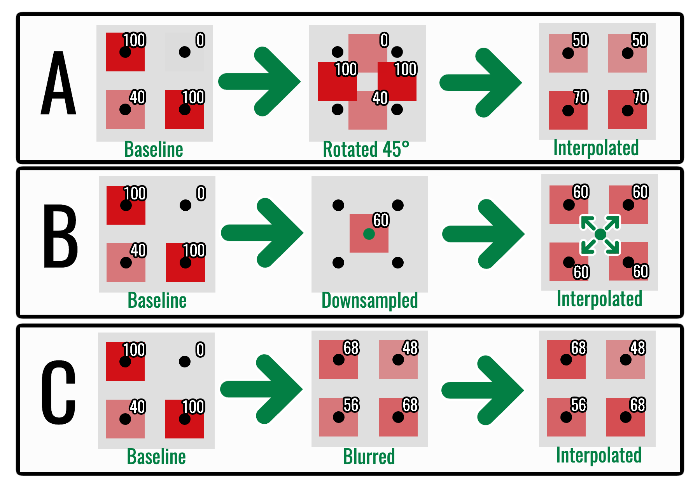

The algebraic stability theorem controls topology by
$\lVert I-J\rVert_\infty$. In digital imaging, the crucial question is how a
physical acquisition error produces that intensity difference.

This chapter develops the thesis's **Aim-and-Shoot** model: first the image is
spatially aligned with the sensor, then its intensity is measured.

{fig-alt="An eye is spatially aligned with a camera before capture." width=55%}

::: {.callout-note title="What this chapter adds"}
The preceding stability theorem starts with the number
$\|I-I_{\mathrm{obs}}\|_\infty$. It does not explain where that number comes
from. This chapter opens the acquisition pipeline and bounds it using three
quantities:

| Symbol | Meaning | Units |
|---|---|---|
| $\lambda$ | largest spatial displacement | pixels |
| $L_I$ | largest intensity jump per adjacency step | intensity levels per pixel step |
| $\varepsilon_{\mathrm{rad}}$ | largest radiometric change | intensity levels |

Their combination
$\lceil\lambda\rceil L_I+\varepsilon_{\mathrm{rad}}$ has intensity units and
can therefore bound the input sup norm. The model is deliberately worst-case:
it supplies an operational safety envelope, not a prediction of the average
pixel error.
:::

## The sampled-image problem

An ideal rotation preserves Euclidean distance. On a continuous domain it is
an isometry. A pixel array, however, is tied to $\mathbb Z^2$. Rotating by an
angle other than a multiple of $90^\circ$ moves samples off-grid, forcing an
interpolation rule.

Interpolation can:

- merge nearby components;
- fill narrow holes;
- fragment thin structures; and
- introduce new intermediate intensities.

The physical displacement may be small while the discrete topological change
is large.

{fig-alt="A two-by-two intensity pattern is rotated off a black-dot sampling lattice and then interpolated to a pattern of equal intermediate values." width=72%}

Resolution reduction produces the same kind of information loss by a different
spatial mechanism: several fine samples are replaced by one coarse
measurement.

{fig-alt="A two-by-two intensity pattern is downsampled to one coarse measurement and interpolated back as a two-by-two block of equal values." width=72%}

These toy arrays expose the intensity mixing directly. The next two plots show
its topological consequence on a rotating shape: the resampled complex can
gain or lose components and loops even though the underlying continuous
rotation preserves topology.

{fig-alt="Line plot of the zeroth Betti count from zero to 360 degrees, with grid-aligned and oblique angles marked."}

The two homological dimensions need not fail identically. The first plot
counts fragmentation and merging through \(\beta_0\); the second counts the
creation and destruction of loops through \(\beta_1\).

{fig-alt="Line plot of the first Betti count from zero to 360 degrees, showing periodic spikes at oblique angles."}

::: {#prp-grid-isometry name="Discrete invariance under grid-aligned isometries"}
Let $T$ be a bijection of the pixel grid that preserves cubical face relations
and filtration values up to relabelling. Then the original and transformed
filtered complexes are isomorphic, their persistence modules are isomorphic,
and

$$
d_B(\operatorname{Dgm}(I),\operatorname{Dgm}(T I))=0.
$$
:::

::: {.proof}
At every threshold, $T$ gives a cubical isomorphism between the two sublevel
complexes. These isomorphisms commute with the filtration inclusions, so they
form an isomorphism of persistence modules. Isomorphic modules have identical
barcodes, whose bottleneck distance is zero.
:::

Translations by whole pixels and rotations through multiples of
$90^\circ$ are grid-aligned when boundary handling is compatible. An oblique
rotation is an isometry of $\mathbb R^2$ but not an automorphism of
$\mathbb Z^2$. This failure of the continuous transformation to commute with
sampling is the **discretisation gap**.

{fig-alt="A black line segment shown at several angles from horizontal to vertical, with only slight pixel staircasing." width=96%}

There is no contradiction between this visual stability and the preceding
low-resolution failures. The continuous theorem concerns the underlying
rotation; the sampled result depends additionally on grid spacing,
interpolation, and feature thickness.

## Image and acquisition operators

Let

$$
I:\Omega\to[0,M]
$$

be an intensity function on a finite grid $\Omega\subset\mathbb Z^2$.

Model the observed image as

$$
I_{\mathrm{obs}}=T_S(T_A I),
$$

where:

- $T_A$ is the **aim operator**, representing alignment, rotation, scale,
  focus, and resampling;
- $T_S$ is the **shoot operator**, representing exposure, sensor response,
  quantisation, and noise.

The notation $T_A I$ means “apply the operation $T_A$ to the whole image
$I$.” It is another image on the output grid, not ordinary multiplication.
Similarly, $T_S(T_AI)$ applies the sensor-stage operation to the already
aligned image.

The order is causal:

$$
I_{\mathrm{obs}}=T_S\circ T_A(I).
$$

The scene must first be aligned with the sensor, after which the sensor records
and corrupts the aligned light field. The thesis groups the perturbations as
follows:

| Stage | Perturbation | Mathematical model |
|---|---|---|
| Aim | in-plane rotation | $x\mapsto R_\theta x$ followed by interpolation |
| Aim | change of scale or resolution | $x\mapsto\lambda x$ and resampling |
| Aim | optical defocus | convolution $I\mapsto I*K$ |
| Shoot | response or contrast change | pointwise transfer function $\rho(I)$ |
| Shoot | illumination drift or electronic noise | additive perturbation $\eta$ |
| Shoot | bit-depth reduction | quantisation $Q(I)$ |

The classification is mechanistic rather than visual. Blur changes intensity
values, but it belongs to the Aim stage because it mixes spatial neighbours.
Illumination drift can also change every intensity, but it belongs to the
Shoot stage because it does not geometrically resample the grid.

![One FIVES fundus patch under representative acquisition perturbations [@jin2022fives]: additive illumination drift, gamma response, contrast change, blur, and two-bit quantisation. Naming the mechanism matters because visually different corruptions enter different terms of the stability bound.](../assets/acquisition-perturbation-examples.png){fig-alt="Six retinal patches showing the original image and versions with drift, gamma change, contrast change, blur, and severe bit-depth reduction." width=86%}

The figure is a catalogue of outputs, not yet a bound. To obtain a bound we
must first choose the adjacency relation used to measure spatial intensity
change, and then separate the Aim and Shoot contributions by the triangle
inequality.

### Why the Moore graph appears

Treating pixels as closed squares means diagonally touching pixels share a
vertex. For cubical $H_1$, that shared vertex can participate in a continuous
edge cycle. A four-neighbour pixel graph would remove the diagonal
relationship and can destroy a loop that exists in the cubical complex. The
thesis therefore measures local intensity changes on the Moore
eight-neighbour graph

$$
G_\infty=(\Omega,E_\infty),
\qquad
xy\in E_\infty\iff\|x-y\|_\infty=1.
$$

{fig-alt="Four pixel squares arranged around a central gap alongside an eight-neighbour graph representation." width=70%}

::: {#lem-error-decomposition name="Acquisition-error decomposition"}
The triangle inequality gives

$$
\lVert I-I_{\mathrm{obs}}\rVert_\infty
\leq
\underbrace{\lVert I-T_A I\rVert_\infty}_{\text{mechanical}}
+
\underbrace{\lVert T_A I-T_S(T_A I)\rVert_\infty}_{\text{radiometric}}.
$$

This separates two physically different sources of error.
:::

::: {.proof}
Insert and subtract the intermediate image $T_AI$:

$$
I-I_{\mathrm{obs}}
=(I-T_AI)+(T_AI-T_S(T_AI)).
$$

Apply the triangle inequality for the supremum norm.
:::

## Radiometric error

Suppose the sensor perturbation is uniformly bounded:

$$
\lVert J-T_SJ\rVert_\infty\leq\varepsilon_{\mathrm{rad}}
$$

for images $J$ inside the standard operating range. Then

$$
\lVert T_A I-T_S(T_A I)\rVert_\infty
\leq
\varepsilon_{\mathrm{rad}}.
$$

Standardising illumination, exposure, calibration, and dynamic range makes
this term interpretable.

More generally, model the sensor as

$$
T_S(J)=\rho(J)+\eta,
$$

where $\rho$ is a deterministic response function and $\eta$ is an additive
error field.

::: {#prp-radiometric-stability name="Radiometric stability"}
For an aligned image $J$,

$$
d_B\bigl(\operatorname{Dgm}(J),\operatorname{Dgm}(T_SJ)\bigr)
\leq
\|J-\rho(J)\|_\infty+\|\eta\|_\infty.
$$
:::

::: {.proof}
Algebraic stability gives

$$
d_B\bigl(\operatorname{Dgm}(J),\operatorname{Dgm}(T_SJ)\bigr)
\leq\|J-\rho(J)-\eta\|_\infty.
$$

Apply the triangle inequality for the supremum norm.
:::

Protocol standardisation is intended to keep $\rho$ close to the identity and
to bound $\|\eta\|_\infty$ by a calibrated sensor noise floor. It does not make
radiometric error vanish; it makes the error term measurable before the
topological analysis.

| Distortion | Model | Supremum-norm control |
|---|---|---|
| gamma response | $\rho(v)=255(v/255)^\gamma$ | $\max_v|v-\rho(v)|$ |
| contrast | $\rho(v)=\alpha(v-127.5)+127.5$ | $127.5|1-\alpha|$ before clipping |
| uniform drift | $\eta(x)=\delta$ | $|\delta|$ |
| Gaussian or Poisson noise | stochastic $\eta$ | realised value $\|\eta\|_\infty$ |
| salt-and-pepper noise | impulses to $0$ or $255$ | up to $255$ |
| bit-depth reduction | quantisation | one quantisation step |

### Quantisation

::: {#prp-quantisation name="Nearest-level quantisation bound"}
For a uniform quantiser $Q$ with step size $q$ and rounding to the nearest
level,

$$
\lVert I-Q(I)\rVert_\infty\leq\frac q2.
$$

The persistence diagram therefore moves by at most $q/2$. If no persistence
feature lies close enough to a decision threshold, moderate quantisation can
produce a visible stability plateau—the **terrace effect** observed in the
thesis experiments.
:::

::: {.proof}
Every real intensity lies within half a quantisation step of its nearest
level, so $|I(x)-Q(I)(x)|\leq q/2$ for every sample $x$. Taking the maximum
gives the supremum-norm bound. Applying sublevel-set stability gives the same
upper bound on bottleneck distance.
:::

::: {#cor-terrace-threshold name="Persistence threshold for quantisation survival"}
If quantisation moves a persistence diagram by at most $\Delta$ and a feature
has persistence $p>2\Delta$, that feature cannot be matched to the diagonal.
It must survive as an off-diagonal feature after quantisation.
:::

::: {.proof}
The $\ell_\infty$ distance from $(b,d)$ to the diagonal is

$$
\inf_x\max\{|b-x|,|d-x|\}
=\frac{d-b}{2}
=\frac p2.
$$

If $p>2\Delta$, then $p/2>\Delta$. A matching of cost at most $\Delta$ cannot
send the point to the diagonal.
:::

This gives the thesis's **terrace effect** a mathematical interpretation.
Progressive bit-depth reduction need not cause gradual deterioration. Features
with persistence above $2\Delta$ are protected until the quantisation step
crosses their persistence scale, after which performance may drop abruptly.

## Mechanical error

Choose an adjacency graph on $\Omega$ and define the discrete image gradient

$$
L_I=
\max_{\{x,y\}\in E}|I(x)-I(y)|.
$$

Suppose every grid value used to construct an aligned output sample lies
within graph distance $\lceil\lambda\rceil$ of the corresponding source
location. A path between them then requires at most
$\lceil\lambda\rceil$ adjacency steps. This formulation includes an
integer-valued displacement and, in the interpolation case, the entire local
resampling stencil.

We first prove the estimate for a displacement that lands on another grid
vertex. The following subsection then explains why a convex interpolation of
nearby grid values obeys the same local bound. Separating these cases avoids
silently treating an off-grid coordinate as though it were already a pixel.

::: {#lem-graph-gradient name="Geometric stability via graph paths"}
Under this graph-distance assumption, the resulting mechanical error satisfies

$$
\lVert I-T_A I\rVert_\infty
\leq
\lceil\lambda\rceil L_I.
$$
:::

::: {.proof}
For a grid-valued displaced sample $T_Ax$, choose a shortest graph path
$x=x_0,x_1,\ldots,x_m=T_Ax$, where
$m\leq\lceil\lambda\rceil$. Then

$$
|I(x)-I(T_Ax)|
\leq\sum_{j=0}^{m-1}|I(x_j)-I(x_{j+1})|
\leq mL_I
\leq\lceil\lambda\rceil L_I.
$$

Taking the maximum over $x$ proves the supremum-norm bound.
:::

### Bilinear interpolation and the local bound

An off-grid coordinate $x'=(x_0+u,y_0+v)$ with $u,v\in[0,1]$ is evaluated by
the convex combination

$$
\begin{aligned}
I(x')={}&(1-u)(1-v)I(x_0,y_0)
+u(1-v)I(x_0+1,y_0)\\
&+(1-u)vI(x_0,y_0+1)
+uvI(x_0+1,y_0+1),
\end{aligned}
$$

followed, for integer-valued images, by rounding. All coefficients are
nonnegative and sum to one, so interpolation cannot leave the interval between
the smallest and largest of the four neighbouring intensities.

Consequently, if every interpolation vertex lies within Moore-graph distance
$\lceil\lambda\rceil$ of the corresponding source location, its intensity
differs from the source by at most $\lceil\lambda\rceil L_I$. Convexity gives
the same bound for their bilinear average. This supplies the
interpolation-aware justification for @lem-graph-gradient rather than treating
$T_Ax$ as necessarily lying on the lattice.

{fig-alt="A small intensity grid transformed by rotation, downsampling, and blur, illustrating three kinds of spatial mixing."}

### Global versus local displacement

For a rotation about the image centre, displacement grows with distance from
the centre. At radius $R$, a useful approximation is

$$
\lambda_{\max}\approx 2R\sin\left(\frac{|\theta|}{2}\right),
$$

which is approximately $R|\theta|$ for small angles measured in radians.
Thus a visually small angular error can create a large global displacement at
the edge of a high-resolution image. The supremum bound is deliberately
conservative: it records the worst affected pixel, not the typical pixel.

The bound is also local in the perturbative sense. A large grid-aligned
$90^\circ$ rotation may have a large coordinate displacement but zero
topological error by @prp-grid-isometry. The quantity
$\lceil\lambda\rceil L_I$ is intended for unintended, interpolation-heavy
misalignment near the acquisition baseline, not as an exact formula for every
geometric transformation.

The same motion has different consequences for different images:

- if $L_I$ is small, intensities vary slowly and interpolation is mild;
- if $L_I$ is large, thin high-contrast structures can shatter or merge.

This is why “rotation by one degree” is not a complete description of
topological risk.

## The computational stability bound

All the preceding estimates now enter one chain:

$$
\text{physical perturbation}
\longrightarrow
\text{sup-norm image error}
\longrightarrow
\text{bottleneck diagram error}.
$$

::: {#thm-computational-stability name="Computational stability bound"}
Assume the radiometric error is at most $\varepsilon_{\mathrm{rad}}$ and every
grid value used by the aim operator lies within graph distance
$\lceil\lambda\rceil$ of its corresponding source location. Then

$$
\lVert I-I_{\mathrm{obs}}\rVert_\infty
\leq
\lceil\lambda\rceil L_I+\varepsilon_{\mathrm{rad}}.
$$

Applying algebraic stability yields

$$
\boxed{
d_B\bigl(
\operatorname{Dgm}(I),
\operatorname{Dgm}(I_{\mathrm{obs}})
\bigr)
\leq
\lceil\lambda\rceil L_I+\varepsilon_{\mathrm{rad}}
}
$$
:::

::: {.proof}
By @lem-error-decomposition and @lem-graph-gradient,

$$
\lVert I-I_{\mathrm{obs}}\rVert_\infty
\leq
\lceil\lambda\rceil L_I+\varepsilon_{\mathrm{rad}}.
$$

Apply the sublevel-set stability theorem to $I$ and $I_{\mathrm{obs}}$.
:::

The bound identifies three levers:

1. reduce displacement $\lambda$ through alignment;
2. reduce effective gradient $L_I$ through resolution and optical control; or
3. reduce radiometric error $\varepsilon_{\mathrm{rad}}$ through
   standardisation.

## Stable vectorisation

::: {#cor-vector-stability name="Stability after vectorisation"}
If a diagram vectorisation $\Phi$ is $L_\Phi$-Lipschitz, then

$$
\lVert
\Phi(\operatorname{Dgm}I)
-
\Phi(\operatorname{Dgm}I_{\mathrm{obs}})
\rVert_2
\leq
L_\Phi
\left(
\lceil\lambda\rceil L_I+\varepsilon_{\mathrm{rad}}
\right).
$$
:::

::: {.proof}
Apply the Lipschitz inequality for $\Phi$ to the two persistence diagrams,
then substitute the bound from @thm-computational-stability.
:::

The vectorisation constant can amplify the acquisition error. Coarse summaries
may discard information, but they can also provide a smaller and more
interpretable operational sensitivity.

## Failure modes suggested by the bound

| Failure mode | Mathematical mechanism | Possible control |
|---|---|---|
| Off-grid rotation | interpolation across large $L_I$ | registration or grid-aware augmentation |
| Defocus blur | spatial averaging closes narrow gaps | focus quality control |
| Downsampling | reduced resolution aliases small features | validated operating resolution |
| Illumination drift | increased $\varepsilon_{\mathrm{rad}}$ | capture standardisation |
| Quantisation | bounded rounding error | preserve sufficient bit depth |
| Compression | artificial local gradients | lossless image formats |

The bound is conservative. Its purpose is not to predict the exact barcode but
to expose which physical quantities control worst-case change.

::: {.callout-tip title="What to carry forward"}
- Algebraic stability begins after two images on a common grid are available.
- Sampling and interpolation determine whether a small physical motion becomes
  a small image-space perturbation.
- Mechanical error couples displacement with local image gradient.
- Radiometric error changes intensities without moving the sampling geometry.
- A valid downstream vectorisation contributes its own Lipschitz factor.

The next chapter uses these separate mechanisms to design complementary
diagnostic probes.
:::

## Exercises

1. Evaluate the bound for $\lambda=1.2$, $L_I=20$, and
   $\varepsilon_{\mathrm{rad}}=5$.
2. Explain why a smooth image and a sharp binary image respond differently to
   the same interpolation.
3. Derive the quantisation bound for nearest-level rounding.
4. Which term is most directly reduced by better camera alignment?
5. How does a Lipschitz vectorisation change the final bound?

[Previous: Stability](../stability/index.qmd) ·
[Course contents](../index.qmd) ·
[Next: Reliability Engineering](../reliability-engineering/index.qmd)
