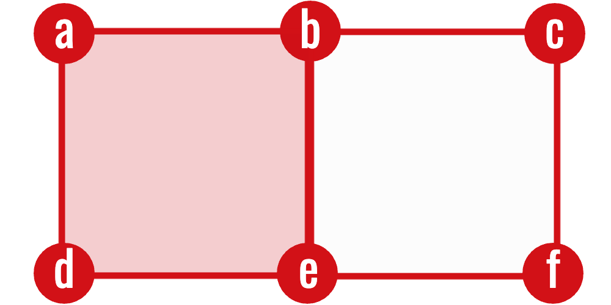

The definition

$$
H_k=\ker\partial_k/\operatorname{im}\partial_{k+1}
$$

is abstract, but a finite complex turns every boundary map into a finite
matrix. Homology can therefore be computed by linear algebra.

::: {.callout-note title="The computation in four moves"}
For each dimension $k$:

1. list the $k$-cells and $(k-1)$-cells;
2. make one matrix whose $j$th column records the facets of the $j$th
   $k$-cell;
3. compute the matrix rank over $\mathbb F_2$; and
4. substitute the ranks into
   $\beta_k=n_k-r_k-r_{k+1}$.

Nothing geometrically new is introduced in this chapter. It is a coordinate
version of the chain groups and boundary maps already defined.
:::

{fig-alt="Two adjacent square outlines with only the left square filled; the six vertices are labelled a through f." width=68%}

No matrix has been chosen yet. The picture supplies the three finite lists
that become its bases. Choosing an order for each list is the only additional
step needed to turn the boundary maps into coordinate arrays.

## Boundary matrices

Choose an ordering

$$
\sigma_1^k,\ldots,\sigma_{n_k}^k
$$

of the $k$-cells and an ordering of the $(k-1)$-cells.

Here $n_k$ means “the number of $k$-cells,” and
$\sigma_j^k$ means “the $j$th cell in the chosen list.” The superscript is a
dimension label, not an exponent.

::: {#def-boundary-matrix name="Boundary matrix"}
The **$k$th boundary
matrix** $D_k$ represents

$$
\partial_k\colon C_k\to C_{k-1}.
$$

Its entry in row $i$ and column $j$ is

$$
(D_k)_{ij}=
\begin{cases}
1,&\sigma_i^{k-1}\text{ is a facet of }\sigma_j^k,\\
0,&\text{otherwise}.
\end{cases}
$$

Thus, a column is the boundary of one cell.
:::

For example, if an edge $e_j$ has endpoints $v_2$ and $v_5$, its column in
$D_1$ has a $1$ in rows $2$ and $5$ and zero everywhere else. Multiplying
$D_1$ by a binary vector selecting several edges adds their endpoint columns;
vertices incident to two selected edges cancel. A zero product therefore
means that the selected edges form a cycle.

The chosen order controls where entries appear, but it cannot change the
homology.

::: {#prp-basis-order-independence name="Betti numbers do not depend on the cell ordering"}
Reordering the bases of $C_k$ and $C_{k-1}$ changes the boundary matrix to

$$
D_k'=P_{k-1}D_kP_k^{-1},
$$

where $P_{k-1}$ and $P_k$ are permutation matrices. Consequently
$\operatorname{rank}D_k'=\operatorname{rank}D_k$, and every Betti number is
unchanged.
:::

::: {.proof}
Permutation matrices are invertible. Multiplication by an invertible matrix
on either side does not change rank: it merely expresses the same linear map
in different ordered bases. The formula in @thm-betti-computation depends
only on cell counts and boundary ranks, both of which are unchanged.
:::

Ordering is nevertheless an implementation requirement. A program must use
the same row ordering for $D_k$ that it uses as the column ordering for
$D_{k-1}$; otherwise the product $D_{k-1}D_k$ no longer represents the
composition of the two boundary maps.

## The matrix chain condition

::: {#prp-matrix-chain name="Matrix chain condition"}
For consecutive boundary matrices,

$$
D_{k-1}D_k=0.
$$
:::

::: {.proof}
Coordinates respect composition: $D_{k-1}D_k$ is the matrix of
$\partial_{k-1}\circ\partial_k$. The fundamental lemma of homology says this
composite is the zero map, so its matrix is the zero matrix.
:::

This is both a theorem and a useful implementation test. If two consecutive
boundary matrices have a nonzero product, then the complex, cell ordering, or
boundary construction is incorrect.

## Betti numbers from ranks

Rank–nullity gives

$$
\dim\ker D_k=n_k-\operatorname{rank}D_k.
$$

Also,

$$
\dim\operatorname{im}D_{k+1}
=
\operatorname{rank}D_{k+1}.
$$

::: {#thm-betti-computation name="Betti calculation via rank"}
Therefore,

$$
\boxed{
\beta_k
=
n_k-\operatorname{rank}D_k-\operatorname{rank}D_{k+1}
}
$$
:::

::: {.proof}
The cycle space is $\ker D_k$ and the boundary space is
$\operatorname{im}D_{k+1}$. Hence

$$
\beta_k=\dim\ker D_k-\dim\operatorname{im}D_{k+1}.
$$

Rank–nullity gives $\dim\ker D_k=n_k-\operatorname{rank}D_k$, and the
dimension of the image is $\operatorname{rank}D_{k+1}$. Substituting yields
the displayed formula.
:::

This formula computes Betti numbers without explicitly constructing quotient
spaces.

## Example: an unfilled triangle

Let the vertices be $v_0,v_1,v_2$ and the edges
$e_{01},e_{12},e_{20}$. With rows ordered by vertices and columns by edges,

$$
D_1=
\begin{pmatrix}
1&0&1\\
1&1&0\\
0&1&1
\end{pmatrix}.
$$

Over $\mathbb F_2$, $\operatorname{rank}D_1=2$. There are no $2$-cells, so
$D_2$ has rank zero.

Hence

$$
\beta_0=3-2=1,
\qquad
\beta_1=3-2-0=1.
$$

Adding the triangular $2$-cell creates a one-column matrix

$$
D_2=
\begin{pmatrix}
1\\1\\1
\end{pmatrix}.
$$

Its rank is $1$, so $\beta_1=3-2-1=0$. Algebra detects that the loop has been
filled.

## Binary Gaussian elimination

The following routine computes matrix rank over $\mathbb F_2$.

```python
import numpy as np

def rank_mod2(matrix):
    a = np.asarray(matrix, dtype=np.uint8).copy() % 2
    rows, cols = a.shape
    pivot_row = 0

    for col in range(cols):
        candidates = np.flatnonzero(a[pivot_row:, col])
        if len(candidates) == 0:
            continue

        pivot = pivot_row + candidates[0]
        a[[pivot_row, pivot]] = a[[pivot, pivot_row]]

        for row in range(rows):
            if row != pivot_row and a[row, col]:
                a[row] ^= a[pivot_row]

        pivot_row += 1
        if pivot_row == rows:
            break

    return pivot_row
```

For dense matrices this is adequate pedagogically. Real complexes produce
large sparse matrices, so practical implementations store only the indices of
nonzero entries.

## An explicit Betti-number algorithm

For an $n$-dimensional finite complex, put $d_k=|K_k|$ and introduce the
boundary ranks $r_0=r_{n+1}=0$. The complete computation is:

1. group the cells by dimension and choose a fixed ordering within each
   group;
2. assemble $D_k\in\mathbb F_2^{d_{k-1}\times d_k}$ for
   $1\leq k\leq n$;
3. reduce each $D_k$ over $\mathbb F_2$ to obtain
   $r_k=\operatorname{rank}D_k$;
4. return

   $$
   \beta_k=d_k-r_k-r_{k+1},
   \qquad 0\leq k\leq n.
   $$

::: {#prp-betti-algorithm-correct name="Correctness of the Betti-number algorithm"}
The procedure above returns

$$
\bigl(\dim H_0(K),\ldots,\dim H_n(K)\bigr).
$$
:::

::: {.proof}
Matrix assembly makes $D_k$ the coordinate representation of $\partial_k$.
Gaussian elimination preserves the represented linear map's rank, so Step 3
returns $r_k=\dim\operatorname{im}\partial_k$. By rank--nullity,
$\dim\ker\partial_k=d_k-r_k$. Since
$\operatorname{im}\partial_{k+1}\subseteq\ker\partial_k$,

$$
\dim H_k
=\dim\ker\partial_k-\dim\operatorname{im}\partial_{k+1}
=d_k-r_k-r_{k+1}.
$$

This is exactly the quantity returned in Step 4.
:::

This algorithm computes the dimensions of homology groups. The persistence
algorithm developed later reduces one global boundary matrix in filtration
order; it retains pivot pairings as well as ranks, and those pairings encode
births and deaths.

::: {.callout-tip title="Static homology versus persistent homology"}
The rank formula answers “how many features exist in this one complex?”
Persistent reduction answers “when did each feature appear, and when did it
disappear?” The latter needs the cells ordered by filtration time and retains
the column pairings rather than only the final ranks.
:::

## Building a cubical boundary matrix

For a $k$-cube

$$
\kappa=I_1\times\cdots\times I_n,
$$

its boundary contains the upper and lower facets associated with every
non-degenerate factor:

$$
\partial\kappa
=
\sum_i\left(\delta_i^-\kappa+\delta_i^+\kappa\right).
$$

An implementation can therefore:

1. enumerate all cells by dimension;
2. create a dictionary from each cell to its row index;
3. generate the facets of each $k$-cell; and
4. set the corresponding entries in column $j$ of $D_k$.

Canonical cell representations are essential. If the same shared edge is
encoded in two different ways, cancellation will fail.

## Complexity and sparsity

A $k$-cube has at most $2k$ facets, so every column of a cubical boundary
matrix is sparse. The challenge is not constructing a column but reducing a
large collection of columns.

Useful implementation practices include:

- integer or bitset representations over $\mathbb F_2$;
- sparse column storage;
- dimension-by-dimension processing;
- clearing columns no longer needed; and
- verifying $D_{k-1}D_k=0$ on test complexes.

## Sanity tests

Before processing real data, a homology implementation should recover:

| Complex | Expected nonzero Betti numbers |
|---|---|
| one vertex | $\beta_0=1$ |
| two isolated vertices | $\beta_0=2$ |
| tree | $\beta_0=1$ |
| unfilled square | $\beta_0=1,\ \beta_1=1$ |
| filled square | $\beta_0=1$ |
| hollow cube boundary | $\beta_0=1,\ \beta_2=1$ |

These small examples expose most errors in face generation, indexing, and
coefficient arithmetic.

::: {.callout-tip title="What to carry forward"}
A boundary matrix contains incidence information: rows are faces, columns are
cells, and a $1$ means “is a facet of.” Reduction over $\mathbb F_2$ computes
the ranks needed for Betti numbers. Persistent homology will use essentially
the same matrix operations, but in a filtration-compatible order.
:::

## Exercises

1. Construct $D_1$ for a path with three vertices and two edges.
2. Use the rank formula to compute its $\beta_0$ and $\beta_1$.
3. Construct $D_1$ and $D_2$ for a filled square.
4. Explain why every column of $D_1$ has exactly two nonzero entries.
5. Why is sparse column storage natural for cubical boundary matrices?

[Previous: Homology](../homology/index.qmd) ·
[Course contents](../index.qmd) ·
[Next: Persistent Homology](../persistent-homology/index.qmd)
