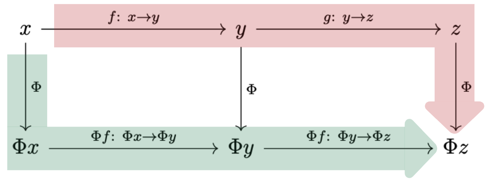
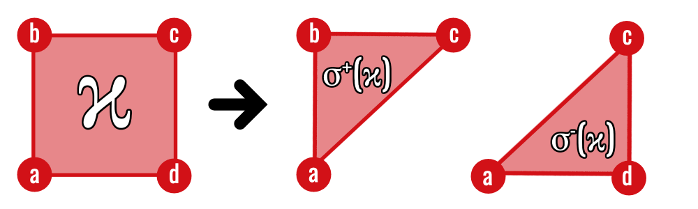
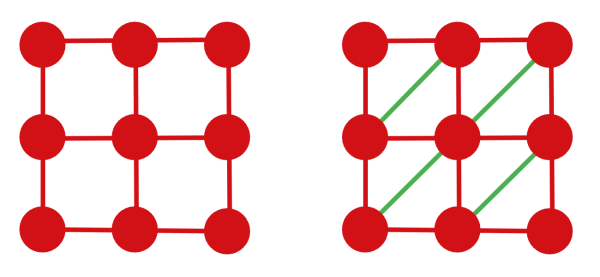

The earlier chapters describe a pipeline:

$$
\text{complex}
\longrightarrow
\text{chain complex}
\longrightarrow
\text{homology}.
$$

Category theory explains why this pipeline respects maps, compositions, and
filtrations rather than merely assigning isolated outputs [@nanda2023].

::: {.callout-important title="This chapter is a second pass"}
The computational course is complete without this chapter. Its purpose is to
show that the maps used throughout the notes fit together coherently and that
the cubical theory connects to the standard simplicial theory.

If category theory is new, read “object” as a mathematical structure and
“morphism” as an allowed structure-preserving map. The essential dictionary
is:

| Geometry | Algebra |
|---|---|
| cubical complex $K$ | chain complex $C_\bullet(K)$ |
| cubical map $f$ | chain map $C_\bullet(f)$ |
| inclusion $K_s\hookrightarrow K_t$ | homology map $H_k(K_s)\to H_k(K_t)$ |
| filtration | persistence module |

The abstraction packages this entire table into functors. It does not alter
the homology computations already performed.
:::

## Categories and functors

::: {#def-category-functor name="Category and functor"}
A **category** $\mathcal C$ consists of:

1. a collection of objects;
2. for every pair $X,Y$, a collection $\mathcal C(X,Y)$ of morphisms
   $f\colon X\to Y$;
3. associative composition
   $\mathcal C(X,Y)\times\mathcal C(Y,Z)\to\mathcal C(X,Z)$; and
4. an identity morphism $\operatorname{id}_X$ for every object, satisfying
   $f\circ\operatorname{id}_X=f=\operatorname{id}_Y\circ f$.

Relevant examples include:

- $\mathbf{CubeCx}$: cubical complexes and cubical maps;
- $\mathbf{SimpCx}$: simplicial complexes and simplicial maps;
- $\mathbf{ChainCx}$: chain complexes and chain maps;
- $\mathbf{Vect}_{\mathbb F_2}$: vector spaces and linear maps.

A **functor** $F\colon\mathcal C\to\mathcal D$ maps objects to objects and
morphisms to morphisms while preserving identities and composition:

$$
F(\operatorname{id}_X)=\operatorname{id}_{F(X)},
\qquad
F(g\circ f)=F(g)\circ F(f).
$$
:::

{fig-alt="A two-row commuting diagram whose red upper route and green lower route both connect the image of x to the image of z." width=76%}

The axioms formalise a simple discipline: objects cannot be studied in
isolation from the maps between them. In computational topology, the maps are
what track a feature from one threshold to the next.

For a familiar example, vector spaces form a category whose morphisms are
linear maps. Composing morphisms is ordinary function composition, and the
identity matrix represents the identity morphism. Category theory keeps only
this pattern and permits the word “vector space” to be replaced by “complex,”
“chain complex,” or “persistence module.”

### The poset category

Every partially ordered set $(P,\leq)$ determines a category. Its objects are
the elements of $P$, and there is one morphism $p\to q$ exactly when
$p\leq q$. Reflexivity supplies identities and transitivity supplies
composition.

The filtration index set is such a category. A persistence module is
equivalently a functor

$$
V\colon(\mathbb N,\leq)\longrightarrow\mathbf{Vect}_{\mathbb F_2}.
$$

This viewpoint explains why all squares involving structure maps must commute:
there is only one order morphism $i\to j$, so every factorisation of it must
have the same image under the functor.

## The chain functor

A cellular map $f\colon K\to L$ induces linear maps

$$
C_k(f)\colon C_k(K)\to C_k(L).
$$

To be a **chain map**, these must commute with the boundary:

$$
\partial^L_k C_k(f)
=
C_{k-1}(f)\partial^K_k.
$$

This commuting relation is not cosmetic: it is exactly what guarantees that
cycles are sent to cycles and boundaries to boundaries.

::: {#prp-cubical-chain-functor name="Cubical chains form a functor"}
With coefficients in $\mathbb F_2$, a dimension-nonincreasing cubical map
$f\colon K\to L$ induces

$$
C_k(f)(\sigma)=
\begin{cases}
f(\sigma),&\dim f(\sigma)=k,\\
0,&\dim f(\sigma)<k,
\end{cases}
$$

on each basis $k$-cube $\sigma$, extended linearly. These maps form a chain
map and define a functor

$$
C_\bullet\colon\mathbf{CubeCx}\longrightarrow\mathbf{ChainCx}.
$$
:::

::: {.proof-sketch}
The boundary of a cube is the sum of its facets. Face preservation ensures
that the non-degenerate images of those facets are precisely the facets of
the image cube; facets collapsed by $f$ contribute in cancelling pairs over
$\mathbb F_2$. Hence
$\partial C_k(f)=C_{k-1}(f)\partial$ on basis cubes, and therefore on all
chains by linearity. The identity map fixes every basis cube, while evaluation
on a basis cube shows

$$
C_\bullet(g\circ f)=C_\bullet(g)\circ C_\bullet(f).
$$

Thus identities and compositions are preserved. A fully general treatment
of cubical maps requires careful handling of degeneracies; the formula above
records the mechanism used in the finite cubical setting
[@kaczynski2006computational].
:::

The two possible routes—map then take the boundary, or take the boundary then
map—give the same result.

This equality is often drawn as a commuting square. “Commuting” means that
starting with a $k$-chain in the upper-left corner and following either route
produces exactly the same $(k-1)$-chain. The diagrammatic language is only a
compact way to assert equality of two compositions.

{fig-alt="A two-by-two commutative square from C k of K to C k minus one of K across the top, and the corresponding chain spaces of L across the bottom. Vertical arrows are induced by f and horizontal arrows are boundary maps." width=62%}

## The homology functor

::: {#prp-induced-homology name="A chain map induces a homology map"}
Let $f_\bullet\colon C_\bullet\to D_\bullet$ be a chain map. Then

$$
H_k(f)\colon H_k(C)\to H_k(D),
\qquad
[z]\longmapsto[f_k(z)]
$$

is a well-defined linear map.
:::

::: {.proof}
If $z$ is a cycle, then
$\partial f_k(z)=f_{k-1}(\partial z)=0$, so $f_k(z)$ is a cycle. If
$z-z'=\partial c$, then

$$
f_k(z)-f_k(z')
=f_k(\partial c)
=\partial f_{k+1}(c),
$$

so the images differ by a boundary and determine the same homology class.
Thus the formula is independent of the representative. Linearity follows
from linearity of $f_k$.
:::

A chain map therefore sends cycles to cycles and boundaries to boundaries. It
induces

$$
H_k(f)\colon H_k(K)\to H_k(L),
\qquad
[z]\longmapsto[C_k(f)(z)].
$$

This assignment preserves identities and compositions, so $H_k$ is a functor
from complexes to vector spaces.

Functoriality is what lets an inclusion

$$
K_s\hookrightarrow K_t
$$

produce the linear map

$$
H_k(K_s)\to H_k(K_t)
$$

used in a persistence module.

## Cubes to simplices

The Coxeter–Freudenthal–Kuhn triangulation splits an $n$-cube into $n!$
simplices without introducing new vertices. In two dimensions, it divides a
square into two triangles.

For the unit cube $[0,1]^n$, choose a permutation
$\pi$ of $\{1,\ldots,n\}$. Starting from $v_0=0$, define

$$
v_k=\sum_{j=1}^k e_{\pi(j)},\qquad 1\leq k\leq n,
$$

where $e_i$ is the $i$th coordinate vector. The simplex
$[v_0,\ldots,v_n]$ consists of points whose coordinates are ordered
according to $\pi$. Equivalently, after fixing an ordering convention it is
described by inequalities of the form

$$
0\leq x_{\pi(n)}\leq\cdots\leq x_{\pi(1)}\leq1.
$$

There are $n!$ coordinate permutations and hence $n!$ top-dimensional
simplices. Their common faces agree across neighbouring cubes. This global
consistency is what an arbitrary, independently chosen diagonal in each cube
would fail to guarantee.

{fig-alt="A square maps to a sum of two triangles sharing a diagonal." width=75%}

For one square, either diagonal would produce a triangulation. Across an image
grid, however, the choices cannot be made independently: the subdivisions
must agree wherever neighbouring cubes meet. The CFK convention supplies one
coherent choice throughout the lattice.

{fig-alt="A two-by-two square grid is shown before and after adding four parallel green diagonal edges, one in every square." width=62%}

::: {#prp-triangulation-chain-map name="Triangulation is a chain map"}
The triangulation map

$$
\mathbb T\colon C_\bullet^\square(K)
\to
C_\bullet^\triangle(K^\triangle)
$$

commutes with boundary:

$$
\partial^\triangle\mathbb T
=
\mathbb T\partial^\square.
$$
:::

::: {.proof-sketch}
Let a square have vertices $v_{00},v_{10},v_{01},v_{11}$ and triangulate it
along the diagonal $[v_{00},v_{11}]$. Then

$$
\mathbb T(\kappa)
=[v_{00},v_{10},v_{11}]+[v_{00},v_{01},v_{11}].
$$

Taking the simplicial boundary produces the four outer edges and two copies
of the diagonal. The diagonal cancels over $\mathbb F_2$, leaving precisely
the triangulation of the four cubical boundary edges. Hence
$\partial^\triangle\mathbb T(\kappa)=\mathbb T\partial^\square(\kappa)$.
The identity is immediate on vertices and edges and extends linearly.

In dimension $n$, the Coxeter–Freudenthal–Kuhn triangulation indexes the
$n!$ simplices by coordinate permutations; internal facets occur in pairs
and cancel, while boundary facets reproduce the triangulated cubical
boundary [@kaczynski2006computational].
:::

::: {#thm-triangulation-homology name="Triangulation preserves homology"}
Consequently,

$$
H_k^\square(K)\cong H_k^\triangle(K^\triangle).
$$

Triangulation changes the cell decomposition without changing the underlying
topological space.
:::

::: {.proof-sketch}
The chain-map identity above gives maps on homology. The cubical complex and
its CFK triangulation have the same geometric realisation, and the
triangulation map has a chain-homotopy inverse obtained by grouping the
simplices back into their parent cubes. Chain-homotopic composites induce the
identity on homology, so the induced homology maps are isomorphisms.
:::

::: {#thm-cfk-functor name="CFK triangulation is functorial"}
On cubical complexes and cubical maps that respect the lattice order, the
assignments

$$
K\longmapsto K^\triangle,
\qquad
f\longmapsto f^\triangle
$$

define a functor
$\mathbb T\colon\mathbf{CubeCx}\to\mathbf{SimpCx}$.
:::

::: {.proof-sketch}
The vertices of every CFK simplex form an inclusion chain in the coordinate
order. An order-preserving cubical map sends such a chain to another chain,
possibly with repeated vertices. Removing repetitions leaves a simplex of
$L^\triangle$, so the vertex map extends to a simplicial map
$f^\triangle$. The identity cubical map gives the identity vertex map.
For composable maps $f$ and $g$, both
$(g\circ f)^\triangle$ and $g^\triangle\circ f^\triangle$ agree on every
vertex. A simplicial map is determined by its vertex values, so the two maps
are equal. Thus identities and compositions are preserved.
:::

## Filtered functors

A filtered cubical complex is not only a sequence

$$
K_0\subseteq K_1\subseteq\cdots.
$$

It is a functor from its ordered index set to $\mathbf{CubeCx}$. A morphism
between filtered complexes is a family of cubical maps
$f_t\colon K_t\to L_t$ satisfying

$$
f_u\circ\iota^K_{t,u}
=
\iota^L_{t,u}\circ f_t
\qquad(t\leq u).
$$

This equation says that mapping at threshold $t$ and then including gives the
same result as first including and then mapping at threshold $u$.

Applying triangulation, chains, and homology at every index gives functors

$$
\mathbf{CubeFilt}
\longrightarrow
\mathbf{SimpFilt}
\longrightarrow
\mathbf{ChainFilt}
\longrightarrow
\mathbf{PersMod}.
$$

Here $\mathbf{ChainFilt}$ contains filtered chain complexes and compatible
chain maps, while $\mathbf{PersMod}$ contains persistence modules and module
morphisms. Their composition is the persistent-homology functor

$$
\operatorname{PH}_k
=H_k^{\mathrm{filt}}\circ C_\bullet^{\mathrm{filt}}
\circ\mathbb T^{\mathrm{filt}}.
$$

It preserves every commuting square needed to follow a class through the
entire filtration. This is the formal chain of custody from a pixel threshold
to a persistent homology class.

{fig-alt="A five-column, two-row commutative diagram. The upper row passes from an image space to cubical complexes, simplicial complexes, chain complexes, and vector spaces. The lower row passes through the corresponding filtered categories and ends in persistence modules." width=100%}

Each column is one mathematical representation of the same input. The dashed
vertical arrows indicate the passage from a static object to its
filtration-level counterpart; the horizontal arrows are the functors that
carry structure from one representation to the next.

## Functorial stability

::: {#thm-functorial-algebraic-stability name="Functorial route to algebraic stability"}
Suppose

$$
\lVert I-J\rVert_\infty\leq k.
$$

Then the associated persistence modules are $k$-interleaved, and their
persistence diagrams satisfy

$$
d_B\bigl(
\operatorname{Dgm}(I),
\operatorname{Dgm}(J)
\bigr)
\leq k.
$$
:::

::: {.proof}
For every cell $\sigma$,
$I(\sigma)\leq J(\sigma)+k$ and
$J(\sigma)\leq I(\sigma)+k$. Therefore

Then the sublevel complexes satisfy shifted inclusions

$$
K_t(I)\subseteq K_{t+k}(J),
\qquad
K_t(J)\subseteq K_{t+k}(I).
$$

Denote these inclusions by $\alpha_t$ and $\beta_t$. Inclusion maps compose
transitively, so

$$
\beta_{t+k}\circ\alpha_t
=\iota^I_{t,t+2k},
\qquad
\alpha_{t+k}\circ\beta_t
=\iota^J_{t,t+2k}.
$$

The persistent-homology functor preserves compositions. Hence
$\operatorname{PH}_k(\alpha_t)$ and
$\operatorname{PH}_k(\beta_t)$ obey the same two equations in
$\mathbf{PersMod}$ and constitute a $k$-interleaving. The algebraic
isometry theorem identifies interleaving distance with bottleneck distance
for the finite, pointwise finite-dimensional modules considered here.
Consequently,

$$
d_B\bigl(
\operatorname{Dgm}(I),
\operatorname{Dgm}(J)
\bigr)
\leq k.
$$
:::

The argument is powerful because each layer has one responsibility:

1. the intensity bound creates shifted inclusions;
2. functoriality carries inclusions into algebra;
3. interleavings measure the shift; and
4. the isometry theorem converts it into diagram distance.

## Why keep this chapter advanced?

Categories are not required to compute a boundary matrix or read a barcode.
They become valuable when we want to prove that an entire multi-stage pipeline
is coherent.

For a first reading, it is enough to retain the principle:

> Structure-preserving maps remain structure-preserving after passing from
> geometry to chains, homology, and persistence.

::: {.callout-tip title="What to carry forward"}
Functoriality is disciplined bookkeeping with mathematical force. It ensures
that inclusions and transformations are not forgotten when geometry is
converted into algebra. Triangulation then permits cubical image complexes to
use results developed in the more flexible simplicial setting, without
changing their homology.
:::

[Previous: Retinal Diagnostics Case Study](../retinal-case-study/index.qmd) ·
[Course contents](../index.qmd)
