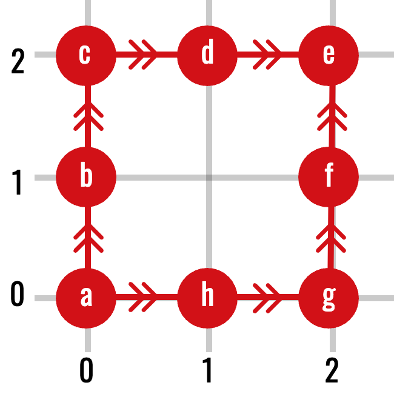
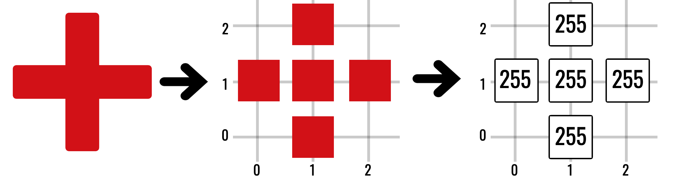
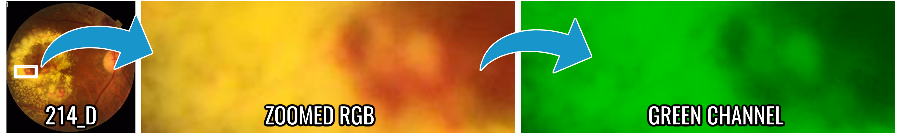
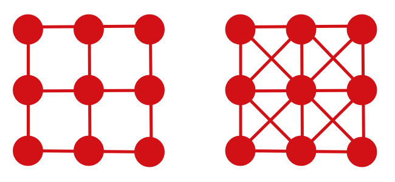

A digital image is a rectangular array of measurements. Topologically, the
important information is not only the value of each pixel, but also which
pixels are neighbours. Graphs provide the simplest finite model of that
relationship.

::: {.callout-note title="From continuous spaces back to finite data"}
The previous chapter used paths $\gamma\colon[0,1]\to X$ to define
continuous connectivity. A computer image contains only finitely many sample
locations, so we replace a continuous path by a finite sequence of adjacent
pixels. This is the same conceptual question—“can one location be reached
from another?”—in a representation a computer can enumerate.

This chapter uses graphs to settle adjacency and thresholding first. It then
explains why graphs alone are insufficient for holes and why pixels must be
promoted to filled squares in a cubical complex.
:::

## Graphs

::: {#def-graph name="Graph and path"}
A **graph** is a pair $G=(V,E)$ consisting of a set of vertices $V$ and a set
of edges $E$. For an undirected simple graph, each edge is an unordered pair
$\{u,v\}$ of distinct vertices.

A **path** from $v_0$ to $v_m$ is a sequence

$$
v_0,v_1,\ldots,v_m
$$

such that $\{v_{i-1},v_i\}\in E$ for every $i$. Two vertices are connected if
there is a path between them. This relation partitions $V$ into
**connected components**.
:::

{fig-alt="Eight red labelled vertices arranged on a three-by-three coordinate grid and joined by directed edges." width=52%}

The arrows show that graphs may also carry direction. The pixel-adjacency
graphs used below are **undirected**, so a connection can be traversed in
either direction. When reading the example only as an undirected graph, simply
forget the arrowheads. This distinction matters because the equivalence
relation in the next result uses undirected paths.

::: {#prp-graph-connected name="Graph connectivity is an equivalence relation"}
On the vertex set of an undirected graph, define $u\sim v$ when there is a
path from $u$ to $v$. Then $\sim$ is an equivalence relation, and its
equivalence classes are the connected components.
:::

::: {.proof}
The length-zero path shows $u\sim u$, so the relation is reflexive. Reversing
a path from $u$ to $v$ gives a path from $v$ to $u$, so it is symmetric.
Concatenating a path from $u$ to $v$ with one from $v$ to $w$ gives a path
from $u$ to $w$, so it is transitive. The equivalence classes therefore
partition the vertex set.
:::

Graphs already capture zeroth-dimensional topology: the number of graph
components is the quantity later denoted $\beta_0$.

## Pixel grids

::: {#def-digital-image name="Digital image"}
Let

$$
\Omega\subset\mathbb Z^2
$$

be a finite set of pixel coordinates. A grayscale digital image is a pair
$(\Omega,I)$, where

$$
I\colon\Omega\to\mathbb R
$$

assigns an intensity to each pixel. For an 8-bit image, the values usually lie
in $\{0,\ldots,255\}$.
:::

{fig-alt="A red cross is converted into five occupied positions on a three-by-three coordinate grid and then into a grid whose five entries have intensity 255." width=82%}

Colour images have several intensity functions—typically red, green, and blue.
Many mathematical pipelines analyse one channel at a time or first transform
the channels into a scalar field.

For the retinal case study, the green channel is used because it gives strong
contrast between the background retina, dark vessels and haemorrhages, and
bright exudates. This is not a topological requirement: it is a modelling
choice made before topology is computed. A different scalar channel can induce
a different filtration and therefore a different persistence diagram.

{fig-alt="A magnified retinal fundus region comparing an RGB image with the extracted green intensity channel."}

## Four- and eight-neighbour adjacency

For pixels $p=(p_1,p_2)$ and $q=(q_1,q_2)$:

- they are **4-neighbours** when $d_1(p,q)=1$;
- they are **8-neighbours** when $d_\infty(p,q)=1$.

Four-neighbour adjacency permits horizontal and vertical steps. Eight-neighbour
adjacency also permits diagonal steps.

Recall that

$$
d_1(p,q)=|p_1-q_1|+|p_2-q_2|,
\qquad
d_\infty(p,q)=\max\{|p_1-q_1|,|p_2-q_2|\}.
$$

Thus $q=p+(1,0)$ has both distances equal to $1$, while
$q=p+(1,1)$ has $d_1(p,q)=2$ but $d_\infty(p,q)=1$. The formulas therefore
recover exactly the horizontal/vertical and diagonal descriptions.

{fig-alt="Two three-by-three grid graphs, the second including diagonal edges." width=70%}

The choice changes connectivity. Two diagonally touching pixels form two
components under 4-connectivity but one component under 8-connectivity.
Therefore, adjacency is part of the mathematical model—not a harmless
implementation detail.

::: {.callout-warning title="The digital-connectivity ambiguity"}
Using the same adjacency rule for both foreground and background can create
paradoxical interpretations of components and holes. Cubical complexes resolve
much of this ambiguity by representing pixels together with their shared edges
and vertices.
:::

## Threshold sets

An image becomes a family of binary shapes when we vary an intensity threshold.

For a one-row image with intensities

$$
\bigl(2,\ 7,\ 4\bigr),
$$

the sublevel sets at thresholds $2$, $4$, and $7$ contain respectively the
first pixel; the first and third pixels; and all three pixels. At threshold
$4$ there are two components, but at threshold $7$ the middle pixel joins
them. Persistent homology will later record this merge rather than forcing us
to choose one “correct” threshold.

::: {#def-image-level-sets name="Image level sets"}
For $t\in\mathbb R$, define the **sublevel set**

$$
L_t=\{x\in\Omega:I(x)\leq t\}.
$$

If $s\leq t$, then $L_s\subseteq L_t$. Increasing the threshold can add pixels
but never remove them.

The corresponding **superlevel set** is

$$
U_t=\{x\in\Omega:I(x)\geq t\}.
$$

Equivalently, superlevel sets can be studied as sublevel sets of the inverted
image

$$
\widetilde I(x)=M-I(x),
$$

where $M$ is the maximum intensity.
:::

::: {#lem-nested-sublevels name="Sublevel sets are nested"}
If $s\leq t$, then $L_s\subseteq L_t$.
:::

::: {.proof}
If $x\in L_s$, then $I(x)\leq s\leq t$, so $x\in L_t$.
:::

Sublevel sets reveal dark structures early. Superlevel sets reveal bright
structures early. Persistent homology records how the connectivity and holes
of these sets evolve.

At this point, $L_t$ is only a set of pixel coordinates. We can use an
adjacency graph to count its connected components, but we have not yet said
which edges, vertices, or filled squares belong to the thresholded shape. The
next chapter introduces cubical complexes and then upgrades these coordinate
sets into genuine filtered cell complexes.

## Components by graph search

Once an adjacency rule is fixed, connected components can be found by
breadth-first search or depth-first search.

```python
def components(vertices, neighbours):
    unseen = set(vertices)
    result = []

    while unseen:
        start = unseen.pop()
        stack = [start]
        component = {start}

        while stack:
            vertex = stack.pop()
            for nxt in neighbours(vertex):
                if nxt in unseen:
                    unseen.remove(nxt)
                    component.add(nxt)
                    stack.append(nxt)

        result.append(component)

    return result
```

This is enough for $\beta_0$, but graphs alone do not directly encode filled
areas. A four-edge cycle might represent a genuine hole or merely the boundary
of a filled square. To distinguish these cases, we need higher-dimensional
cells.

{fig-alt="A grid of yellow vertices with two highlighted red square cycles; the left cycle lies on a filled green square while the right surrounds an empty centre." width=82%}

## From graphs to cell complexes

A graph has vertices and edges. A **cell complex** adds faces and
higher-dimensional cells:

$$
\text{vertices}\longrightarrow
\text{edges}\longrightarrow
\text{squares or triangles}\longrightarrow\cdots
$$

The distinction is crucial. The boundary of a square is a cycle; once the
square itself is present, that cycle is filled and no longer represents a
hole.

Digital images naturally lead to cubical complexes because pixels are squares.
Point-cloud data often lead to simplicial complexes because triangles and
higher-dimensional simplices can be built from pairwise relations.

## A useful discrete gradient

Later, when studying image stability, we will need to measure the largest
intensity jump between neighbouring pixels. Given a chosen adjacency graph,
define

$$
L_I=\max_{\{x,y\}\in E}|I(x)-I(y)|.
$$

This is a graph-based Lipschitz constant. Large values indicate sharp edges;
small values indicate slowly varying intensity. Interpolation across a
high-gradient image can cause much larger topological changes than the same
spatial motion applied to a smooth image.

::: {.callout-tip title="What to carry forward"}
- A graph turns adjacency into a finite notion of path and component.
- An intensity threshold turns one image into a nested family of binary
  shapes.
- The adjacency convention is part of the model.
- Graphs count components, but filled cells are needed to distinguish a loop
  from the boundary of a filled region.

The next chapter supplies those filled cells.
:::

## Exercises

1. Determine the 4- and 8-neighbours of $(3,4)$ in an unrestricted grid.
2. Give three pixels that are connected under 8-connectivity but disconnected
   under 4-connectivity.
3. Prove that $L_s\subseteq L_t$ whenever $s\leq t$.
4. For intensities $\{0,2,5,7\}$, list the distinct sublevel sets.
5. Explain why a graph cannot distinguish an unfilled triangle from a filled
   triangle.

[Previous: Topological Spaces](../topological-spaces/index.qmd) ·
[Course contents](../index.qmd) ·
[Next: Cubical and Simplicial Complexes](../complexes/index.qmd)
