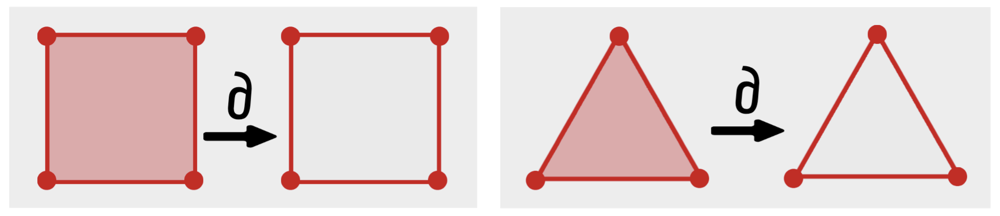
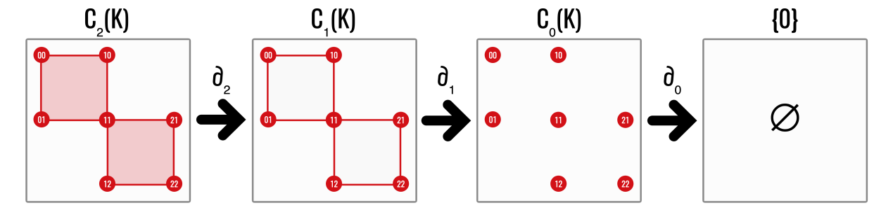
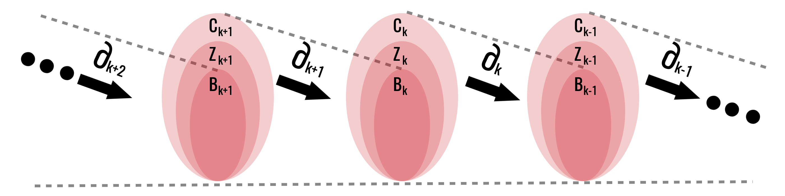
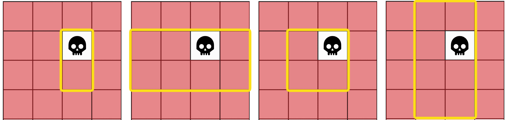
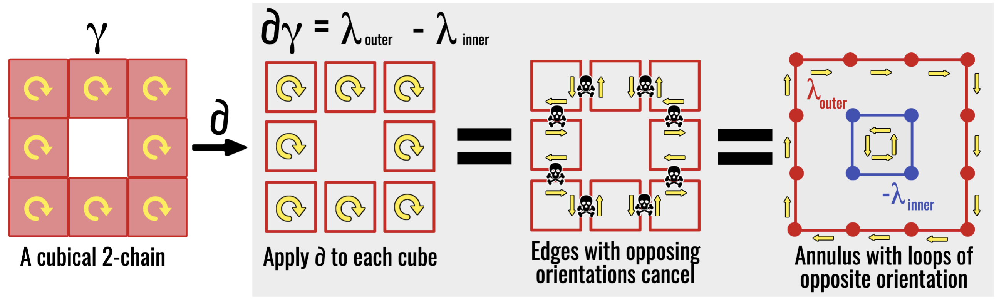
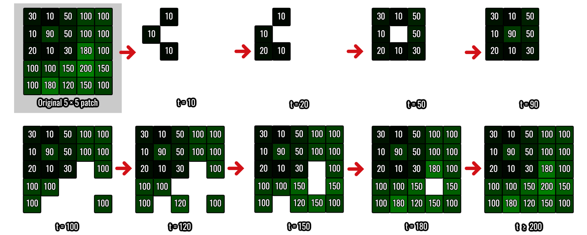

Homology counts holes by comparing two kinds of chains:

- cycles, which have no boundary; and
- boundaries, which enclose higher-dimensional cells.

A hole is represented by a cycle that is not itself a boundary.
The construction developed here follows the standard computational treatment
[@edelsbrunner2010; @nanda2023].

::: {.callout-note title="Keep one square in view"}
The entire construction can be understood by comparing two objects:

1. the four-edge perimeter of a square, with no interior; and
2. the same perimeter together with the filled square.

The perimeter has no boundary, so it is a cycle in both objects. In the first
object it surrounds a hole. In the second it is itself the boundary of the
filled square and should not count as a hole. Homology is the algebraic rule
that makes exactly this distinction.
:::

## Chain groups

Let $K$ be a finite cell complex and work over $\mathbb F_2$. The
**$k$th chain group** $C_k(K)$ is the vector space with the $k$-cells of $K$ as
a basis.

Thus:

- $C_0(K)$ contains formal sums of vertices;
- $C_1(K)$ contains formal sums of edges; and
- $C_2(K)$ contains formal sums of squares or triangles.

Because coefficients lie in $\mathbb F_2$, a chain can be identified with a
subset of cells. Addition is symmetric difference.

The word **formal** is important: adding two edges does not mean adding their
coordinates or lengths. It means placing both edges in one algebraic
collection. If the same edge is selected twice, its coefficient is
$1+1=0$, so it disappears.

## The boundary operator

::: {#def-boundary-operator name="Boundary operator"}
The **boundary operator**

$$
\partial_k\colon C_k(K)\to C_{k-1}(K)
$$

sends each cell to the sum of its facets and extends linearly.

For an edge $e=[u,v]$,

$$
\partial_1 e=u+v.
$$

For a square $\kappa$ with boundary edges $e_1,e_2,e_3,e_4$,

$$
\partial_2\kappa=e_1+e_2+e_3+e_4.
$$
:::

{fig-alt="A filled square maps to its four-edge boundary and a filled triangle maps to its three-edge boundary."}

The first picture shows what \(\partial_k\) does to one cell. Arranging the
same operation in every dimension produces the chain complex in the next
picture: \(2\)-cells map to edge chains, edge chains map to vertex chains,
and vertex chains map to zero.

{fig-alt="Two squares map to their edges, then vertices, then zero through boundary operators."}

### The simplicial boundary

The same construction works for simplicial complexes. Let
$C_k^\triangle(K)$ have the $k$-simplices as a basis.

::: {#def-simplicial-boundary name="Simplicial boundary operator"}
For a $k$-simplex $\sigma=[v_0,\ldots,v_k]$, define

$$
\partial_k^\triangle\sigma
=
\sum_{i=0}^k
[v_0,\ldots,\widehat{v_i},\ldots,v_k],
$$

where the hat means that $v_i$ is omitted. Extend the formula linearly to
all simplicial $k$-chains.
:::

For a triangle,

$$
\partial_2^\triangle[v_0,v_1,v_2]
=[v_1,v_2]+[v_0,v_2]+[v_0,v_1],
$$

the formal sum of its three edges. Thus the cubical and simplicial formulas
implement the same instruction—sum the codimension-one faces—even though the
cells have different shapes.

![With oriented coefficients, the boundary of \([v_0,v_1,v_2]\) is the alternating sum \([v_1,v_2]-[v_0,v_2]+[v_0,v_1]\). Over \(\mathbb F_2\), the signs disappear but the same three edges remain.](../assets/oriented-simplex-boundary.png){fig-alt="An oriented filled triangle maps to an alternating sum of three oriented edges, which recombine as its oriented perimeter." width=92%}

## Boundary of a boundary

::: {#lem-boundary-squared name="Fundamental lemma of homology"}
For every cubical chain,

$$
\partial_{k-1}\circ\partial_k=0.
$$
:::

::: {.proof}
It is enough to prove the identity on a basis cube
$\kappa=I_1\times\cdots\times I_n$. Each codimension-two face of $\kappa$ is
obtained by collapsing two distinct non-degenerate factors, say $I_a$ and
$I_b$. It appears twice in $\partial(\partial\kappa)$: once by collapsing
$I_a$ first and $I_b$ second, and once in the opposite order.

Over $\mathbb F_2$, the two copies have total coefficient $1+1=0$. With
oriented coefficients, the two orders have opposite signs and cancel for the
same reason. Every term in $\partial(\partial\kappa)$ is such a
codimension-two face, so the whole sum is zero. Linearity extends the result
from cubes to all chains.
:::

::: {#lem-simplicial-boundary-square name="The simplicial boundary also squares to zero"}
For every $k\geq2$,

$$
\partial_{k-1}^\triangle\partial_k^\triangle=0.
$$
:::

::: {.proof}
Evaluate the composite on a simplex
$\sigma=[v_0,\ldots,v_k]$. Every codimension-two face is obtained by
deleting two distinct vertices, say $v_i$ and $v_j$. It occurs once when
$v_i$ is deleted first and $v_j$ second, and once in the opposite order.
Thus every codimension-two face occurs exactly twice and cancels over
$\mathbb F_2$. Linearity gives the result for every simplicial chain.
:::

Both cell models therefore produce the same algebraic pattern: a sequence of
chain spaces in which two consecutive boundary operations compose to zero.

This identity makes the sequence

$$
\cdots\longrightarrow C_{k+1}
\xrightarrow{\partial_{k+1}}C_k
\xrightarrow{\partial_k}C_{k-1}
\longrightarrow\cdots
$$

a **chain complex**.

Read the arrows from right to left as repeated perimeter-taking:
a $k$-dimensional chain is sent to its $(k-1)$-dimensional boundary, which is
then sent to zero. The adjective “complex” here refers to this linked sequence
of vector spaces and maps, not to a cubical or simplicial complex itself.

## Cycles and boundaries

The notation in this section condenses two geometric tests:

| Space | Test | Geometric reading |
|---|---|---|
| $Z_k=\ker\partial_k$ | $\partial_kz=0$ | $z$ has no exposed boundary |
| $B_k=\operatorname{im}\partial_{k+1}$ | $z=\partial_{k+1}c$ | $z$ bounds a higher-dimensional filling |

Both conditions are needed. Being closed makes a chain a candidate hole;
failing to bound is what makes the candidate nontrivial.

The space of **$k$-cycles** is

$$
Z_k(K)=\ker\partial_k.
$$

These are chains with no boundary.

The space of **$k$-boundaries** is

$$
B_k(K)=\operatorname{im}\partial_{k+1}.
$$

These are chains that occur as boundaries of higher-dimensional chains.

::: {#prp-boundaries-cycles name="Every boundary is a cycle"}
For every $k$,

$$
B_k(K)\subseteq Z_k(K).
$$
:::

::: {.proof}
Let $z\in B_k(K)$. Then $z=\partial_{k+1}c$ for some
$c\in C_{k+1}(K)$. By @lem-boundary-squared,

$$
\partial_kz
=\partial_k(\partial_{k+1}c)
=0.
$$

Thus $z\in\ker\partial_k=Z_k(K)$.
:::

{fig-alt="Nested regions B inside Z inside C at consecutive chain dimensions."}

Every boundary is a cycle, but not every cycle is a boundary. The difference
between them is precisely the hole information.

### Why counting cycles is not enough

It is tempting to define a hole as a cycle and simply count all cycles. That
fails because many geometrically different cycles can surround the same empty
region. Moving a loop outward across a band of filled squares changes the
edges in the loop, but it should not create a new topological feature.

{fig-alt="A cubical region with one central hole and four nested edge cycles drawn around that hole."}

The next picture performs that statement on an explicit cubical chain.
Applying \(\partial\) to every square in the annular \(2\)-chain makes the
interior shared edges occur twice and cancel. Only the outer and inner loops
remain. Thus

$$
\partial\gamma
=\lambda_{\mathrm{outer}}-\lambda_{\mathrm{inner}},
$$

or, over \(\mathbb F_2\), the same equation with \(+\) in place of \(-\).

{fig-alt="A grid annulus is differentiated square by square; shared edges cancel and the remaining inner and outer perimeter loops have opposite orientations." width=100%}

The quotient by $B_k$ is precisely the algebraic operation that removes this
over-counting. Rather than choosing one privileged representative, homology
keeps the entire equivalence class of cycles that differ by boundaries.

## Homology groups

The **$k$th homology group** is

$$
H_k(K)
=
\frac{Z_k(K)}{B_k(K)}
=
\frac{\ker\partial_k}{\operatorname{im}\partial_{k+1}}.
$$

The historical name is “group,” but with coefficients in the field
$\mathbb F_2$ this quotient is also a vector space. That is why we may take
its dimension and why Gaussian elimination can compute it.

::: {#lem-homologous-cycles name="Homologous cycles"}
For $z_1,z_2\in Z_k(K)$,

$$
[z_1]=[z_2]\text{ in }H_k(K)
\quad\Longleftrightarrow\quad
z_1-z_2\in B_k(K).
$$
:::

::: {.proof}
By equality of cosets,

$$
[z_1]=[z_2]
\iff z_1+B_k=z_2+B_k
\iff z_1-z_2\in B_k.
$$
:::

Intuitively, homologous cycles wrap around the same hole.

### Dimension zero

$H_0(K)$ records connected components. If $K$ has $c$ components, then

$$
H_0(K)\cong\mathbb F_2^c.
$$

### Dimension one

$H_1(K)$ records independent loops. The boundary of an unfilled square
represents a nonzero class. Once the square is filled by a $2$-cell, the same
cycle becomes a boundary and hence represents zero in homology.

### Dimension two

$H_2(K)$ records enclosed two-dimensional voids, such as the surface of a
hollow cube. Adding the solid $3$-cube fills the void.

## Betti numbers

The **$k$th Betti number** is

$$
\beta_k(K)=\dim H_k(K).
$$

Over a field,

$$
\beta_k
=
\dim\ker\partial_k-\dim\operatorname{im}\partial_{k+1}.
$$

::: {#prp-betti-rank name="Betti number from boundary ranks"}
Let $D_k$ be the matrix of $\partial_k$, let $r_k=\operatorname{rank}D_k$,
and let $n_k$ be the number of $k$-cells of $K$. Then

$$
\beta_k(K)=n_k-r_k-r_{k+1}.
$$
:::

::: {.proof}
By definition and the dimension formula for a quotient,

$$
\beta_k
=\dim Z_k-\dim B_k
=\operatorname{nullity}D_k-\operatorname{rank}D_{k+1}.
$$

Rank–nullity gives $\operatorname{nullity}D_k=n_k-r_k$, while
$\operatorname{rank}D_{k+1}=r_{k+1}$. Substitution proves the formula.
:::

Typical signatures include:

| Space | $\beta_0$ | $\beta_1$ | $\beta_2$ |
|---|---:|---:|---:|
| point | 1 | 0 | 0 |
| two points | 2 | 0 | 0 |
| filled disc | 1 | 0 | 0 |
| circle | 1 | 1 | 0 |
| sphere surface | 1 | 0 | 1 |
| torus surface | 1 | 2 | 1 |

Betti numbers are coarse: they count holes but do not describe their exact
location or geometry.

### Betti numbers along a filtration

At one threshold, Betti numbers give a static inventory. Across thresholds,
they become functions of the filtration parameter. New pixels can create a
component, merge two components, create a loop, or fill a loop; accordingly,
$\beta_0$ and $\beta_1$ can both increase and decrease.

{fig-alt="A five-by-five intensity grid and several binary threshold stages used to track zeroth and first Betti numbers."}

For the filtration shown in the figure, one obtains:

| $t$ | 10 | 20 | 50 | 90 | 100 | 120 | 150 | 180 | 200 |
|---:|---:|---:|---:|---:|---:|---:|---:|---:|---:|
| $\beta_0$ | 3 | 2 | 1 | 1 | 3 | 3 | 1 | 1 | 1 |
| $\beta_1$ | 0 | 0 | 1 | 0 | 0 | 0 | 1 | 1 | 0 |

This table also exposes the weakness of selecting a single threshold. A
threshold that isolates one structure may merge or erase another. Persistent
homology replaces the search for a universally correct threshold with a record
of the entire topological evolution.

### Interpretation in the retinal example

The thesis uses three deliberately simple correspondences:

| Image structure | Filtration | Homological quantity |
|---|---|---|
| dark components, including haemorrhage-like regions | sublevel | $H_0$ |
| dark vascular loops | sublevel | $H_1$ |
| bright components, including exudate-like regions | inverted-image sublevel | $H_0$ |

These are modelling correspondences, not diagnoses. A component or loop can be
caused by anatomy, pathology, illumination, the image boundary, or an
interpolation artefact. Homology records structure; clinical interpretation
requires the acquisition and validation analysis developed later.

## Homotopy invariance

This theorem reconnects the computation to the topological motivation. Its
statement is essential; the proof sketch uses the functorial language
developed only in the optional final chapter. On a first reading, retain the
conclusion that continuously deforming a space does not change its homology.

::: {#thm-homotopy-invariance name="Homotopy invariance of homology"}
If $X$ and $Y$ are homotopy equivalent, then

$$
H_k(X)\cong H_k(Y)
$$

for every $k$. Consequently, all Betti numbers agree.
:::

::: {.proof-sketch}
Choose homotopy-inverse maps $f\colon X\to Y$ and $g\colon Y\to X$.
Functoriality gives induced maps $H_k(f)$ and $H_k(g)$. Homotopic maps induce
the same map on homology, so

$$
H_k(g)H_k(f)=H_k(g\circ f)=H_k(\operatorname{id}_X)
$$

and similarly $H_k(f)H_k(g)=H_k(\operatorname{id}_Y)$. Thus the induced maps
are inverse isomorphisms. The nontrivial ingredient—that homotopic maps induce
the same homology map—is proved by constructing a chain homotopy; see
@nanda2023.
:::

This explains why a thick annulus and a circle have the same homology. It also
explains the value of homology for noisy geometry: many local deformations
leave the algebraic signature unchanged.

## A worked square

Let $K$ consist of four vertices and four edges forming a square, but no
$2$-cell.

- There is one connected component, so $\beta_0=1$.
- The sum of all four edges is a $1$-cycle.
- There are no $2$-cells, so $B_1=0$.
- Therefore the cycle survives in $H_1$, giving $\beta_1=1$.

Now add the square as a $2$-cell. Its boundary is exactly that four-edge cycle.
The cycle moves into $B_1$, so $\beta_1$ drops to zero.

::: {.callout-tip title="What to carry forward"}
- Chains are selections of cells.
- Cycles have no boundary.
- Boundaries are cycles already explained by a higher-dimensional filling.
- Homology identifies cycles that differ only by such fillings.
- A Betti number is the number of independent surviving classes.

The next chapter replaces these definitions by boundary matrices and Gaussian
elimination.
:::

## Exercises

1. Compute the boundary of a path consisting of three consecutive edges.
2. Explain why a single edge is not a $1$-cycle.
3. Compute $(\beta_0,\beta_1)$ for two disjoint unfilled triangles.
4. What happens to $\beta_1$ when both triangles in Exercise 3 are filled?
5. Show directly that the boundary of a triangle has zero boundary over
   $\mathbb F_2$.

[Previous: Linear Algebra for Homology](../linear-algebra/index.qmd) ·
[Course contents](../index.qmd) ·
[Next: Computing Homology](../computing-homology/index.qmd)
