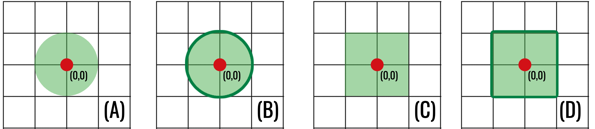

Computational topology begins with a deceptively simple question:

> What does it mean for two things to be close?

On the real line, the distance between $x$ and $y$ is naturally $|x-y|$. In
the plane, we might measure the length of the straight segment joining two
points. On a street grid, however, the number of horizontal and vertical
blocks may be more useful. For two digital images, we may instead care about
the largest change in intensity at any pixel.

These examples measure different things, but they share a small collection of
rules. A **metric space** isolates those rules and gives us a precise language
for distance, neighbourhoods, convergence, and continuity. Later, the same
language will quantify how much a topological summary can change when an image
is perturbed.

::: {.callout-note title="Learning goals"}
By the end of this chapter, you should be able to:

- verify whether a function is a metric;
- compare common metrics on $\mathbb{R}^n$;
- work with metric subspaces, bounded sets, and open balls;
- explain how a metric determines a topology;
- recognise continuous, Lipschitz, and distance-preserving maps; and
- compute the supremum distance between two digital images.
:::

::: {.callout-tip title="Reading the notation"}
The expression

$$
d\colon X\times X\to[0,\infty)
$$

simply says that $d$ accepts **two points of $X$** and returns a nonnegative
real number. The set $X$ need not consist of geometric points: its elements
could be graphs, functions, or entire digital images. The abstraction lets
one definition of distance cover all of these cases.
:::

## What is a metric?

::: {#def-metric name="Metric space"}
Let $X$ be a set. A **metric** on $X$ is a function

$$
d\colon X\times X\longrightarrow [0,\infty)
$$

such that, for every $x,y,z\in X$:

1. **Non-negativity:** $d(x,y)\geq 0$.
2. **Identity of indiscernibles:** $d(x,y)=0$ if and only if $x=y$.
3. **Symmetry:** $d(x,y)=d(y,x)$.
4. **Triangle inequality:** $d(x,z)\leq d(x,y)+d(y,z)$.

The pair $(X,d)$ is called a **metric space**.
:::

The first three axioms formalise familiar properties of distance. The triangle
inequality says that travelling through an intermediate point $y$ cannot be
shorter than the distance from $x$ directly to $z$:

$$
d(x,z)\leq d(x,y)+d(y,z).
$$

When checking a proposed metric, the triangle inequality is usually the only
non-immediate axiom.

::: {#lem-reverse-triangle name="Reverse triangle inequality"}
In every metric space $(X,d)$ and for all $x,y,z\in X$,

$$
\bigl|d(x,z)-d(y,z)\bigr|\leq d(x,y).
$$
:::

::: {.proof}
The triangle inequality gives
$d(x,z)\leq d(x,y)+d(y,z)$, hence
$d(x,z)-d(y,z)\leq d(x,y)$. Interchanging $x$ and $y$ gives
$d(y,z)-d(x,z)\leq d(x,y)$. Combining the two inequalities proves the
absolute-value bound.
:::

### A first example: the real line

On $\mathbb{R}$, define

$$
d(x,y)=|x-y|.
$$

This is the usual distance between real numbers. For example, $d(-2,3)=5$.
Its triangle inequality is the familiar absolute-value inequality

$$
|x-z|\leq |x-y|+|y-z|.
$$

### A non-example

The function

$$
q(x,y)=|x-y|^2
$$

is not a metric on $\mathbb{R}$. It satisfies non-negativity, identity, and
symmetry, but it fails the triangle inequality. Taking $x=0$, $y=1$, and
$z=2$ gives

$$
q(0,2)=4
\quad\text{but}\quad
q(0,1)+q(1,2)=1+1=2.
$$

One failed axiom is enough: $q$ is not a metric. This example is a useful
warning that modifying a valid metric can destroy its metric properties.

## Common metrics on $\mathbb{R}^n$

For points

$$
\mathbf{x}=(x_1,\ldots,x_n),
\qquad
\mathbf{y}=(y_1,\ldots,y_n)
$$

in $\mathbb{R}^n$, three metrics appear frequently. Each is induced by a norm:

$$
d_p(\mathbf x,\mathbf y)=\lVert\mathbf x-\mathbf y\rVert_p.
$$

| Name | Notation | Distance between $\mathbf x$ and $\mathbf y$ |
|---|---:|---|
| Manhattan | $d_1$ | $\displaystyle \sum_{i=1}^n |x_i-y_i|$ |
| Euclidean | $d_2$ | $\displaystyle \left(\sum_{i=1}^n |x_i-y_i|^2\right)^{1/2}$ |
| Chebyshev | $d_\infty$ | $\displaystyle \max_{1\leq i\leq n}|x_i-y_i|$ |

The names describe three different geometries:

- $d_1$ measures travel parallel to the coordinate axes;
- $d_2$ measures straight-line distance; and
- $d_\infty$ records only the largest coordinate difference.

Consider $\mathbf{x}=(1,2)$ and $\mathbf{y}=(4,6)$. Then

$$
\begin{aligned}
d_1(\mathbf{x},\mathbf{y})&=|1-4|+|2-6|=7,\\
d_2(\mathbf{x},\mathbf{y})&=\sqrt{(1-4)^2+(2-6)^2}=5,\\
d_\infty(\mathbf{x},\mathbf{y})&=\max\{3,4\}=4.
\end{aligned}
$$

The points have not changed, but the question used to compare them has. There
is no universally correct metric: the appropriate choice depends on which
features of the problem should count as near.

::: {#prp-finite-norm-comparison name="Comparison of the standard norms"}
For every $\mathbf v\in\mathbb R^n$, these norms satisfy

$$
\lVert\mathbf v\rVert_\infty
\leq
\lVert\mathbf v\rVert_2
\leq
\sqrt n\,\lVert\mathbf v\rVert_\infty,
\qquad
\lVert\mathbf v\rVert_2
\leq
\lVert\mathbf v\rVert_1
\leq
\sqrt n\,\lVert\mathbf v\rVert_2.
$$
:::

::: {.proof}
Since every coordinate satisfies
$|v_i|\leq\lVert\mathbf v\rVert_\infty$,

$$
\lVert\mathbf v\rVert_2^2
=\sum_i|v_i|^2
\leq n\lVert\mathbf v\rVert_\infty^2.
$$

Also, the largest squared coordinate is one term in the sum, so
$\lVert\mathbf v\rVert_\infty\leq\lVert\mathbf v\rVert_2$.
Next, $\lVert\mathbf v\rVert_2\leq\lVert\mathbf v\rVert_1$ follows after
squaring because the square of the sum contains all squares plus nonnegative
cross terms. Finally, Cauchy–Schwarz gives

$$
\lVert\mathbf v\rVert_1
=\sum_i |v_i|\cdot1
\leq
\left(\sum_i|v_i|^2\right)^{1/2}
\left(\sum_i1^2\right)^{1/2}
=\sqrt n\,\lVert\mathbf v\rVert_2.
$$
:::

They may assign different numerical distances, but none can become small while
another remains arbitrarily large in a fixed finite dimension. This observation
will help explain why they induce the same open sets on $\mathbb R^n$.

::: {.callout-important title="Same set, different geometry"}
The set $X$ does not determine distance by itself. The metric is part of the
structure. Thus $(\mathbb{R}^2,d_1)$ and $(\mathbb{R}^2,d_2)$ are different
metric spaces even though they have the same underlying points.
:::

### The discrete metric

Every set admits at least one metric. Define

$$
d_{\mathrm{disc}}(x,y)=
\begin{cases}
0,&x=y,\\
1,&x\neq y.
\end{cases}
$$

This is the **discrete metric**. It treats every pair of distinct points as
equally far apart. The example is useful because it reminds us that a metric
does not require coordinates, angles, or a surrounding Euclidean space.

To check the triangle inequality, observe that its left-hand side is at most
$1$. If $x\neq z$, then at least one of $x\neq y$ or $y\neq z$ holds, so the
right-hand side is at least $1$.

## Subspaces and bounded sets

Suppose $(X,d)$ is a metric space and $S\subseteq X$. Restricting $d$ to pairs
of points in $S$ gives a metric

$$
d|_{S\times S}\colon S\times S\longrightarrow\mathbb{R}.
$$

The resulting metric space is called a **metric subspace** of $X$.

For example, the integer lattice $\mathbb{Z}^2$ becomes a metric subspace of
$(\mathbb{R}^2,d_2)$ when it inherits Euclidean distance. Alternatively, we
could equip the same lattice with $d_1$ or $d_\infty$. These choices encode
different notions of adjacency on a pixel grid.

A subset $S\subseteq X$ is **bounded** if it fits inside a ball of finite
radius: there are $x_0\in X$ and $R>0$ such that

$$
d(x_0,s)<R
\qquad\text{for every }s\in S.
$$

When $S$ is bounded, its **diameter** is

$$
\operatorname{diam}(S)
=
\sup\{d(x,y):x,y\in S\}.
$$

The diameter measures the greatest possible separation between points of the
set. The supremum need not be attained: a set can have a finite diameter
without containing a pair of points exactly that far apart.

## Open balls and neighbourhoods

Let $(X,d)$ be a metric space, let $x\in X$, and let $\varepsilon>0$. The
**open ball** of radius $\varepsilon$ centred at $x$ is

$$
B_\varepsilon(x)
=
\{y\in X:d(x,y)<\varepsilon\}.
$$

An open ball collects all points sufficiently near its centre. Its shape
depends on the metric:

- in $(\mathbb{R}^2,d_1)$, balls look like diamonds;
- in $(\mathbb{R}^2,d_2)$, balls are ordinary discs;
- in $(\mathbb{R}^2,d_\infty)$, balls look like axis-aligned squares.

{#fig-metric-balls fig-alt="Four grid diagrams comparing circular and square open and closed balls around the origin."}

Although these regions look different, they play the same logical role: they
describe what it means to vary a point by less than a chosen tolerance.

The corresponding **closed ball** is

$$
\overline B_\varepsilon(x)
=
\{y\in X:d(x,y)\leq\varepsilon\}.
$$

### Open and closed sets

A subset $U\subseteq X$ is **open** if every point of $U$ has a sufficiently
small open ball that remains inside $U$. Formally, for every $x\in U$, there is
some $\varepsilon>0$ such that

$$
B_\varepsilon(x)\subseteq U.
$$

A subset $C\subseteq X$ is **closed** if its complement $X\setminus C$ is
open.

Open and closed are not opposites in ordinary language. A set may be both open
and closed, or neither. In every metric space, $\varnothing$ and $X$ are both
open and closed. In $\mathbb R$ with the usual metric, $[0,1)$ is neither:
it contains no open ball around $0$, while its complement contains no open
ball around $1$.

## From a metric to a topology

This is the first deliberate increase in abstraction. Until now, a metric has
returned numerical distances. We will now retain only the open sets determined
by those distances. Think of this as discarding the ruler while keeping every
possible answer to the question “which points are sufficiently near this
one?” The next chapter studies what survives after that numerical information
has been forgotten.

Let $\mathcal{T}_d$ be the collection of all open subsets of $(X,d)$. This
collection satisfies:

1. $\varnothing,X\in\mathcal{T}_d$;
2. every union of members of $\mathcal{T}_d$ belongs to $\mathcal{T}_d$; and
3. every finite intersection of members of $\mathcal{T}_d$ belongs to
   $\mathcal{T}_d$.

These are precisely the axioms of a **topology**. We therefore call
$\mathcal{T}_d$ the topology induced by the metric $d$.

::: {#thm-metric-topology name="Every metric induces a topology"}
The collection $\mathcal T_d$ of open subsets of a metric space $(X,d)$ is a
topology on $X$.
:::

::: {.proof}
Both $\varnothing$ and $X$ are open: the first condition is vacuous for
$\varnothing$, while every ball about a point of $X$ lies in $X$.

Let $\{U_\alpha\}_{\alpha\in A}$ be open and let
$x\in\bigcup_{\alpha\in A}U_\alpha$. Choose $\alpha_0$ with
$x\in U_{\alpha_0}$. Some ball $B_\varepsilon(x)$ lies in
$U_{\alpha_0}$ and hence in the union. Thus arbitrary unions are open.

Finally, let $x\in U_1\cap\cdots\cap U_n$, where every $U_i$ is open. Choose
$\varepsilon_i>0$ with $B_{\varepsilon_i}(x)\subseteq U_i$ and put
$\varepsilon=\min_i\varepsilon_i$. Then
$B_\varepsilon(x)\subseteq\bigcap_iU_i$. Therefore finite intersections are
open.
:::

Topology remembers which sets are open but forgets the numerical distances
that produced them. This is our first move from geometry towards topology:
exact measurements become less important than the qualitative structure of
neighbourhoods.

Different metrics can induce the same topology. For example, $d_1$, $d_2$, and
$d_\infty$ all determine the usual topology on $\mathbb{R}^n$. They disagree
about exact distances and the shapes of balls, but agree about which subsets
are open. The norm inequalities above allow a sufficiently small ball for one
metric to be placed inside a ball for another.

## Convergence and continuity

A sequence $(x_m)_{m\geq 1}$ in $(X,d)$ **converges** to $x\in X$ if

$$
\text{for every }\varepsilon>0,\text{ there is }N
\text{ such that }m\geq N\implies d(x_m,x)<\varepsilon.
$$

We write $x_m\to x$. In words, the terms of the sequence eventually enter
every open ball around $x$ and remain there.

Now let $(X,d_X)$ and $(Y,d_Y)$ be metric spaces. A function
$f\colon X\to Y$ is **continuous at** $x_*\in X$ if, for every
$\varepsilon>0$, there is a $\delta>0$ such that

$$
d_X(x,x_*)<\delta
\quad\Longrightarrow\quad
d_Y\bigl(f(x),f(x_*)\bigr)<\varepsilon.
$$

Continuity says that sufficiently small changes to the input produce
controlled changes to the output. Equivalently, whenever $x_m\to x$, a
continuous function satisfies $f(x_m)\to f(x)$.

For example, $f\colon\mathbb R\to\mathbb R$ given by $f(x)=3x$ is continuous.
Given $\varepsilon>0$, choosing $\delta=\varepsilon/3$ gives

$$
|x-x_*|<\delta
\quad\Longrightarrow\quad
|f(x)-f(x_*)|=3|x-x_*|<\varepsilon.
$$

### Lipschitz maps and isometries

A map $f\colon X\to Y$ is **Lipschitz** if there is a constant $L\geq 0$ such
that

$$
d_Y\bigl(f(x),f(y)\bigr)
\leq
L\,d_X(x,y)
$$

for every $x,y\in X$. The number $L$ is a global bound on how much $f$ can
amplify distances.

::: {#prp-lipschitz-continuous name="Lipschitz maps are continuous"}
Every Lipschitz map between metric spaces is continuous.
:::

::: {.proof}
Suppose $f$ has Lipschitz constant $L$. If $L=0$, then
$d_Y(f(x),f(y))=0$ for all $x,y$, so $f$ is constant and therefore
continuous. If $L>0$, given $\varepsilon>0$, choose
$\delta=\varepsilon/L$. Then

$$
d_X(x,x_*)<\delta
\quad\Longrightarrow\quad
d_Y(f(x),f(x_*))
\leq Ld_X(x,x_*)<\varepsilon.
$$
:::

An **isometry** is a map that preserves all distances:

$$
d_Y\bigl(f(x),f(y)\bigr)=d_X(x,y).
$$

Translations and rotations of Euclidean space are isometries under $d_2$.
They move a configuration without changing its internal geometry. Every
isometry is $1$-Lipschitz and therefore continuous.

### Rigid motions of Euclidean space

The stability problem later in these notes distinguishes an ideal geometric
motion from the resampling error produced when that motion is represented on a
pixel grid. The ideal motion has the form

$$
\psi(x)=Rx+\mathbf t,
$$

where $R$ is an orthogonal matrix ($R^\mathsf TR=I$) and $\mathbf t$ is a
translation vector. Rotations and reflections are encoded by $R$; translations
are encoded by $\mathbf t$.

::: {#lem-rigid-isometry name="Rigid-body transformations are isometries"}
Let $\psi\colon\mathbb R^n\to\mathbb R^n$ be given by
$\psi(x)=Rx+\mathbf t$, where $R^\mathsf TR=I$. Then $\psi$ is an isometry for
the Euclidean metric.
:::

::: {.proof}
For $x,y\in\mathbb R^n$,

$$
\begin{aligned}
\|\psi(x)-\psi(y)\|_2^2
&=\|R(x-y)\|_2^2\\
&=(x-y)^\mathsf TR^\mathsf TR(x-y)\\
&=(x-y)^\mathsf T(x-y)
=\|x-y\|_2^2.
\end{aligned}
$$

Both norms are nonnegative, so taking square roots gives
$\|\psi(x)-\psi(y)\|_2=\|x-y\|_2$.
:::

The inverse is explicit:

$$
\psi^{-1}(y)=R^\mathsf T(y-\mathbf t).
$$

Thus a rigid motion is not merely distance-preserving; it is bijective and has
a continuous inverse. In the continuous setting, it does not alter the
topological type of a shape. The difficulty begins only when its output must be
sampled back onto a discrete grid.

::: {.callout-tip title="Why this matters later"}
Stability theorems have the flavour of a Lipschitz bound. They compare a
distance between inputs with a distance between topological summaries:

$$
\text{output change}\leq\text{input change}.
$$

Metric spaces make both sides of such a statement meaningful.
:::

## The supremum metric on functions

Here the “points” of the metric space are functions. In the image application,
one point is therefore one whole image. If $I$ and $J$ are two images on the
same pixel grid, then

$$
\|I-J\|_\infty
$$

is a single number describing their worst pixelwise disagreement. This change
of viewpoint—from pixels as points to images as points—is easy to miss and is
central to the later stability theorem.

Computational topology often studies bounded real-valued functions

$$
f\colon X\longrightarrow\mathbb{R}.
$$

Let $\mathcal B(X,\mathbb R)$ denote the set of bounded functions from $X$ to
$\mathbb R$. For $f,g\in\mathcal B(X,\mathbb R)$, define

$$
d_\infty(f,g)
=
\lVert f-g\rVert_\infty
=
\sup_{x\in X}|f(x)-g(x)|.
$$

The **supremum** is the smallest number that is at least as large as every
value $|f(x)-g(x)|$. It is needed when $X$ is infinite and a largest value
might not actually be attained. On a finite image grid, no subtlety remains:
the supremum is simply the largest entry in the difference image.

This is a metric on $\mathcal B(X,\mathbb R)$. Boundedness ensures that the
distance is finite. If $X$ is a finite pixel grid, the supremum is simply a
maximum, so the distance between two equally sized images is the largest
pointwise intensity difference.

For example, consider two $2\times2$ greyscale images:

$$
f=
\begin{pmatrix}
0&2\\
3&5
\end{pmatrix},
\qquad
g=
\begin{pmatrix}
1&2\\
4&2
\end{pmatrix}.
$$

Their absolute pointwise difference is

$$
|f-g|=
\begin{pmatrix}
1&0\\
1&3
\end{pmatrix},
$$

so $\lVert f-g\rVert_\infty=3$.

This metric deliberately ignores how many pixels changed. It records the
largest change at any one pixel. That is exactly the quantity appearing in
the classical stability bound for sublevel-set persistent homology:

$$
d_B\bigl(\operatorname{Dgm}(f),\operatorname{Dgm}(g)\bigr)
\leq
\lVert f-g\rVert_\infty.
$$

We will define persistence diagrams and the bottleneck distance in later
chapters. For now, the inequality says that controlling the largest input
change controls the change in the topological output.

### A small implementation

```python
import numpy as np

def supremum_distance(f, g):
    """Largest pointwise difference between equally shaped arrays."""
    f = np.asarray(f, dtype=float)
    g = np.asarray(g, dtype=float)

    if f.shape != g.shape:
        raise ValueError("The arrays must have the same shape.")

    return np.max(np.abs(f - g))

f = np.array([[0, 2], [3, 5]])
g = np.array([[1, 2], [4, 2]])

print(supremum_distance(f, g))  # 3.0
```

The mathematics tells us which quantity to compute; the code is a direct
translation of the definition.

## Chapter summary

- A metric is a distance function satisfying four axioms.
- The underlying set does not determine its metric.
- Open balls describe local neighbourhoods and generate open sets.
- Open sets induced by a metric form a topology.
- Lipschitz maps control distance globally; isometries preserve it exactly.
- For images, the supremum metric records the largest pointwise intensity
  change and will drive the stability theory of persistent homology.

## Exercises

1. Compute $d_1$, $d_2$, and $d_\infty$ between $(2,-1)$ and $(-1,3)$.
2. Show that $d(x,y)=2|x-y|$ is a metric on $\mathbb{R}$.
3. Explain precisely where $q(x,y)=|x-y|^2$ fails to be a metric.
4. Describe $B_1(0)$ in $\mathbb{R}$ with the usual metric. How does it differ
   from $\overline B_1(0)$?
5. Let $X=\{a,b,c\}$ have the discrete metric. List every open ball of radius
   $1/2$ and every open ball of radius $2$.
6. Prove that every singleton is open in a discrete metric space.
7. Suppose two greyscale images have intensities in $[0,255]$. What is the
   largest possible supremum distance between them?
8. Prove that every isometry is Lipschitz and therefore continuous.
9. For bounded functions $f,g,h\colon X\to\mathbb R$, prove the triangle
   inequality
   $\lVert f-h\rVert_\infty\leq
   \lVert f-g\rVert_\infty+\lVert g-h\rVert_\infty$.

::: {.callout-tip collapse="true" title="Solutions"}
1. The coordinate differences are $3$ and $4$, so
   $d_1=7$, $d_2=5$, and $d_\infty=4$.
2. Multiplying a metric by a positive constant preserves all four metric
   axioms. In particular, the triangle inequality follows by multiplying
   $|x-z|\leq|x-y|+|y-z|$ by $2$.
3. With $x=0$, $y=1$, and $z=2$, the triangle inequality would require
   $4=q(0,2)\leq q(0,1)+q(1,2)=2$, which is false.
4. The open ball is $(-1,1)$. The closed ball is $[-1,1]$ and includes its
   endpoints.
5. For radius $1/2$, the balls are $\{a\}$, $\{b\}$, and $\{c\}$. Every ball
   of radius $2$ is all of $X$.
6. For any $x\in X$, the ball $B_{1/2}(x)$ is exactly $\{x\}$. Hence every
   singleton is open.
7. The largest possible distance is $255$, achieved when some pixel has value
   $0$ in one image and $255$ in the other.
8. An isometry satisfies the Lipschitz inequality with equality and $L=1$.
   Given $\varepsilon>0$, choose $\delta=\varepsilon$ to prove continuity.
9. For each $x\in X$, the ordinary triangle inequality gives
   $|f(x)-h(x)|\leq|f(x)-g(x)|+|g(x)-h(x)|$. Each term on the right is bounded
   by its supremum. Taking the supremum over $x$ proves the result.
:::

## What comes next

A metric gives us more than numerical distances: it gives us open sets and
therefore a topology. The next chapter will keep the open-set structure while
allowing us to forget the metric. This abstraction is what makes it possible
to recognise the same shape across very different geometric realisations.

[Course contents](../index.qmd) ·
[Next: Topological Spaces and Continuity](../topological-spaces/index.qmd)
