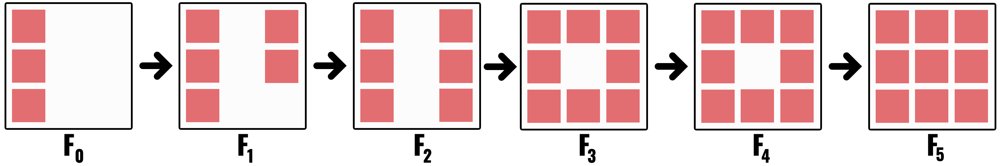
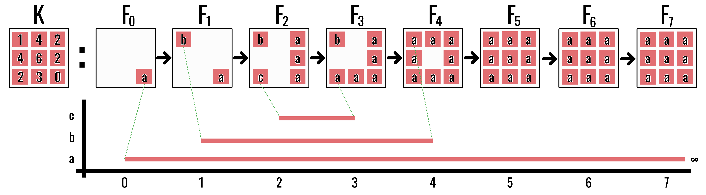
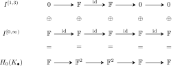
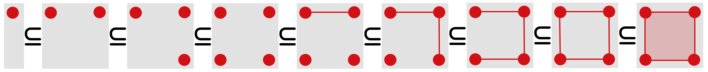

Ordinary homology studies one complex at a time. Persistent homology studies a
nested sequence

$$
K_0\subseteq K_1\subseteq\cdots\subseteq K_m
$$

and records how long each homological feature survives.
The cubical construction and interval viewpoint follow
@wagner2011cubical and @zomorodian2004computing.

::: {.callout-note title="Three descriptions of the same process"}
The discussion moves between three levels. They should not be mistaken for
three separate constructions.

| Level | What we see |
|---|---|
| geometry | complexes grow as the threshold increases |
| algebra | homology groups are connected by linear maps |
| summary | each class becomes an interval or a diagram point |

The geometry provides intuition, the algebra determines which features are
really the same through time, and the barcode records the result compactly.
Whenever the module notation becomes dense, return to the picture of a
component appearing, merging, or a loop filling in.
:::

## Filtrations

::: {#def-filtration name="Filtration"}
A **filtration** of a complex $K$ is a nested family of subcomplexes whose
union is $K$. Every cell $\sigma$ has a **filtration value**

$$
\operatorname{filt}(\sigma)
=
\min\{t:\sigma\in K_t\}.
$$

Face closure requires

$$
\tau\preceq\sigma
\quad\Longrightarrow\quad
\operatorname{filt}(\tau)
\leq
\operatorname{filt}(\sigma).
$$

A cell cannot appear before one of its faces.
:::

## Image filtrations

For an image $(\Omega,I)$, pixel values are attached to top-dimensional
$2$-cubes. Lower-dimensional faces must also receive values. For a sublevel
filtration, define

$$
\widehat I(\gamma)
=
\min\{I(z):\gamma\preceq\kappa_z\}.
$$

Then

$$
K_t=\{\sigma:\widehat I(\sigma)\leq t\}
$$

is face-closed. Dark pixels enter early and brighter pixels enter later.

A superlevel filtration can be implemented as a sublevel filtration of

$$
\widetilde I=M-I.
$$

This makes bright structures appear early.

{fig-alt="Six stages of an evolving three-by-three cubical complex."}

## Two small examples

First read the unlabelled filtration geometrically. At \(t=0\), the left
column is one component. At \(t=1\), two isolated pixels appear on the right,
so two components are born simultaneously. The middle-right pixel joins those
two components at \(t=2\); the top-middle pixel joins the resulting right-hand
component to the older left-hand component at \(t=3\). The bottom-middle pixel
then closes a loop at \(t=4\), and the central pixel fills it at \(t=5\).

Thus its \(H_0\) intervals are

$$
[0,\infty),\qquad [1,2),\qquad [1,3),
$$

and its \(H_1\) interval is

$$
[4,5).
$$

The simultaneous births at \(t=1\) already signal a bookkeeping issue:
threshold values alone do not order tied cells or tied generators. Later we
will impose a compatible ordering when an algorithm requires one.

The next example isolates the **elder rule**. Components \(a\), \(b\), and
\(c\) are born at thresholds \(0\), \(1\), and \(2\). When \(a\) meets \(c\)
at \(t=3\), the older component \(a\) continues and \(c\) dies. When \(a\)
meets \(b\) at \(t=4\), \(a\) again continues and \(b\) dies. Its \(H_0\)
barcode is therefore

$$
[0,\infty),\qquad [1,4),\qquad [2,3).
$$

{fig-alt="A three-by-three image filtration with component labels above a barcode showing one infinite and two finite intervals."}

In either example, the left endpoint is the threshold at which a feature
appears and the right endpoint is the threshold at which it ceases to define
an independent homology class. The symbol \(\infty\) means that the class
survives to the end of the filtration.

## Barcodes and persistence diagrams

The intervals drawn for the example form a **barcode**: one horizontal bar for
each feature lifespan. The equivalent **persistence diagram** replaces an
interval $[b,d)$ with the point $(b,d)$.

The diagonal

$$
\Delta=\{(x,x):x\in\mathbb R\}
$$

represents zero-persistence features. A point far from the diagonal represents
a long-lived feature because its vertical distance above the line $b=d$
increases with $d-b$.

Barcodes make lifespans visually intuitive; diagrams make distances and
statistical summaries easier to define. At this stage, regard them as two ways
to record the intervals seen in the example. The module theory below explains
why every finite one-parameter filtration has such an interval description
and why that description is unique.

## Persistence modules

Applying $H_k$ to every complex and every inclusion produces a sequence of
vector spaces and linear maps:

$$
H_k(K_0)\longrightarrow
H_k(K_1)\longrightarrow\cdots\longrightarrow
H_k(K_m).
$$

The map $H_k(K_t)\to H_k(K_{t+1})$ is induced by inclusion. It asks what a
class visible at time $t$ becomes one threshold later. It may remain
independent, become zero because a hole is filled, or merge into an older
class. A persistence module is simply the entire linked sequence treated as
one object.

::: {#def-persistence-module name="Persistence module"}
A finite persistence module is a sequence of vector spaces and linear maps

$$
V_0\longrightarrow V_1\longrightarrow\cdots\longrightarrow V_m.
$$

Applying $H_k$ to a filtration produces such a module with $V_t=H_k(K_t)$.
:::

A **morphism of persistence modules**
$\phi_\bullet\colon V_\bullet\to W_\bullet$ is a family of linear maps
$\phi_t\colon V_t\to W_t$ that respects the structure maps:

$$
b_t\phi_t=\phi_{t+1}a_t.
$$

{fig-alt="Two horizontal persistence sequences V and W with vertical maps phi at adjacent indices, forming a commuting square between the structure maps a and b." width=72%}

This condition prevents the maps $\phi_t$ from making unrelated choices at
different thresholds. A module isomorphism is such a morphism in which every
$\phi_t$ is invertible and the componentwise inverses also respect the
structure maps.

A class is **born** when it first appears outside the image of the previous
map. It **dies** when it becomes trivial or merges into an older class. Its
lifespan is an interval

$$
[b,d).
$$

The persistence is $d-b$. Long intervals describe features that survive many
thresholds; short intervals describe transient features.

### Birth and death as linear-algebraic events

Write $a_{i\to j}=a_{j-1}\circ\cdots\circ a_i$ for the composite structure
map. A nonzero vector $v\in V_i$ is **born at $i$** when

$$
v\notin\operatorname{im}a_{i-1\to i}.
$$

For $i=0$, there is no preceding vector space; equivalently set
$V_{-1}=0$, so every nonzero class initially present is born at index $0$.

It **dies at $j>i$** when $j$ is the first index for which its forward image is
indistinguishable from something older:

$$
a_{i\to j}(v)\in\operatorname{im}a_{i-1\to j}.
$$

This definition includes two geometrically different events:

- the class may become zero because a cycle is filled; or
- it may merge with a class born earlier.

In both cases it ceases to be an independent generator. If no such $j$ exists,
the class has interval $[i,\infty)$.

The **elder rule** resolves the bookkeeping ambiguity at a merge: the older
class is continued and the younger class is declared dead. If two classes have
the same birth index, a fixed compatible cell ordering breaks the tie. The
rule chooses interval representatives; it does not assert that a geometric
component possesses a literal identity independent of the filtration.

## Interval modules

The following definitions formalise the intervals already read from the
example. They are not a new geometric stage: an interval module is the
smallest algebraic object representing one feature that is present for one
consecutive span of thresholds.

::: {#def-interval-module name="Interval module"}
The interval module $I^{[b,d)}$ is $\mathbb F$ at indices
$b\leq t<d$, zero elsewhere, and uses identity maps between its nonzero
vector spaces.
:::

The name “interval” is literal: the module is nonzero on one consecutive block
of indices and nowhere else. It is the algebraic model of one feature that is
born once, remains alive, and dies once.

::: {#def-module-direct-sum name="Direct sum of persistence modules"}
For persistence modules $(V_\bullet,a_\bullet)$ and
$(W_\bullet,b_\bullet)$, their direct sum is

$$
(V_\bullet,a_\bullet)\oplus(W_\bullet,b_\bullet)
=
(V_\bullet\oplus W_\bullet,\ a_\bullet\oplus b_\bullet),
$$

where every structure map acts componentwise.
:::

::: {#prp-persistent-direct-sum name="Persistent groups respect direct sums"}
For $i\leq j$,

$$
\operatorname{im}(a_{i\to j}\oplus b_{i\to j})
\cong
\operatorname{im}a_{i\to j}
\oplus
\operatorname{im}b_{i\to j}.
$$
:::

::: {.proof}
The composite structure map of the direct sum is block diagonal:

$$
(a\oplus b)_{i\to j}
=
\begin{pmatrix}
a_{i\to j}&0\\
0&b_{i\to j}
\end{pmatrix}.
$$

Its value on $(v,w)$ is $(a_{i\to j}v,b_{i\to j}w)$. Hence its image consists
exactly of pairs with first coordinate in $\operatorname{im}a_{i\to j}$ and
second coordinate in $\operatorname{im}b_{i\to j}$.
:::

This proposition licenses the “divide and conquer” interpretation of a
barcode. If a module splits into interval summands, its persistent information
is the collection of the persistent information of those summands.

::: {#def-indecomposable-module name="Indecomposable persistence module"}
A nonzero persistence module is **indecomposable** if an isomorphism
$I_\bullet\cong V_\bullet\oplus W_\bullet$ forces one of $V_\bullet$ or
$W_\bullet$ to be the zero module.
:::

::: {.callout-note title="Why introduce indecomposability?"}
The term is algebraic bookkeeping for “one feature that cannot be split into
two independent shorter-lived features.” It is needed to state the structure
theorem precisely. On a first reading, the practical conclusion matters more
than the terminology: a finite one-parameter persistence module can be broken
into interval-shaped pieces.
:::

::: {#prp-interval-indecomposable name="Interval modules are indecomposable"}
Every interval module $I^{[b,d)}$ is indecomposable.
:::

::: {.proof}
Suppose
$I^{[b,d)}\cong V_\bullet\oplus W_\bullet$. At an index inside $[b,d)$,

$$
1=\dim I_t=\dim V_t+\dim W_t,
$$

so exactly one of $V_t,W_t$ is one-dimensional and the other is zero. Suppose
the nonzero summand switched somewhere inside the interval, say
$V_t\cong\mathbb F$ but $V_{t+1}=0$. Then the map on the $V$ summand has rank
zero. Since $W_t=0$, the map on the $W$ summand also has rank zero. Their
direct sum would have rank zero, contradicting the identity map of rank one in
the interval module. Thus the same summand is nonzero throughout $[b,d)$ and
the other summand is zero everywhere.
:::

::: {#thm-structure-persistence name="Structure theorem for finite persistence modules"}
Every finite-dimensional one-parameter persistence module over a field
decomposes as

$$
V_\bullet
\cong
\bigoplus_{[b,d)}
\left(I^{[b,d)}_\bullet\right)^{\oplus\mu(b,d)}.
$$

The multiset of intervals is unique up to ordering and isomorphism. A
complicated evolving vector space can therefore be decomposed into independent
lifespans.
:::

This theorem is the reason barcodes are legitimate rather than merely a
visual convention. It says the linked vector spaces actually decompose into
feature lifespans, and that the multiset of lifespans is determined uniquely.

{fig-alt="A three-row commutative diagram. The first two rows are interval modules supported on one to three and zero to infinity. The bottom row is their direct sum, with vector-space dimensions one, two, two, one, one." width=88%}

Read the diagram columnwise: at any index, the vector space in the bottom row
is the direct sum of the two entries above it. Read it rowwise: each upper row
is one independent lifespan. The barcode forgets the displayed bases and
retains only those two supports.

::: {.proof-sketch}
Regard the module as a finite representation of the directed path
$0\to1\to\cdots\to m$. A left-to-right elimination chooses compatible bases
while retaining the pivot choices already made at earlier arrows. In these
adapted bases, each surviving basis vector follows one chain of identity
arrows from a first nonzero index $b$ to a last nonzero index $d-1$ and is
zero elsewhere. Each such chain is an interval submodule $I^{[b,d)}$, and
the adapted basis expresses the whole representation as their direct sum.

The phrase “compatible bases” is essential: putting each linear map
independently into rank-normal form would not ensure that the basis chosen in
an intermediate vector space works for both adjacent maps. Establishing that
simultaneous compatibility is the substantive existence step in the
type-$A$ quiver decomposition theorem.

For uniqueness, the ranks of all composite maps
$V_i\to V_j$ determine every interval multiplicity by finite differences.
Indeed, $\operatorname{rank}(V_i\to V_j)$ counts exactly those intervals that
contain both $i$ and $j$. Hence two interval decompositions of the same module
have the same multiplicities. A full algebraic proof is the type-$A$
quiver/PID decomposition theorem [@zomorodian2004computing; @nanda2023].
:::

## Persistent homology groups

::: {#def-persistent-group name="Persistent homology group"}
For indices $i\leq j$, the persistent homology group

$$
H_k^{i\to j}
=
\operatorname{im}
\left(
H_k(K_i)\to H_k(K_j)
\right)
$$

contains the classes born by time $i$ that remain alive at time $j$. Its
dimension is the persistent Betti number over that interval.
:::

## Compatible orderings and refined filtrations

Several cells can share one intensity value. The coarse filtration then adds
them simultaneously, hiding the individual algebraic events. For computation,
we refine time by ordering the cells one at a time.

For example, all four edges of a square may receive value $7$. The
mathematical filtration adds them together at threshold $7$, but a
column-reduction algorithm must process four separate columns. A compatible
ordering invents four temporary substeps, all still labelled by the physical
threshold $7$. These substeps are computational bookkeeping and must not be
interpreted as four distinct intensity measurements.

::: {#def-compatible-ordering name="Compatible cell ordering"}
Let $f$ be a face-monotone filtration function on a finite complex $K$. A
total order

$$
\sigma_1,\ldots,\sigma_N
$$

is **compatible** when:

1. $f(\sigma_i)<f(\sigma_j)$ implies $i<j$; and
2. $\sigma_i\prec\sigma_j$ implies $i<j$.
:::

The refined filtration is

$$
K_i^*=\{\sigma_1,\ldots,\sigma_i\},
\qquad
\varnothing=K_0^*\subset K_1^*\subset\cdots\subset K_N^*=K.
$$

The second compatibility condition makes every $K_i^*$ face-closed. At the
last index associated with a threshold $t$, the refined complex equals the
original $K_t$. Refinement is therefore a time dilation of tied events, not a
change to the threshold complexes themselves.

{fig-alt="A long sequence of nested square complexes, beginning with one vertex and adding the remaining vertices, edges, and finally the filled square one at a time." width=100%}

::: {#prp-cell-attachment name="Single-cell birth–death dichotomy"}
Suppose a filtration adds one $k$-cell $\sigma$ at a step and all faces of
$\sigma$ are already present. Exactly one of the following occurs:

1. a class in $H_k$ is born; or
2. a class in $H_{k-1}$ dies.
:::

::: {.proof}
Let $K'=K\cup\{\sigma\}$. Since every face of $\sigma$ lies in $K$,
$\partial\sigma\in Z_{k-1}(K)$.

If $\partial\sigma\notin B_{k-1}(K)$, it represents a nonzero class in
$H_{k-1}(K)$. In $K'$ it becomes the boundary of $\sigma$, so that class dies.

If $\partial\sigma\in B_{k-1}(K)$, choose $c\in C_k(K)$ with
$\partial c=\partial\sigma$. Then $z=\sigma-c$ satisfies $\partial z=0$.
Because the coefficient of the new cell $\sigma$ in $z$ is nonzero, $z$ was
not a chain in $K$. It also cannot be a boundary in $K'$: any $(k+1)$-cell
whose boundary contains $\sigma$ would have $\sigma$ as a face and therefore,
by compatibility, could not have appeared before $\sigma$. Thus $z$ gives a
new $k$-dimensional class. These two cases are mutually exclusive and
exhaustive.
:::

## Matrix reduction

This section turns the preceding theory into an algorithm. It uses the same
column addition as Gaussian elimination, but preserves the left-to-right
filtration order. Ordinary rank reduction tells us how many classes remain;
persistence reduction also remembers which column first created a class and
which later column killed it.

Order all cells so that faces precede cofaces and filtration values never
decrease. Form one boundary matrix $D$ for the filtered complex.

The standard persistence algorithm reduces columns from left to right. Let
$\operatorname{low}(j)$ be the row index of the lowest nonzero entry in column
$j$. Whenever two nonzero columns share the same low:

$$
\operatorname{low}(i)=\operatorname{low}(j),
\qquad i<j,
$$

replace column $j$ by

$$
D_j\leftarrow D_j+D_i
$$

over $\mathbb F_2$. Continue until every nonzero column has a unique low.

The pairing interpretation is:

- a reduced zero column creates a birth; and
- a nonzero column $j$ with $\operatorname{low}(j)=i$ pairs the birth at cell
  $i$ with the death at cell $j$.

Unpaired births persist indefinitely.

::: {#lem-column-operation-filtration name="Allowed column additions preserve the filtered boundary information"}
If $i<j$, replacing column $D_j$ by $D_j+D_i$ is an invertible change of
basis in the chain group that uses only a cell appearing no later than
$\sigma_j$. It preserves the boundary operator and the filtration-compatible
span of every prefix of columns.
:::

::: {.proof}
The operation is right multiplication by an elementary matrix $E$ satisfying
$E^{-1}=E$ over $\mathbb F_2$, so it is an invertible basis change. Because
$i<j$, the new $j$th basis vector is
$\sigma_j+\sigma_i$ and belongs to the same filtration prefix as
$\sigma_j$. No earlier column changes. Hence the span of the first $r$
columns is unchanged for every $r$, and the represented filtered boundary
map is unchanged up to a compatible basis.
:::

::: {#thm-persistence-reduction name="Reduced pivots encode persistence intervals"}
After left-to-right reduction, every nonzero column $j$ has a unique pivot
$i=\operatorname{low}(j)$. The pair $(i,j)$ records a homology class born
when $\sigma_i$ enters and killed when $\sigma_j$ enters. A zero column whose
index is not used as a pivot records an essential class that remains
unpaired.
:::

::: {.proof-sketch}
At stage $j$, the first $j-1$ cells already form a subcomplex. If the reduced
boundary of $\sigma_j$ is nonzero with lowest row $i$, it represents the
oldest still-unpaired boundary component selected by the compatible basis;
attaching $\sigma_j$ makes that class a boundary. Uniqueness of the pivot
prevents the same birth from being killed twice. If the column reduces to
zero, its boundary is already generated by earlier boundaries, so the
single-cell dichotomy produces a new class instead. Subsequent columns either
use its row as a unique pivot, giving its death, or never do, in which case
the class survives to the end. The allowed column operations preserve every
filtered prefix by @lem-column-operation-filtration, so these pairings belong
to the original filtration rather than merely to the reduced matrix
[@edelsbrunner2010; @zomorodian2004computing].
:::

The algorithm enforces the elder rule algebraically: when a new column creates
a dependence among living generators, reduction eliminates the generator
with the latest compatible birth index and leaves the older pivot structure
in place.

::: {.callout-note title="Compatible ordering"}
If several cells share a filtration value, ties must be broken so every face
appears before its cofaces. This preserves face closure and prevents artificial
birth–death events.
:::

## What persistence does—and does not—say

Persistence quantifies survival across the chosen filtration. It does not
automatically identify semantic importance. A long interval may represent a
meaningful structure, a boundary artefact, or a systematic acquisition defect.

Interpretation always depends on:

- the complex construction;
- the filtration function;
- coefficient field;
- boundary treatment; and
- the physical meaning of the data.

::: {.callout-tip title="What to carry forward"}
- A filtration is one shape observed at every threshold.
- Homology maps decide whether a feature at one threshold is still the same
  feature later.
- The structure theorem converts this evolution into intervals.
- Matrix pivots compute the birth–death pairings.
- Persistence measures survival under the chosen filtration, not automatic
  semantic importance.

The next chapter asks whether these intervals change continuously when the
input image changes.
:::

## Exercises

1. Reconstruct the three \(H_0\) intervals and one \(H_1\) interval of the
   first, unlabelled filtration directly from its six pictures.
2. Convert the labelled elder-rule intervals
   $[0,\infty)$, $[1,4)$, and $[2,3)$ into persistence-diagram points.
3. What happens to every interval if a constant $c$ is added to all filtration
   values?
4. Explain why a lower-dimensional face cannot enter after its coface.
5. In a reduced boundary matrix, what does a zero column represent?

[Previous: Computing Homology](../computing-homology/index.qmd) ·
[Course contents](../index.qmd) ·
[Next: Stability](../stability/index.qmd)
