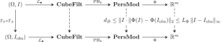

The computational stability bound explains how acquisition error can move a
persistence diagram:

$$
d_B\bigl(\operatorname{Dgm}(I),\operatorname{Dgm}(I_{\mathrm{obs}})\bigr)
\leq
\lceil\lambda\rceil L_I+\varepsilon_{\mathrm{rad}}.
$$

A deployed system, however, faces a different question. If performance has
deteriorated, is the dominant fault mechanical—alignment, interpolation,
resolution, or blur—or radiometric—illumination, response, quantisation, or
sensor noise?

The thesis treats this as a reliability-engineering problem, not only as a
classification problem. It pairs two deliberately low-dimensional probes
whose failure modes are expected to be complementary:

- a geometric probe based on global image moments; and
- a topological probe based on persistence diagrams.

The goal is not to claim that either representation is universally superior.
The goal is to make their disagreement informative.

::: {.callout-note title="A change of viewpoint"}
The earlier chapters asked whether a mathematical representation is stable.
The question is how two imperfect representations can be used together to
identify a likely failure mechanism. The logic is comparative:

1. compress each image into a small geometric vector and a small topological
   vector;
2. expose both vectors to controlled perturbations;
3. observe which representation loses useful information first; and
4. interpret the pattern using the known sensitivities of the two probes.

The phrase **control** here means a complementary measurement channel, not an
untreated group in a clinical trial.
:::

## From diagrams to vectors

A persistence diagram is a multiset whose cardinality varies from image to
image. Standard statistical models expect a vector in a fixed-dimensional
Euclidean space. A **vectorisation** is therefore a map

$$
\Phi\colon(\mathcal D,d_B)\longrightarrow(\mathbb R^m,\|\cdot\|_2).
$$

This is also the interface with neural networks. Although an image network can
accept a pixel tensor directly, a persistence diagram is an unordered,
variable-size collection of birth--death points. It cannot be passed unchanged
to an ordinary fixed-input layer. The map $\Phi$ converts the diagram into a
fixed list of numbers that can be used alone, concatenated with learned image
features, or supplied as an explicit topological channel.

The purpose is not to replace convolutional features categorically.
Convolutions describe local appearance extremely well, while persistent
homology explicitly describes multiscale connectivity and loops. The two
representations retain different information and can therefore be
complementary.

The vectorisation is a new mathematical stage and can destroy stability if it
amplifies small diagram changes.

::: {#thm-total-vector-stability name="Total computational stability after vectorisation"}
Suppose $\Phi$ is $L_\Phi$-Lipschitz:

$$
\|\Phi(\mathcal D)-\Phi(\mathcal D')\|_2
\leq L_\Phi d_B(\mathcal D,\mathcal D').
$$

Under the Aim-and-Shoot assumptions,

$$
\|\Phi(\operatorname{Dgm}I)
-\Phi(\operatorname{Dgm}I_{\mathrm{obs}})\|_2
\leq
L_\Phi\bigl(\lceil\lambda\rceil L_I+\varepsilon_{\mathrm{rad}}\bigr).
$$
:::

::: {.proof}
Apply the Lipschitz inequality for $\Phi$, then substitute the computational
stability bound for the bottleneck distance.
:::

{fig-alt="A four-column, two-row commutative diagram. The upper row begins with an ideal image and the lower row with an observed image. Both pass through cubical filtrations and persistence modules to Euclidean vectors. Vertical annotations give bottleneck and vector stability bounds." width=100%}

The top and bottom rows perform the same computation on two images. The
vertical comparisons are the stability guarantees: acquisition error first
bounds the separation between persistence modules and then, after applying
$\Phi$, bounds the Euclidean separation between the numerical feature
vectors.

The constant $L_\Phi$ is an amplification factor. A high-fidelity
vectorisation may retain more of the diagram, but its output can be more
sensitive. A coarse summary discards information, yet can offer a smaller,
more interpretable sensitivity envelope.

## The geometric control: Hu moments

Image moments are weighted averages of pixel coordinates. Before reading the
formulas, it helps to know what the lowest orders mean:

| Moment | Informal meaning |
|---|---|
| $M_{00}$ | total image mass or total intensity |
| $M_{10}/M_{00}$ | horizontal centre of mass |
| $M_{01}/M_{00}$ | vertical centre of mass |
| second- and third-order moments | spread, elongation, and asymmetry |

The indices $p$ and $q$ state how strongly horizontal and vertical coordinates
are weighted. The construction assumes $M_{00}\ne0$, as is the case for a
nonzero fundus image.

Let $I\colon\Omega\to\mathbb R$ be an image. Its raw moment of order $(p,q)$ is

$$
M_{pq}
=
\sum_{(x,y)\in\Omega}x^py^qI(x,y).
$$

The centroid is

$$
\bar x=\frac{M_{10}}{M_{00}},
\qquad
\bar y=\frac{M_{01}}{M_{00}}.
$$

Translation dependence is removed by the central moments

$$
\mu_{pq}
=
\sum_{(x,y)\in\Omega}
(x-\bar x)^p(y-\bar y)^qI(x,y),
$$

and scale is normalised by

$$
\eta_{pq}
=
\frac{\mu_{pq}}{\mu_{00}^{\,1+(p+q)/2}},
\qquad p+q\geq2.
$$

Hu's seven invariants $\phi_1,\ldots,\phi_7$ are polynomial combinations of
the normalised moments through order three [@hu1962visual]. In the continuous
idealisation they are invariant under translation, uniform scale, and
rotation. In computation, exact invariance is affected by sampling,
interpolation, finite precision, and boundary handling.

The explicit seven polynomials are lengthy and are not needed for the
stability comparison. What matters here is their design: centring removes
translation, normalisation removes uniform scale, and Hu's combinations remove
ideal continuous rotation. Readers interested primarily in topology may treat
the resulting seven numbers as a defined baseline descriptor.

Raw Hu invariants span many orders of magnitude. The thesis uses the
stabilised log transform

$$
h_i
=
-\operatorname{sgn}(\phi_i)
\log_{10}(|\phi_i|+\varepsilon),
\qquad i=1,\ldots,7.
$$

The resulting vector $\mathbf v_{\mathrm{geo}}\in\mathbb R^7$ is the
**mechanical control**. Its global spatial integration makes it comparatively
insensitive to ideal rigid motion, but changes to absolute intensity can alter
the mass integrals throughout the image.

::: {.callout-note title="A controlled comparison, not a theorem of universal robustness"}
Hu moments are not guaranteed to outperform topology under every mechanical
perturbation, and persistence is not guaranteed to outperform Hu moments under
every radiometric perturbation. The proposed roles are hypotheses about this
pipeline under a specified acquisition envelope. They must be tested rather
than assumed.
:::

## The topological control

This construction reuses the diagrams from the preceding chapters. No new
homology theory is being introduced; only a fixed-dimensional summary is
being chosen.

Each image produces three diagrams:

$$
\mathcal D_0,\qquad
\mathcal D_1,\qquad
\mathcal D_S,
$$

representing sublevel $H_0$, sublevel $H_1$, and inverted-image sublevel
$H_0$, respectively. The first two prioritise dark structures; the third
prioritises bright structures.

For finite persistences $p_1\geq p_2\geq\cdots$, define

$$
S_k(\mathcal D)=\sum_{i=1}^kp_i
$$

and, for a noise threshold $\tau\geq0$,

$$
E^\tau_{\mathrm{tot}}(\mathcal D)
=
\sum_{x\in\mathcal D}\max(0,\operatorname{pers}(x)-\tau).
$$

The topological feature vector is

$$
\mathbf v_{\mathrm{topo}}
=
\begin{pmatrix}
S_k(\mathcal D_0)\\
E^\tau_{\mathrm{tot}}(\mathcal D_0)\\
S_k(\mathcal D_1)\\
E^\tau_{\mathrm{tot}}(\mathcal D_1)\\
S_k(\mathcal D_S)\\
E^\tau_{\mathrm{tot}}(\mathcal D_S)
\end{pmatrix}
\in\mathbb R^6.
$$

It deliberately forgets location, orientation, and the detailed geometry of
individual features. What remains is the amount of persistent connectivity in
three physically interpretable channels.

### Stability of the summaries

::: {#lem-reliability-top-k name="Top-$k$ persistence is Lipschitz"}
If $d_B(\mathcal D,\mathcal D')\leq\delta$, then

$$
|S_k(\mathcal D)-S_k(\mathcal D')|
\leq2k\delta.
$$
:::

::: {.proof}
Under a bottleneck matching of cost at most $\delta$, matched birth and death
coordinates each move by at most $\delta$. Thus matched persistences differ by
at most $2\delta$. A point matched to the diagonal has persistence at most
$2\delta$, so regard a diagonal match as persistence zero. Match the $k$
persistences contributing to $S_k(\mathcal D)$ into $\mathcal D'$. Their
matched sum is at most $S_k(\mathcal D')$, while their total change is at most
$2k\delta$. Hence
$S_k(\mathcal D)\leq S_k(\mathcal D')+2k\delta$. Interchanging the diagrams
gives the reverse inequality and proves the result.
:::

For truncated total persistence, a global finite-domain bound can be stated in
terms of the maximum possible number $N_{\max}$ of diagram points:

::: {#lem-reliability-truncated name="Finite-domain stability of truncated total persistence"}
For diagrams generated on a fixed finite complex with at most $N_{\max}$
finite features,

$$
|E^\tau_{\mathrm{tot}}(\mathcal D)
-E^\tau_{\mathrm{tot}}(\mathcal D')|
\leq2N_{\max}\delta.
$$
:::

::: {.proof}
The scalar function $p\mapsto\max(0,p-\tau)$ is $1$-Lipschitz. Each matched
pair changes persistence by at most $2\delta$, and hence changes its truncated
contribution by at most $2\delta$. Express the difference of the two totals as
a sum over the bottleneck matching, assigning contribution zero to a diagonal
point. Every positive summand can be charged to a distinct off-diagonal point
of $\mathcal D$, so there are at most $N_{\max}$ of them; similarly, every
negative summand can be charged to a distinct point of $\mathcal D'$. The
total positive part and the magnitude of the total negative part are each at
most $2N_{\max}\delta$. Their difference therefore has absolute value at most
$2N_{\max}\delta$.
:::

This worst-case constant can be enormous for a high-resolution image. The
threshold $\tau$ is therefore operationally important: it suppresses
low-persistence “topological dust,” reducing the number of features that
actually contribute. The mathematical worst case and the effective operating
case should not be conflated.

::: {#prp-topological-vector-lipschitz name="Lipschitz constant of the six-dimensional topological vector"}
Let

$$
\delta
=
\max_{\ast\in\{0,1,S\}}
d_B(\mathcal D_\ast,\mathcal D_\ast').
$$

On a fixed finite complex,

$$
\|\mathbf v_{\mathrm{topo}}-\mathbf v_{\mathrm{topo}}'\|_2
\leq
2\sqrt{3(k^2+N_{\max}^2)}\,\delta.
$$
:::

::: {.proof}
For each of the three diagrams, one coordinate changes by at most
$2k\delta$ and the other by at most $2N_{\max}\delta$. Squaring the six
bounds, summing, and taking the square root gives

$$
\sqrt{3(2k\delta)^2+3(2N_{\max}\delta)^2}
=
2\sqrt{3(k^2+N_{\max}^2)}\,\delta.
$$
:::

## Why retain both sublevel and superlevel information?

In ideal continuous settings, duality theorems can relate complementary
sublevel and superlevel constructions. A finite digital image complicates that
argument:

- foreground and background connectivity cannot both be represented naively
  by the same adjacency convention;
- image boundaries are not automatically compactified;
- cubical and dual-cell conventions matter; and
- a mathematically dual representation can obscure physical meaning.

Even if a bright component could be represented indirectly by a dark
complementary loop, retaining $\mathcal D_S$ makes the feature interpretable as
a bright object. The six-dimensional vector therefore favours physical
legibility over minimal algebraic redundancy.

## The differential failure matrix

The probes are evaluated separately. “Pass” and “fail” mean that a probe
remains within or leaves a pre-specified validation envelope; they are not
medical labels.

Read the rows as the response of the geometric probe and the columns as the
response of the topological probe. A diagonal outcome says that the probes
agree; an off-diagonal outcome is useful precisely because their sensitivities
disagree.

| | Topology passes | Topology fails |
|---|---|---|
| **Geometry passes** | Both controls remain within their operating envelope, or the primary failure depends on a factor neither control measures | **Mechanical/Aim hypothesis:** interpolation damages connectivity while global moments remain usable |
| **Geometry fails** | **Radiometric/Shoot hypothesis:** structural ordering survives while absolute intensity integrals wash out | **Mixed or severe failure:** both acquisition mechanisms, or an unmodelled optical fault, may be active |

The matrix is a fault-isolation heuristic. It does not prove causation from one
observation. Its value depends on validation under controlled perturbations and
on calibrated pass/fail thresholds.

## The coarse-vectorisation hypothesis

Let $\Theta_\varepsilon$ be a degradation operator of magnitude
$\varepsilon$. The thesis asks whether the two vectorisations have asymmetric
performance decay:

- in a radiometric regime, $\mathbf v_{\mathrm{topo}}$ should decay more
  slowly than $\mathbf v_{\mathrm{geo}}$; and
- in an interpolation-heavy mechanical regime, $\mathbf v_{\mathrm{geo}}$
  should decay more slowly than $\mathbf v_{\mathrm{topo}}$.

This hypothesis is intentionally narrower than “topology is robust.” It
specifies the perturbation mechanism, the two concrete summaries, and the
classifier used to test their accessible information.

## Why use a linear probe?

A flexible classifier can learn around defects in a feature representation.
That is useful for prediction, but it confounds a study whose purpose is to
compare the representations themselves. The thesis therefore uses logistic
regression:

$$
\Pr(Y=1\mid x)
=
\frac{1}{1+\exp[-(w^\mathsf Tx+b)]}.
$$

The parameters are fitted by regularised negative log-likelihood. An
$\ell_2$ penalty is appropriate because the top-$k$ sum and truncated total
persistence are correlated but intentionally retained: one measures dominant
features, while the other measures broader feature mass.

A linear probe asks whether the vectorisation makes the relevant distinction
available to a hyperplane. It is not intended to establish the maximum
achievable diagnostic performance.

## Failure modes suggested by the theory

| Failure mode | Mechanism | Possible control |
|---|---|---|
| resolution reduction | smoothing lowers $L_I$, but excessive reduction aliases small lesions | validate an intermediate operating resolution |
| vignetting | spatially varying drift changes when peripheral features enter | flat-field or local contrast normalisation |
| lossy compression | artificial block gradients create extrema and short bars | prefer lossless image formats |
| homological shattering | interpolation fragments high-gradient vessels and loops | registration, acquisition control, and complementary geometric monitoring |

The table converts the inequality into engineering questions. It does not
replace empirical calibration: the constants and acceptable envelopes remain
device-, dataset-, and task-dependent.

::: {.callout-tip title="What to carry forward"}
Vectorisation is a lossy but necessary bridge from mathematical descriptors to
statistical models. The geometric and topological probes retain different
information, so neither is a universal reference standard. Their calibrated
pattern of agreement and disagreement is the proposed fault-isolation signal.
The retinal case study now tests that proposal on controlled data
perturbations.
:::

[Previous: Computational Stability](../computational-stability/index.qmd) ·
[Course contents](../index.qmd) ·
[Next: Retinal Diagnostics Case Study](../retinal-case-study/index.qmd)
