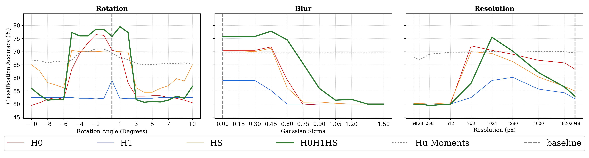
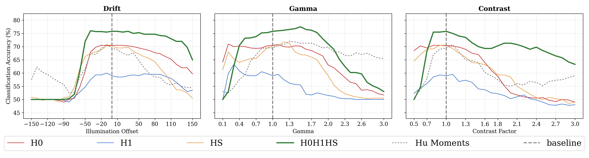
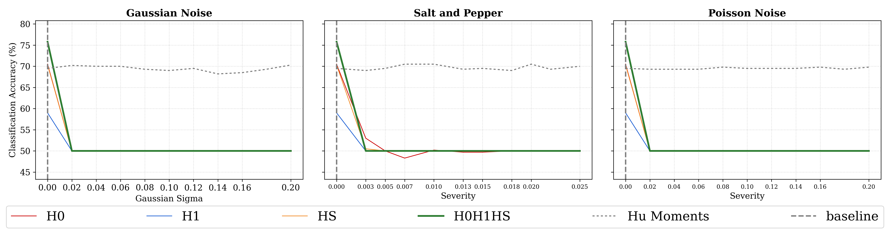
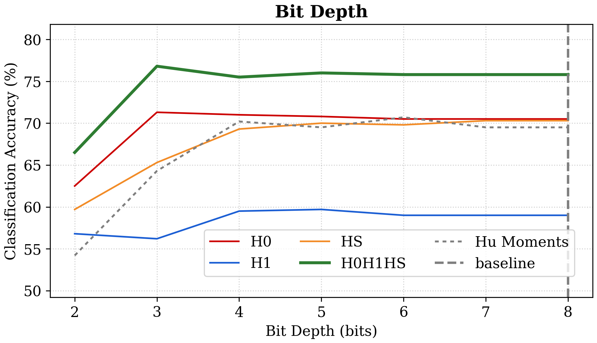

The thesis applies cubical persistent homology to retinal fundus images. The
goal is not to present a clinical diagnostic system, but to study a narrower
reliability question, using the FIVES image dataset and building on earlier
retinal applications of topological data analysis
[@jin2022fives; @garside2019topological]:

> When image-based performance deteriorates, can complementary mathematical
> probes help distinguish spatial acquisition failure from radiometric failure?

::: {.callout-warning title="Scope"}
This is a mathematical and computational case study, not medical advice or a
validated clinical device.
:::

::: {.callout-note title="Structure of the case study"}
The analysis separates four questions that are easily conflated:

1. **Representation:** which mathematical features are extracted?
2. **Prediction:** how well do those features separate the two study groups
   on clean data?
3. **Robustness:** how much does that performance change under a controlled
   corruption?
4. **Fault isolation:** do the geometric and topological probes fail in the
   pattern predicted by the acquisition model?

A high clean accuracy does not by itself establish robustness, and robustness
on these synthetic perturbations does not establish clinical validity.
:::

## Why retinal images?

Fundus photographs contain structures at several scales:

- connected dark regions such as haemorrhagic features;
- bright connected regions such as exudative features; and
- vascular structures capable of forming loops.

![Schematic retinal anatomy, comparing a healthy fundus with annotated diabetic-retinopathy features. Adapted from Figure 1 of Malhi, Grewal, and Pannu under CC BY 4.0 [@malhi2023detection]. The diagram supplies anatomical orientation; it does not assert that every labelled lesion is uniquely recoverable from homology.](../assets/retinal-anatomy-comparison.png){fig-alt="Two labelled schematic retinas: the healthy eye marks the fovea, macula, optic disc, and vessels, while the diabetic-retinopathy eye marks haemorrhage, abnormal vessel growth, aneurysm, cotton-wool spot, and hard exudates." width=94%}

They are naturally represented as intensity functions on a cubical grid.
Dimensions zero and one have direct structural interpretations:

$$
H_0\longleftrightarrow\text{connected components},
\qquad
H_1\longleftrightarrow\text{loops}.
$$

These correspondences describe image morphology, not a one-to-one mapping
between a homology class and a lesion. A component or loop may also arise from
normal anatomy, acquisition artefacts, preprocessing, or the image boundary.

![A concrete FIVES image with zoomed examples of a red blob-like region and vascular loops [@jin2022fives]. These annotations motivate the \(H_0/H_1\) vocabulary, but they are visual examples rather than labelled generators of the computed homology groups.](../assets/retinal-blobs-loops.png){fig-alt="A diabetic-retinopathy fundus image with two magnified regions, one circling a red blob and the other circling several vascular loops." width=88%}

## Dataset and cohort

The FIVES dataset contains retinal fundus photographs and vessel annotations
across several diagnostic groups [@jin2022fives]. The thesis restricts its
sensitivity audit to the Normal and Diabetic Retinopathy groups. The official
partitions are pooled into a balanced cohort of $N=400$ images:

$$
200\text{ Normal}
\qquad\text{and}\qquad
200\text{ Diabetic Retinopathy}.
$$

Evaluation uses stratified five-fold cross-validation. Pooling and
repartitioning serve the narrow robustness experiment: every degradation is
compared against the same balanced baseline folds rather than against
differences inherited from an external train/test split. This design is not a
claim about how a clinical model should ultimately be validated.

### Preprocessing

The baseline scalar image is the green channel. Contrast Limited Adaptive
Histogram Equalisation (CLAHE) is applied to reduce local illumination
variation while limiting the amplification of noise. The same preprocessing
definition must be applied consistently to clean and perturbed data; otherwise
the experiment would mix acquisition sensitivity with a changing
preprocessing pipeline.

The study uses:

- $k=5$ in every top-$k$ persistence sum;
- truncation threshold $\tau=5$ for truncated total persistence;
- $\mathbb F_2$ coefficients;
- sublevel $H_0$ and $H_1$ diagrams; and
- an inverted-image sublevel $H_0$ diagram for bright structures.

These are experimental design parameters, not universal constants. Changing
the bit depth, intensity normalisation, resolution, or acquisition device
changes their physical meaning.

## Three persistence streams

The pipeline constructs three diagrams from each image:

1. $\mathcal D_0$: sublevel $H_0$ features for dark components;
2. $\mathcal D_1$: sublevel $H_1$ features for dark loops;
3. $\mathcal D_S$: superlevel $H_0$ features for bright components.

The superlevel stream is implemented as a sublevel filtration of the inverted
image. Keeping it separate preserves the physical interpretation of bright and
dark structures.

![Illustrative topological signatures from two FIVES images [@jin2022fives]. Rows compare the original RGB image with its green channel; columns show sublevel \(H_0\), sublevel \(H_1\), and bright-feature superlevel \(H_0\), with a barcode above the corresponding persistence diagram. The examples demonstrate the representation pipeline, not a diagnostic rule or a claim that one diagram identifies disease.](../assets/retinal-barcodes-diagrams.png){fig-alt="Two retinal images, each shown in colour and green-channel form, beside columns of persistence barcodes and persistence diagrams for connected components, loops, and bright components." width=100%}

The figure makes two otherwise abstract choices concrete. First, passing from
RGB to the green channel changes the scalar function being filtered and hence
changes the resulting signatures. Second, each persistence stream contains
many intervals; the vectorisation below compresses those variable-size
collections into a fixed number of numerical inputs.

## Stable topological summaries

For a diagram $\mathcal D$, order the finite persistences

$$
p_1\geq p_2\geq\cdots\geq0.
$$

::: {#def-retinal-summaries name="Persistence summaries"}
The **top-$k$ persistence sum** is

$$
S_k(\mathcal D)=\sum_{i=1}^k p_i.
$$

If $d_B(\mathcal D,\mathcal D')\leq\delta$, then

$$
|S_k(\mathcal D)-S_k(\mathcal D')|
\leq2k\delta.
$$

The **$\tau$-truncated total persistence** removes a noise floor:

$$
E^\tau_{\mathrm{tot}}(\mathcal D)
=
\sum_{(b,d)\in\mathcal D}
\max(0,d-b-\tau).
$$
:::

::: {#prp-truncated-stability name="Stability of truncated total persistence"}
Let $\mathcal D$ and $\mathcal D'$ be finite persistence diagrams with
$d_B(\mathcal D,\mathcal D')\leq\delta<\tau/2$. Write
$N_a(\mathcal D)$ for the number of points of persistence greater than $a$.
Then

$$
\left|
E^\tau_{\mathrm{tot}}(\mathcal D)
-E^\tau_{\mathrm{tot}}(\mathcal D')
\right|
\leq
2\delta\left(
N_{\tau-2\delta}(\mathcal D)
+N_{\tau-2\delta}(\mathcal D')
\right).
$$
:::

::: {.proof}
Choose a bottleneck matching of cost arbitrarily close to $\delta$. Matched
points have birth and death coordinates differing by at most $\delta$, so
their persistences differ by at most $2\delta$. Since
$p\mapsto\max(0,p-\tau)$ is $1$-Lipschitz, each relevant matched pair changes
the truncated contribution by at most $2\delta$.

A point matched to the diagonal has persistence at most $2\delta<\tau$ and
therefore contributes zero. A matched pair can contribute only if at least
one of its points has persistence greater than $\tau$; the other then has
persistence greater than $\tau-2\delta$. The displayed count is an upper
bound on the number of such pairs. Summing their contributions proves the
inequality.
:::

The thesis combines these statistics into the six-dimensional vector

$$
\mathbf v_{\mathrm{topo}}
=
\begin{pmatrix}
S_k(\mathcal D_0)\\
E^\tau_{\mathrm{tot}}(\mathcal D_0)\\
S_k(\mathcal D_1)\\
E^\tau_{\mathrm{tot}}(\mathcal D_1)\\
S_k(\mathcal D_S)\\
E^\tau_{\mathrm{tot}}(\mathcal D_S)
\end{pmatrix}.
$$

This vector intentionally discards spatial location and focuses on persistent
connectivity.

## An orthogonal geometric control

The comparison vector uses seven log-transformed Hu invariant moments. Raw
moments are spatial intensity sums
[@hu1962visual]

$$
M_{pq}
=
\sum_{(x,y)\in\Omega}
x^p y^q I(x,y).
$$

Central and scale-normalised moments produce seven classical combinations
$\phi_1,\ldots,\phi_7$. Their dynamic range is stabilised by

$$
h_i
=
-\operatorname{sgn}(\phi_i)
\log_{10}(|\phi_i|+\varepsilon).
$$

Hu moments are designed to be invariant under translation, scale, and
rotation in the continuous setting. Their global intensity integration makes
them a useful complement to the topological vector:

- geometry is comparatively robust to spatial motion;
- topology is comparatively robust to some intensity-order changes;
- their failures need not coincide.

## Differential failure matrix

The two probes form a simple fault-isolation heuristic.

| | Topology passes | Topology fails |
|---|---|---|
| **Geometry passes** | Operational envelope or an unmodelled factor | Mechanical issue: interpolation or alignment damages connectivity |
| **Geometry fails** | Radiometric issue: structural order survives intensity washout | Catastrophic or mixed failure |

This matrix does not diagnose disease. It diagnoses disagreement between
measurement channels under controlled perturbations.

## Sensitivity audit

The thesis trains simple linear probes on clean baseline features and evaluates
them under structured transformations:

- rotation;
- blur;
- resolution reduction;
- illumination drift;
- contrast and gamma changes;
- bit-depth reduction;
- Gaussian, Poisson, and salt-and-pepper noise.

The evaluation uses stratified cross-validation and tracks the change in probe
performance relative to baseline. The emphasis is failure behaviour rather
than maximum classification accuracy.

The critical isolation control is **train on clean, test on corrupt**. Within
each fold, the scaler and logistic-regression probe are fitted only on clean
training features. The fitted objects are then applied without retraining to
the clean validation images and to every perturbed version of those same
images. Consequently, a performance drop cannot be hidden by adaptation to the
corruption.

### Perturbation protocols

| Family | Protocol | Range used in the thesis | Mechanism |
|---|---|---:|---|
| mechanical | rotation | $-10^\circ$ to $10^\circ$ | bilinear resampling |
| mechanical | Gaussian blur | $\sigma=0$ to $1.5$ | local spatial averaging |
| mechanical | resolution | $64$ to $2048$ pixels | area resize and resampling |
| radiometric | gamma | $0.1$ to $3.0$ | nonlinear response |
| radiometric | contrast | $0.5$ to $3.0$ | linear scaling about mid-grey |
| radiometric | drift | $-150$ to $150$ | clipped additive offset |
| radiometric | Gaussian noise | $0$ to $0.2$ | additive stochastic corruption |
| radiometric | Poisson noise | $0$ to $0.2$ | shot/read-noise model |
| radiometric | salt-and-pepper | probability up to $0.025$ | impulse corruption |
| radiometric | bit depth | $2$ through $8$ bits | uniform quantisation |

The ranges intentionally extend beyond mild degradation. The goal is to find
where each probe breaks, not merely to report performance near the baseline.

### Robustness gap

For a perturbation $\Theta_\varepsilon$, define

$$
\Delta(\varepsilon)
=
\operatorname{Acc}
\bigl(\Phi_{\mathrm{topo}}\circ\Theta_\varepsilon\bigr)
-
\operatorname{Acc}
\bigl(\Phi_{\mathrm{geo}}\circ\Theta_\varepsilon\bigr).
$$

A positive gap means that the topological probe outperforms the geometric
probe at that perturbation; a negative gap means the reverse. The sign is
interpreted only relative to the baseline and the controlled protocol. It is
not, by itself, a statistical test or a causal diagnosis.

### Clean baseline

Mean five-fold accuracies reported in the public-edition thesis are:

| Probe | Dimension | Baseline accuracy |
|---|---:|---:|
| Log-Hu geometry | 7 | 70.7% |
| sublevel $H_1$ summary | 2 | 70.3% |
| sublevel $H_0$ summary | 2 | 81.7% |
| bright-feature $H_S$ summary | 2 | 85.7% |
| combined $H_0H_1H_S$ topology | 6 | 86.7% |

Thus $\Delta(0)=16.0$ percentage points for the combined topological and
geometric probes. Because their baseline accuracies differ, raw accuracy
difference must be interpreted with care: a probe that starts higher has more
room to fall. The stability curves and threshold crossings are therefore more
informative than one isolated gap value.

::: {.callout-tip title="How to read the stress-test plots"}
Read each curve relative to its own value at the clean operating point. The
important questions are:

1. how rapidly does the curve depart from baseline?
2. is the response gradual, abrupt, or terrace-like?
3. at what perturbation does it cross the pre-specified operating threshold?
4. does the complementary probe cross at the same point?

The plots compare representations under distribution shift. They should not be
read as a leaderboard of universally superior feature extractors.
:::

{fig-alt="Two accuracy plots comparing homology feature streams, their combination, and Hu moments under image rotation and illumination drift." width=92%}

That two-panel comparison isolates the headline contrast. The following
figures widen the view: first across the mechanical family, then across the
radiometric family. They use the same vertical quantity and legend, so the
curves should be compared with their own clean baselines rather than by colour
alone.

{fig-alt="Three classification-accuracy plots for rotation, Gaussian blur, and image resolution."}

Mechanical perturbations resample or mix spatial neighbours. Radiometric
perturbations below primarily alter values on the existing grid.

{fig-alt="Three classification-accuracy plots for illumination offset, gamma, and contrast factor."}

## Main observations

The experiments support a deliberately asymmetric picture:

- **Off-grid rotation and resampling:** topological connectivity can degrade
  sharply through interpolation, while global geometric moments remain more
  stable.
- **Blur and resolution change:** narrow loops and components may merge or
  vanish, again stressing the topological probe.
- **Contrast and illumination changes:** persistence summaries can retain
  structural ordering after global intensity integrals begin to wash out.
- **Bit depth:** the topological probe exhibits a terrace-like plateau across
  moderate quantisation before eventual collapse.
- **Stochastic noise:** many local extrema create topological dust; truncation
  helps, but sufficiently strong noise degrades the topological probe.

Stochastic noise is radiometric in physical origin but can resemble a
mechanical failure algebraically: it disrupts local ordering, creates extrema,
and fragments persistence pairings. In the reported audit, Hu moments average
much of the zero-mean fluctuation over the image, whereas the topological probe
approaches chance rapidly.

{fig-alt="Three accuracy plots showing probe behaviour under Gaussian, Poisson, and salt-and-pepper noise."}

Noise and quantisation are both radiometric, but their signatures differ.
Noise creates many local extrema, whereas quantisation merges nearby intensity
levels. The next plot therefore exhibits terraces rather than the same
noise-driven fragmentation.

{fig-alt="Classification accuracy versus bit depth for three homology streams, their combination, and Hu moments." width=75%}

These are operational findings on a particular pipeline and dataset, not
universal properties of every topological or geometric representation.

## Empirical failure matrix

For the thesis audit, approximate empirical pass thresholds were set at 80%
accuracy for the combined topological probe and 65% for the geometric probe.
Those choices populate the matrix as follows:

| | Topology pass ($\geq80\%$) | Topology fail ($<80\%$) |
|---|---|---|
| **Geometry pass ($\geq65\%$)** | clean baseline; quantisation at three bits or more | rotation around $3^\circ$ or more; moderate blur; sufficiently strong stochastic noise |
| **Geometry fail ($<65\%$)** | strong positive drift; low contrast in the reported envelope | extreme negative drift; severe blur; mixed information loss |

These thresholds are descriptive results of this cohort and implementation.
They require external validation before they can be treated as operating
limits. In particular, accuracy estimates from five folds are correlated, and
the table does not supply confidence intervals or a prospective device study.

## Reproducibility

The public project code is available at
[github.com/reyjosephnieto/ph](https://github.com/reyjosephnieto/ph).

A responsible reproduction should record:

- dataset version and cohort construction;
- preprocessing and channel selection;
- adjacency and boundary conventions;
- filtration direction;
- coefficient field;
- persistence truncation parameters;
- cross-validation splits; and
- every perturbation parameter.

## What the case study contributes

The central contribution is a way of reasoning about failure:

$$
\text{physical acquisition}
\longrightarrow
\text{discrete intensity error}
\longrightarrow
\text{diagram displacement}
\longrightarrow
\text{feature displacement}.
$$

The Aim-and-Shoot bound explains how error propagates. The differential matrix
uses complementary probes to interpret which part of the acquisition process
is likely responsible.

## Limitations and future directions

The thesis suggests several next steps:

- validate the failure matrix prospectively on images acquired under measured
  physical perturbations rather than only software corruptions;
- test transfer across cameras, clinics, and image modalities;
- estimate uncertainty for quadrant assignments rather than using hard
  accuracy cut-offs alone;
- replace the global graph-gradient bound with tighter spatially varying or
  operator-aware estimates;
- investigate persistent cohomology or representative cycles for localisation
  of a detected defect; and
- determine whether an intermediate resolution can reliably suppress sensor
  noise without aliasing small lesions.

The reported interior optimum near $1024$ pixels is especially
dataset-dependent. It motivates a resolution study; it does not establish a
general optimal resolution for retinal imaging.

::: {.callout-tip title="What to retain from the case study"}
The experiment is an illustration of the mathematical chain developed in the
course, not a clinical endpoint. It shows that a representation can be stable
under one perturbation mechanism and fragile under another; that preprocessing
and vectorisation are part of the stability question; and that complementary
failure modes can be more informative than a single clean-data accuracy.
:::

[Previous: Reliability Engineering](../reliability-engineering/index.qmd) ·
[Course contents](../index.qmd) ·
[Advanced: Functoriality and Triangulation](../functoriality-triangulation/index.qmd)
