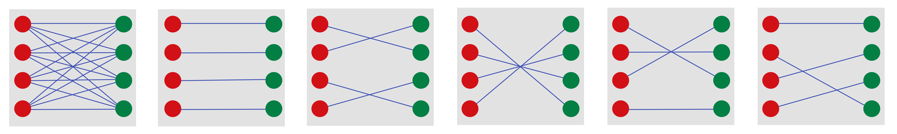
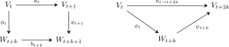
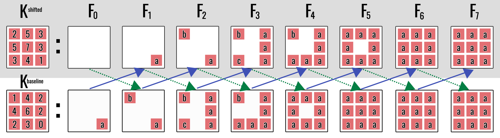
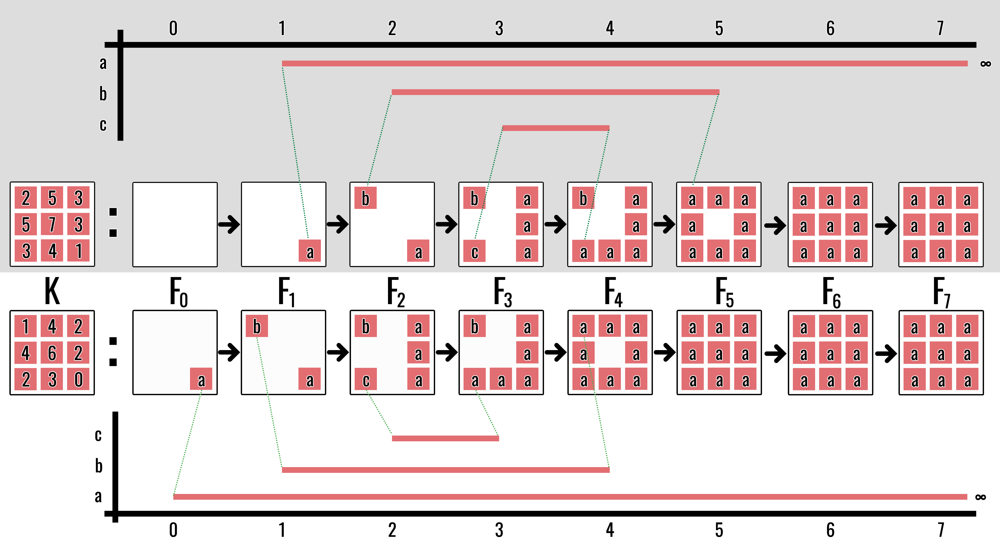

Persistent homology is useful only if small perturbations of the input do not
produce arbitrarily large changes in the output. Stability makes that
requirement precise [@cohen2005stability; @lesnick2015theory].

::: {.callout-note title="The argument before the formalism"}
There are three objects and two output descriptions:

$$
\text{functions}
\xrightarrow{\text{persistent homology}}
\text{modules}
\xrightarrow{\text{interval decomposition}}
\text{diagrams}.
$$

- $\|f-g\|_\infty$ measures the largest input-value change.
- $d_I$ measures how far two persistence modules must be shifted to map into
  one another.
- $d_B$ measures the largest displacement required to match their diagram
  points.

The isometry theorem says $d_I=d_B$. Shifted inclusions of sublevel sets then
show that both are at most $\|f-g\|_\infty$. The definitions below make these
three sentences precise.
:::

## Matching persistence diagrams

Let $\mathcal D$ and $\mathcal D'$ be persistence diagrams. A matching pairs
their points, allowing unmatched points to be paired with the diagonal

$$
\Delta=\{(x,x):x\in\mathbb R\}.
$$

The distance from $(b,d)$ to the diagonal under $d_\infty$ is

$$
\frac{d-b}{2}.
$$

Thus, deleting a low-persistence feature is cheap, while deleting a
long-persistence feature is expensive.

For example, the point $(2,8)$ has persistence $6$ and lies distance $3$
from the diagonal: its closest diagonal point is $(5,5)$. Matching it to the
diagonal means treating the whole interval as absent in the other diagram, so
the cost is half its lifespan.

{fig-alt="Red and green feature sets connected by several possible bipartite matchings."}

## Bottleneck distance

::: {#def-bottleneck name="Bottleneck distance"}
The **bottleneck distance** is

$$
d_B(\mathcal D,\mathcal D')
=
\inf_\gamma
\sup_{x\in\mathcal D\cup\Delta}
\lVert x-\gamma(x)\rVert_\infty,
$$

where $\gamma$ ranges over matchings between the diagrams augmented by the
diagonal.

The objective is minimax: choose a matching that minimises the largest movement
of any feature.
:::

In plain language, try every admissible pairing, record the cost of its worst
pair, and choose the pairing with the smallest such worst cost. The
$\sup$ selects the worst pair within one matching; the $\inf$ selects the best
matching. The diagonal is treated as having unlimited copies so several short
features may independently be matched away.

## Interleavings

Persistence modules require an algebraic distance. A shift by
$\varepsilon\geq0$ moves a module forward:

$$
(V[\varepsilon])_t=V_{t+\varepsilon}.
$$

An interleaving compares two evolving objects whose clocks may be slightly out
of synchronisation. If every event in $V$ can be represented in $W$ after
waiting at most $\varepsilon$, and conversely, then the modules are
$\varepsilon$-interleaved. The round-trip requirement prevents arbitrary maps
from erasing information: going across and back must equal ordinary evolution
for $2\varepsilon$ units of time.

![The thesis's “comb” model of a shift. Sliding the lower module left by \(k\) aligns \(W_{n+k}\) with \(V_n\); the vertical teeth then represent the components of a map \(V\to W[k]\). Compatibility requires neighbouring teeth to respect motion along both modules.](../assets/interleaving-combs.png){fig-alt="Two horizontal persistence-module combs, one red and one green, with the green comb shifted left so corresponding teeth align." width=96%}

::: {#def-interleaving name="Interleaving"}
Two modules $V$ and $W$ are **$\varepsilon$-interleaved** when there are
compatible maps

$$
V\to W[\varepsilon],
\qquad
W\to V[\varepsilon]
$$

whose round trips agree with the internal shifts by $2\varepsilon$.

The **interleaving distance** $d_I(V,W)$ is the infimum over all such
$\varepsilon$.
:::

For a digital image, the natural index range is finite. A shift could move
beyond the largest intensity value, so we **constantly extend** a filtration:
after its final index, it remains equal to its terminal complex forever. The
associated persistence module is extended by identity maps. This convention
makes every forward shift well-defined without changing any finite birth or
death.

In the discrete case, a $k$-interleaving consists of maps

$$
\phi_t\colon V_t\to W_{t+k},
\qquad
\psi_t\colon W_t\to V_{t+k}
$$

satisfying two kinds of conditions. The **parallelogram relations**

$$
b_{t+k}\phi_t=\phi_{t+1}a_t,
\qquad
a_{t+k}\psi_t=\psi_{t+1}b_t
$$

say that the cross-module maps respect evolution through time. The
**triangle relations**

$$
\psi_{t+k}\phi_t=a_{t\to t+2k},
\qquad
\phi_{t+k}\psi_t=b_{t\to t+2k}
$$

say that a round trip through the other module is exactly the same as waiting
$2k$ steps inside the original module.

The triangle relations are the essential conservation law. A long-lived class
cannot be sent to a short-lived noise feature: if it vanished during the
round trip, the composite would be zero even though the internal $2k$-shift
map is nonzero.

{fig-alt="Side-by-side commutative diagrams. On the left, a square compares consecutive maps in V and shifted W. On the right, a triangle maps V at time t through W at time t plus k to V at time t plus two k, equal to the direct internal map." width=88%}

In the square, the two routes compare “advance one step, then cross” with
“cross, then advance one step.” In the triangle, the diagonal two-stage route
through the other module must equal the direct horizontal evolution within
the original module.

{fig-alt="Two rows of image filtrations connected by alternating diagonal arrows."}

::: {.callout-note title="Optional algebraic checkpoint"}
The next two results explain exactly why a zero interleaving means identical
barcode information and how ranks count intervals. They are useful for a
complete algebraic picture, but the main stability argument can be followed
by proceeding directly to the isometry theorem.
:::

::: {#cor-zero-interleaving name="Zero interleaving and equality of barcodes"}
For finite interval-decomposable persistence modules $V$ and $W$, the
following are equivalent:

1. $V$ and $W$ are $0$-interleaved;
2. $V$ and $W$ are isomorphic as persistence modules;
3. $V$ and $W$ have the same barcode; and
4. their rank invariants agree:
   $\operatorname{rank}(V_i\to V_j)=\operatorname{rank}(W_i\to W_j)$ for all
   $i\leq j$.
:::

::: {.proof}
For $k=0$, the triangle relations say that $\psi_t\phi_t$ and
$\phi_t\psi_t$ are identity maps, so the interleaving maps are componentwise
inverse module isomorphisms. Isomorphic modules have the same interval
decomposition by uniqueness.

For an interval decomposition, the rank of $V_i\to V_j$ is the number of
intervals containing the whole index range $[i,j]$. Thus the barcode determines
the rank invariant. Conversely, interval multiplicities can be recovered from
the rank invariant by finite differences, so equal rank invariants give the
same barcode. Finally, a shared interval decomposition gives a module
isomorphism and hence a zero interleaving.
:::

::: {#lem-persistent-rank name="Fundamental lemma of persistent homology"}
For $i\leq j$, the persistent Betti number is

$$
\beta_{i\to j}
=
\#\{[b,d)\in\operatorname{Bar}(V):b\leq i\leq j<d\}.
$$
:::

::: {.proof}
Decompose $V$ into interval modules. The map
$I^{[b,d)}_i\to I^{[b,d)}_j$ has rank one precisely when both indices lie in
the interval, equivalently $b\leq i\leq j<d$; otherwise it has rank zero.
Ranks add over direct sums, so the rank of $V_i\to V_j$ counts exactly those
intervals.
:::

::: {#thm-isometry name="Isometry theorem"}
For pointwise finite-dimensional one-parameter persistence modules,

$$
d_I(V,W)=d_B(\operatorname{Dgm}V,\operatorname{Dgm}W).
$$

The algebraic and geometric comparisons describe the same amount of
displacement.
:::

::: {.proof-sketch}
By the structure theorem, decompose both modules into interval modules. Two
interval modules are $\varepsilon$-interleaved precisely when their endpoint
pairs are within $\varepsilon$ in the $\ell_\infty$ metric, with a short
interval allowed to match the diagonal. Direct sums of such interval
interleavings correspond exactly to diagram matchings. Minimising the largest
interval cost on either side therefore gives the same value. The full theorem
for the standard class of persistence modules is due to the algebraic
stability/isometry theory [@cohen2005stability; @lesnick2015theory].
:::

## The stability theorem

The word **tame** below is a finiteness condition ensuring that the persistence
diagram is well behaved. For the finite cubical filtrations of digital images,
this condition is automatic. Both functions must be defined on the same
domain so that $|f(x)-g(x)|$ can be compared point by point.

::: {#thm-sublevel-stability name="Stability of sublevel-set persistence"}
Let $f,g\colon X\to\mathbb R$ be tame functions on the same domain. For each
homological dimension $k$,

$$
\boxed{
d_B\bigl(\operatorname{Dgm}_k(f),
\operatorname{Dgm}_k(g)\bigr)
\leq
\lVert f-g\rVert_\infty
}
$$
:::

This is the central stability theorem for sublevel-set persistent homology.

If every function value changes by at most $\varepsilon$, no persistence
feature needs to move by more than $\varepsilon$ in bottleneck distance.

The proof has one geometric step and one algebraic step. The pointwise
inequality produces shifted inclusions of sublevel sets; functoriality turns
those inclusions into an interleaving. No direct matching of individual holes
is required.

::: {.proof}
Put $\varepsilon=\lVert f-g\rVert_\infty$. Then

$$
\lVert f-g\rVert_\infty\leq\varepsilon.
$$

Then for every $x$,

$$
f(x)\leq t
\quad\Longrightarrow\quad
g(x)\leq t+\varepsilon.
$$

Therefore,

$$
X_t(f)\subseteq X_{t+\varepsilon}(g).
$$

By symmetry,

$$
X_t(g)\subseteq X_{t+\varepsilon}(f).
$$

These shifted inclusions induce an $\varepsilon$-interleaving of the
persistence modules. The isometry theorem converts that interleaving into the
bottleneck bound.
:::

## Uniform intensity shifts

First consider an \(\mathbb R\)-indexed filtration with no clipping at a
fixed intensity boundary. If $g=f+c$, then every birth and death shifts by
$c$:

$$
(b,d)\longmapsto(b+c,d+c).
$$

Persistence lengths remain unchanged:

$$
(d+c)-(b+c)=d-b.
$$

This is why some persistence summaries are insensitive to a uniform change in
brightness even though the diagram moves.

An actual 8-bit image adds a boundary effect. Values are constrained to
\([0,255]\), so applying a shift and clipping can destroy the exact
translation relation near \(0\) or \(255\). The following retinal example
shows both behaviours: most endpoints move coherently, while features meeting
the boundary can be truncated.

![A uniform negative illumination drift applied to a FIVES image [@jin2022fives]. The \(H_0\) and \(H_1\) barcode endpoints shift towards lower thresholds; clipping at the intensity boundary can truncate features, so the finite 8-bit experiment is not merely an unconstrained translation of \(\mathbb R\).](../assets/illumination-drift-barcodes.png){fig-alt="A retinal image and its darkened version, each shown beside H zero and H one barcodes whose endpoints shift left after illumination drift." width=78%}

A toy filtration makes the translation mechanism visible cell by cell. Adding
one to every intensity delays the appearance of every cell by one filtration
step. The shapes and interval lengths agree after that index shift; only their
positions on the filtration axis change.

{fig-alt="Two rows show a small numbered pixel array, its cubical filtration stages, and corresponding red barcodes, with matching events linked between the baseline and shifted rows." width=100%}

## Stable summaries

Machine-learning models require vectors rather than multisets of diagram
points. A vectorisation

$$
\Phi:(\mathcal D,d_B)\to(\mathbb R^m,\lVert\cdot\rVert)
$$

should itself be Lipschitz:

$$
\lVert\Phi(\mathcal D)-\Phi(\mathcal D')\rVert
\leq
L_\Phi d_B(\mathcal D,\mathcal D').
$$

Otherwise, an unstable post-processing step can destroy the guarantee supplied
by persistent homology.

This is an important change of codomain. Stability of the diagram does not
automatically imply stability of every statistic computed from it. The map
$\Phi$ must be analysed just as the persistent-homology map was analysed.

::: {#prp-top-k-stability name="Stability of the top-$k$ persistence sum"}
If $S_k(\mathcal D)$ is the sum of the $k$ largest finite
persistences, then

$$
|S_k(\mathcal D)-S_k(\mathcal D')|
\leq
2k\,d_B(\mathcal D,\mathcal D').
$$

Each matched interval changes length by at most twice the bottleneck movement.
:::

::: {.proof}
Let $\delta>d_B(\mathcal D,\mathcal D')$ and choose a matching of cost at most
$\delta$. If $(b,d)$ is matched to $(b',d')$, then

$$
|(d-b)-(d'-b')|
\leq |d-d'|+|b-b'|
\leq2\delta.
$$

Matching to the diagonal obeys the same inequality because its cost is half
the persistence. Take the $k$ intervals contributing to $S_k(\mathcal D)$
and follow their matches in $\mathcal D'$, treating a diagonal match as
persistence zero. Their matched total is at most
$S_k(\mathcal D')$, because $S_k(\mathcal D')$ is the largest sum obtainable
from $k$ persistences in $\mathcal D'$. Hence

$$
S_k(\mathcal D)
\leq S_k(\mathcal D')+2k\delta.
$$

Interchanging the two diagrams gives the reverse inequality. Therefore
$|S_k(\mathcal D)-S_k(\mathcal D')|\leq2k\delta$. Letting
$\delta\downarrow d_B(\mathcal D,\mathcal D')$ proves the claim.
:::

## The theorem's limitation

Stability is only as meaningful as the input distance. On an ideal continuous
domain, a small geometric motion may be harmless. On a sampled pixel grid,
rotation or rescaling requires interpolation and can create a large
$\lVert f-g\rVert_\infty$ error.

The theorem has not failed. Rather, the acquisition pipeline has turned a
small physical movement into a large change of the discrete intensity
function. The next chapter analyses this gap.

### When a true theorem gives a vacuous bound

Suppose an 8-bit image has a dark vessel with intensity near $0$ against a
background near $255$. Moving the image by one pixel can compare a vessel
pixel in the original with a background pixel in the resampled image. Then

$$
\|f-g\|_\infty\approx255.
$$

But no finite feature in an 8-bit filtration can have persistence greater than
the dynamic range. The stability conclusion $d_B\leq255$ therefore excludes
almost nothing: the bound is mathematically correct but operationally
uninformative.

This distinction is central to the thesis. Algebraic stability controls
changes in function values on a common domain. It does not say that a small
physical camera motion produces a small supremum-norm change after sampling.
The next chapter opens that black box by decomposing acquisition into spatial
and radiometric mechanisms.

::: {.callout-tip title="What to carry forward"}
The practical stability chain is

$$
\text{small sup-norm input change}
\Longrightarrow
\text{small interleaving}
\Longrightarrow
\text{small bottleneck distance}.
$$

It is a one-sided guarantee: the output cannot move more than the bound, but
it may move much less. A large bound does not prove instability; it says only
that the theorem has become uninformative. The next chapter investigates when
sampling and acquisition make that happen.
:::

## Exercises

1. Compute the distance from $(2,8)$ to the diagonal.
2. If $\lVert f-g\rVert_\infty\leq3$, what bottleneck bound follows?
3. Show the two sublevel-set inclusions used in the proof.
4. Explain why adding a constant preserves persistence lengths.
5. Why must a diagram vectorisation be checked for stability separately?

[Previous: Persistent Homology](../persistent-homology/index.qmd) ·
[Course contents](../index.qmd) ·
[Next: Computational Stability](../computational-stability/index.qmd)
