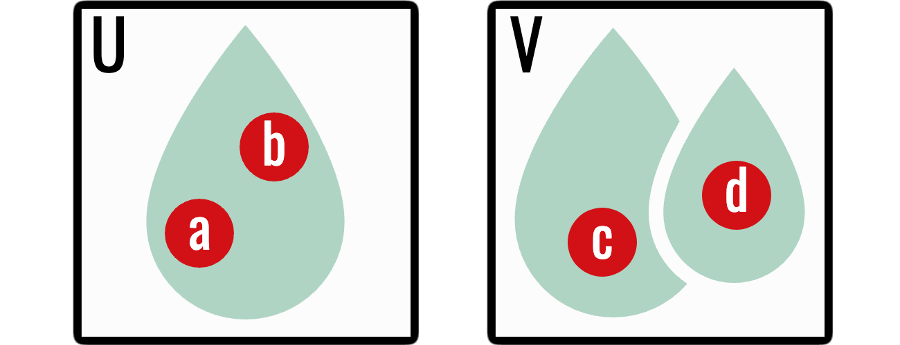
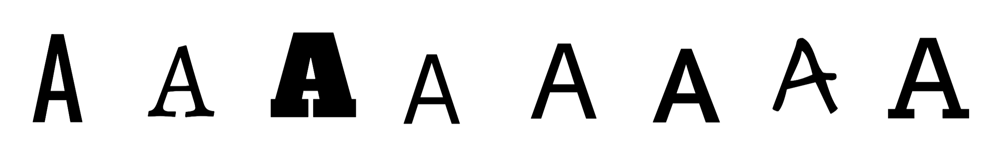
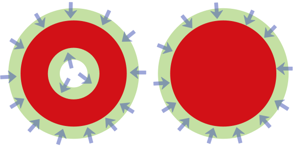

A metric tells us exactly how far apart two points are. Topology keeps less
information: it records which points are near one another without retaining
the numerical distance. This deliberate loss of information is useful. A
circle can be stretched into an ellipse without changing the property we care
about—namely, that it has one connected component and encloses one hole
[@munkres2000topology].

::: {.callout-note title="What changes from the previous chapter?"}
In a metric space, “near” is expressed by a number such as
$d(x,y)<\varepsilon$. In a topological space, nearness is expressed by
membership in open sets. The chapter therefore follows this progression:

1. retain open neighbourhoods but forget their radii;
2. define continuity by requiring open conditions to pull back to open
   conditions;
3. compare spaces by homeomorphism and then by the weaker relation of
   homotopy equivalence; and
4. isolate connected components and holes, the features homology will later
   compute.

The topology axioms may initially look detached from images. Their role is to
state exactly which deformations preserve the qualitative notion of shape.
:::

## Topologies

::: {#def-topology name="Topology"}
Let $X$ be a set. A **topology** on $X$ is a collection $\mathcal T$ of subsets
of $X$ satisfying three axioms:

1. $\varnothing,X\in\mathcal T$;
2. any union of members of $\mathcal T$ belongs to $\mathcal T$; and
3. any finite intersection of members of $\mathcal T$ belongs to $\mathcal T$.

The pair $(X,\mathcal T)$ is a **topological space**, and the members of
$\mathcal T$ are its **open sets**.
:::

The asymmetry between arbitrary unions and finite intersections matters.
Intersecting infinitely many open sets need not produce an open set. For
example,

$$
\bigcap_{n=1}^{\infty}\left(-\frac1n,\frac1n\right)=\{0\},
$$

and $\{0\}$ is not open in the usual topology on $\mathbb R$.

### Three instructive topologies

On any set $X$:

- $\{\varnothing,X\}$ is the **indiscrete topology**;
- the power set $\mathcal P(X)$ is the **discrete topology**; and
- if $X$ is a metric space, its open balls generate the
  **metric-induced topology**.

The indiscrete topology distinguishes as little as possible. The discrete
topology distinguishes every subset. Most spaces encountered in computational
topology lie between these extremes.

## Bases

Listing every open set is often impractical. A **basis** is a collection
$\mathcal B$ of open building blocks such that every open set is a union of
members of $\mathcal B$.

In a metric space $(X,d)$, the open balls

$$
\mathcal B=\{B_\varepsilon(x):x\in X,\ \varepsilon>0\}
$$

form a basis. This is the precise sense in which a metric produces a topology.
Once the open sets are known, the exact radii can be forgotten.

## Continuous maps

Let $(X,\mathcal T_X)$ and $(Y,\mathcal T_Y)$ be topological spaces. A function
$f\colon X\to Y$ is **continuous** if

$$
f^{-1}(U)\in\mathcal T_X
\qquad\text{for every }U\in\mathcal T_Y.
$$

Continuity is expressed using inverse images: an open condition in the target
must pull back to an open condition in the source.

For example, take $f(x)=x^2$ on $\mathbb R$ and the open target interval
$U=(1,4)$. Its inverse image is

$$
f^{-1}(U)=(-2,-1)\cup(1,2),
$$

which is open. Notice that $f^{-1}(U)$ means “all inputs whose outputs land
in $U$”; it does not require $f$ to have an inverse function. This distinction
removes a common source of confusion in the topological definition.

When the topologies come from metrics, this definition is equivalent to the
$\varepsilon$–$\delta$ definition from the previous chapter. The topological
definition is more general because it does not require a distance function.

Two basic facts are worth keeping:

- the identity map $\operatorname{id}_X$ is continuous; and
- a composition of continuous maps is continuous.

These facts make continuous maps suitable as the structure-preserving arrows
of topology.

::: {#prp-continuous-composition name="Composition preserves continuity"}
If $f\colon X\to Y$ and $g\colon Y\to Z$ are continuous, then
$g\circ f\colon X\to Z$ is continuous.
:::

::: {.proof}
Let $U$ be open in $Z$. Since $g$ is continuous, $g^{-1}(U)$ is open in $Y$.
Since $f$ is continuous,

$$
(g\circ f)^{-1}(U)=f^{-1}\bigl(g^{-1}(U)\bigr)
$$

is open in $X$. This is exactly the definition of continuity of $g\circ f$.
:::

## Homeomorphisms

A map $f\colon X\to Y$ is a **homeomorphism** if it is bijective, continuous,
and has a continuous inverse. If such a map exists, we write $X\cong Y$ and
say that the spaces are homeomorphic.

A homeomorphism may bend or stretch a space, but it cannot tear points apart
or glue distinct points together. Consequently:

- a circle and an ellipse are homeomorphic;
- the intervals $(0,1)$ and $\mathbb R$ are homeomorphic; but
- a circle and a closed interval are not homeomorphic.

Homeomorphic spaces have the same topological properties. However,
homeomorphism is often stricter than computational topology needs.

::: {#prp-rigid-homeomorphism name="Rigid motions give homeomorphisms"}
If $X\subseteq\mathbb R^n$ and $\psi(x)=Rx+\mathbf t$ is a rigid motion, then
$X$ and $\psi(X)$ are homeomorphic.
:::

::: {.proof}
The rigid-motion calculation in the previous chapter shows that $\psi$ is
continuous and distance-preserving. Its restriction
$\psi|_X\colon X\to\psi(X)$ is bijective with continuous inverse
$y\mapsto R^\mathsf T(y-\mathbf t)$. Hence it is a homeomorphism.
:::

This is the clean continuous model behind rotation and translation invariance.
For an actual digital image, transformed points usually no longer lie on the
original integer grid. Interpolation then changes intensity values, so the
sampled image need not be related to the original by a cubical isomorphism.

## Connectedness and paths

A space $X$ is **disconnected** if it can be written as

$$
X=U\cup V,
$$

where $U$ and $V$ are disjoint, nonempty, open subsets of $X$. Otherwise,
$X$ is **connected**.

A **path** from $x$ to $y$ is a continuous map

$$
\gamma\colon[0,1]\to X
$$

with $\gamma(0)=x$ and $\gamma(1)=y$. If every pair of points can be joined by
a path, then $X$ is **path-connected**.

{fig-alt="A connected green region containing two points joined by a curved path, beside two disjoint green regions containing one point each." width=82%}

::: {#thm-path-connected name="Path-connected spaces are connected"}
Every path-connected topological space is connected.
:::

::: {.proof}
Suppose $X$ is path-connected but disconnected. Then
$X=U\cup V$ for disjoint nonempty open sets $U,V$. Choose $u\in U$ and
$v\in V$, and let $\gamma\colon[0,1]\to X$ be a path from $u$ to $v$.
The sets $\gamma^{-1}(U)$ and $\gamma^{-1}(V)$ are disjoint, nonempty, open
subsets of $[0,1]$ whose union is $[0,1]$. This disconnects the interval,
contradicting the connectedness of $[0,1]$. Hence $X$ is connected.
:::

The fact that $[0,1]$ is connected is the topological form of the
intermediate value theorem from calculus: a continuous path cannot travel
from one side of a separation to the other without taking intermediate
values. We use that standard result here rather than interrupting the main
argument with a second proof.

Path-connected spaces are connected, although the converse can fail. For
finite graphs and the cubical complexes built from images, path-connectedness
usually matches the intuitive idea of belonging to the same component.

The number of connected components will later become the zeroth Betti number
$\beta_0$.

## Homotopy

Continuity describes one map. A **homotopy** describes a continuous deformation
between two maps.

There are now three levels of comparison:

| Comparison | What must agree? |
|---|---|
| equality | every point and every coordinate |
| homeomorphism | the spaces agree up to continuous bending and stretching |
| homotopy equivalence | only their large-scale topological shape must agree |

Each step deliberately forgets more geometry. Homology is designed to be
unchanged at the weakest level in this table.

Let $f,g\colon X\to Y$ be continuous. A homotopy from $f$ to $g$ is a
continuous function

$$
H\colon X\times[0,1]\to Y
$$

such that

$$
H(x,0)=f(x),
\qquad
H(x,1)=g(x).
$$

We then write $f\simeq g$. The parameter $t\in[0,1]$ represents time: at
$t=0$ we see $f$, at $t=1$ we see $g$, and the intermediate maps describe the
deformation.

![A family of intermediate paths visualising a homotopy from $f$ to $g$. Adapted from a public-domain Wikimedia diagram [@archibald2009-homotopy].](../assets/homotopy.png){fig-alt="A fabric-like family of curves continuously deforming three coloured paths from one side to the other." width=75%}

::: {#prp-homotopy-equivalence-relation name="Homotopy of maps is an equivalence relation"}
For fixed spaces $X$ and $Y$, homotopy is an equivalence relation on the set
of continuous maps $X\to Y$.
:::

::: {.proof}
For reflexivity, the constant-in-time homotopy $H(x,t)=f(x)$ shows
$f\simeq f$. For symmetry, if $H$ is a homotopy from $f$ to $g$, then
$\widetilde H(x,t)=H(x,1-t)$ is a homotopy from $g$ to $f$.

For transitivity, suppose $H$ deforms $f$ to $g$ and $G$ deforms $g$ to $h$.
Define

$$
K(x,t)=
\begin{cases}
H(x,2t),&0\leq t\leq\tfrac12,\\
G(x,2t-1),&\tfrac12\leq t\leq1.
\end{cases}
$$

The two formulas agree at $t=\tfrac12$ because
$H(x,1)=g(x)=G(x,0)$. The pasting lemma therefore makes $K$ continuous, and
$K$ is a homotopy from $f$ to $h$.
:::

### Homotopy equivalence

Spaces $X$ and $Y$ are **homotopy equivalent** if there are continuous maps

$$
f\colon X\to Y,
\qquad
g\colon Y\to X
$$

such that

$$
g\circ f\simeq\operatorname{id}_X,
\qquad
f\circ g\simeq\operatorname{id}_Y.
$$

Homotopy equivalence is weaker than homeomorphism. A filled disc is not
homeomorphic to a point, but it is homotopy equivalent to one: the disc can be
continuously contracted to its centre.

::: {#def-contractible name="Contractible space"}
A space \(X\) is **contractible** if it is homotopy equivalent to a one-point
space. Equivalently, its identity map is homotopic to a constant map:

$$
\operatorname{id}_X\simeq c_p,
\qquad
c_p(x)=p
$$

for some \(p\in X\).
:::

{fig-alt="A sequence of five green shapes becoming progressively simpler and smaller until only a point remains." width=72%}

::: {#prp-homeomorphism-homotopy name="Every homeomorphism is a homotopy equivalence"}
If $f\colon X\to Y$ is a homeomorphism, then $X$ and $Y$ are homotopy
equivalent.
:::

::: {.proof}
Let $g=f^{-1}$. Then
$g\circ f=\operatorname{id}_X$ and
$f\circ g=\operatorname{id}_Y$. Equality is stronger than homotopy: each
identity map is homotopic to itself through the constant-in-time homotopy.
Thus $f$ and $g$ are homotopy inverses.
:::

In particular, the rigid motions considered earlier preserve homotopy type.
The continuous theory therefore regards rotation and translation as harmless;
the later computational-stability chapter studies what changes when the
transformed image must be resampled on a pixel grid.

{fig-alt="Several differently styled capital letter A glyphs."}

::: {.callout-important title="What topology will count"}
Homology is a homotopy invariant. It ignores thickness, angle, and precise
position, but detects features such as connected components, loops, and
enclosed voids.
:::

## Deformation retracts

Let $A\subseteq X$. A **retraction** is a continuous map $r\colon X\to A$ that
fixes every point of $A$. If the identity on $X$ can be homotoped to the
inclusion followed by $r$ while keeping $A$ fixed, then $A$ is a
**deformation retract** of $X$.

A thick annulus deformation retracts onto its central circle. This is why
topology treats a thick loop and a thin loop as having the same essential
shape.

{fig-alt="Three red subspaces inside green neighbourhoods, with arrows indicating continuous collapse from the green region onto the red core." width=68%}

::: {#prp-deformation-retract name="A deformation retract is a homotopy equivalence"}
If $A$ is a deformation retract of $X$, then the inclusion
$i\colon A\hookrightarrow X$ is a homotopy equivalence.
:::

::: {.proof}
Let $r\colon X\to A$ be the retraction. Because $r$ fixes $A$,
$r\circ i=\operatorname{id}_A$. By the definition of deformation retract,
$i\circ r\simeq\operatorname{id}_X$. Thus $i$ and $r$ satisfy the two
conditions for a homotopy equivalence.
:::

## Why abstraction helps computation

Digital data are never perfectly geometric. Sampling, resolution, and noise
alter exact coordinates and distances. A useful descriptor should not change
merely because a curve is drawn a little thicker or shifted slightly.

Topology provides this tolerance by asking qualitative questions:

- How many pieces are there?
- Which cycles surround genuine gaps?
- Which features survive as a threshold changes?

The remaining chapters turn those questions into finite algebra.

::: {.callout-tip title="What to carry forward"}
You do not need to manipulate arbitrary topologies in the later computational
chapters. Retain four ideas:

- a metric produces open sets;
- continuity preserves topological structure;
- connected components are the first features we want to count; and
- homotopy equivalence formalises “the same shape after continuous
  deformation.”

The next chapter returns to finite objects by encoding pixel adjacency with
graphs.
:::

## Exercises

1. Verify that $\{\varnothing,\{a\},\{a,b\}\}$ is a topology on
   $X=\{a,b\}$.
2. List all open sets in the discrete topology on $\{a,b,c\}$.
3. Show that a constant map between topological spaces is continuous.
4. Explain why a homeomorphism is automatically a homotopy equivalence.
5. Give an informal deformation retraction from a filled square to its centre.

[Previous: Metric Spaces](../metric-spaces/index.qmd) ·
[Course contents](../index.qmd) ·
[Next: Graphs and Digital Images](../graphs-digital-images/index.qmd)
