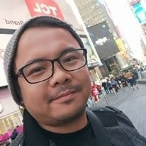

::: {.home-intro}
::: {.home-intro-copy}
Hi, I’m Rey Joseph “RJ” Nieto.

I am a mathematician and university instructor with a First Class Honours BSc
in Mathematics from the [University of Bristol](https://www.bristol.ac.uk/). I
currently teach mathematics and information technology at Bulacan State
University (BulSU) in the Philippines.

Alongside my teaching, I am undertaking structured independent study in
dynamical systems, functional analysis, and measure theory and probability.
This supports my continuing research in topology-informed computer vision,
where I am studying the reliability of measurements derived from retinal
images and possible applications in biomedical and industrial imaging.

More than two decades ago, I first studied mathematics formally at UP Diliman,
but left before completing the degree because of financial hardship.

Before returning to mathematics, I worked in journalism, broadcasting, public
affairs, technical writing, and government communications.
:::

::: {.home-intro-photo}
{.profile-photo fig-alt="Portrait of Rey Joseph RJ Nieto"}
:::
:::

## Teaching

Course materials for general education subjects [Mathematics in the Modern
World](teaching/bulsu/math-modern-world/index.qmd) and [Living in the IT
Era](teaching/bulsu/living-it-era/index.qmd), which I teach at BulSU.

[Teaching materials](teaching/index.qmd){.btn .btn-primary}
[MMW 101](teaching/bulsu/math-modern-world/index.qmd){.btn .btn-outline-primary}
[MST 101d](teaching/bulsu/living-it-era/index.qmd){.btn .btn-outline-primary}

## Research

My final-year project began as a topology-informed classifier for diabetic
retinopathy. During testing, a simulated rotation of roughly three degrees
drove the topology-based version close to chance performance. Rather than set
that failure aside, I changed direction and studied whether the different ways
mathematical measurements respond to blur, rotation, resolution changes, and
sensor noise could help identify what had happened to an image.

The work used cubical persistent homology, a computable but conservative
stability bound, and a parallelised Python pipeline to examine retinal images
under simulated acquisition errors.

I am now returning to a question left open by that project: whether the effects
of sampling and interpolation on a pixel grid can be described more precisely
than the conservative general bound used in the thesis. I am also examining
whether the contrasting responses of topological and geometric measurements
can help distinguish different degradation signatures. This is ongoing
research; I am not assuming in advance that either question will yield a new
theorem.

[Current research](research/index.qmd){.btn .btn-primary}
[View the repo](https://github.com/reyjosephnieto/ph){.btn .btn-outline-primary target="_blank" rel="noopener"}
[View thesis PDF](https://github.com/reyjosephnieto/ph/blob/main/Nieto_TDA_Public_20260430.pdf){.btn .btn-outline-primary target="_blank" rel="noopener"}

## Professional Background

My earlier career spans journalism, broadcasting, public affairs, government
communications, and digital publishing.

[View my CV](cv/index.qmd){.btn .btn-primary}
[LinkedIn profile](https://www.linkedin.com/in/reyjosephnieto/){.btn .btn-outline-primary}
