My current research asks a practical question: when an image is blurred,
rotated, resized, poorly exposed, or corrupted by sensor noise, how does the
information extracted by a computer change? I want to understand whether the
pattern of those changes can help identify what went wrong during acquisition.

## The initial motivation

My interest in retinal imaging has a personal origin in an experience with
diabetic retinopathy. It led me to take a particular interest in the reliability
of retinal-image analysis.

::: {#fig-dr-visual-field}
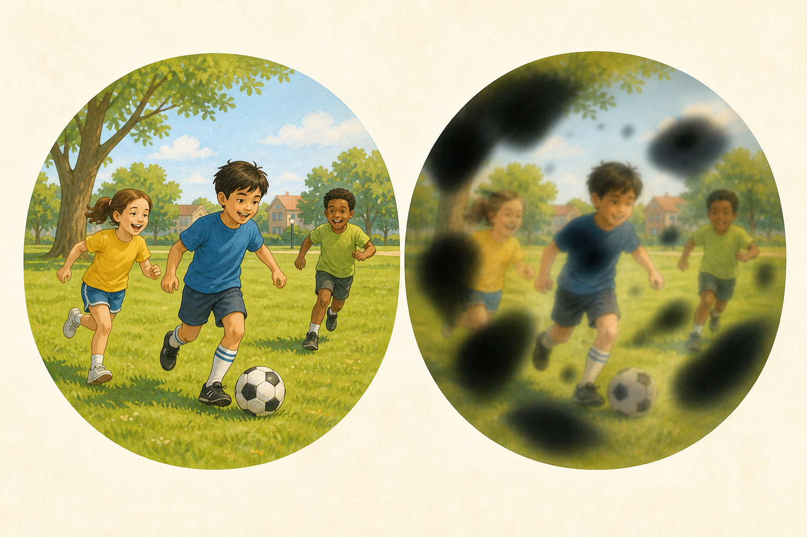{fig-alt="Two illustrated views of the same children playing football in a park, as if seen by a parent. The first is clear. The second is blurred and partly obscured by soft dark patches and floaters to suggest one possible experience of sight loss associated with advanced diabetic retinopathy." width="100%"}

An illustration of what is at stake: being able to see ordinary moments as children grow up. The second view represents one possible experience of sight loss associated with advanced diabetic retinopathy. The condition usually has no noticeable symptoms at first, and its later effects on vision vary. This is an explanatory illustration, not a clinical simulation. See the [NHS overview of diabetic retinopathy](https://www.nhs.uk/conditions/diabetic-retinopathy/){target="_blank" rel="noopener"}.
:::

The NHS Diabetic Eye Screening Programme shows why this problem matters.
Fundus photographs are assessed against defined
[feature-based criteria](https://www.gov.uk/government/publications/diabetic-eye-screening-retinal-image-grading-criteria){target="_blank" rel="noopener"}
within a structured
[grading and referral pathway](https://www.gov.uk/government/publications/diabetic-eye-screening-pathway-requirements-specification/diabetic-eye-screening-pathway-requirements-specification){target="_blank" rel="noopener"}.
Trained graders inspect the images, uncertain or referable findings receive
further review, and people who may need treatment are referred for clinical
assessment.

::: {#fig-retinal-motivation}
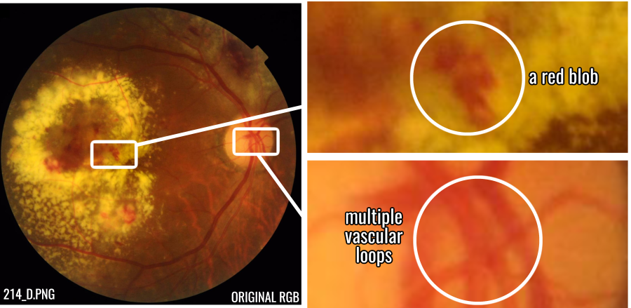{fig-alt="A colour retinal fundus photograph with two boxed regions enlarged alongside it. One enlargement marks a red lesion as a connected blob; the other marks several loops in the retinal vasculature." width="92%"}

A diabetic-retinopathy fundus image, annotated for my thesis to enlarge a connected lesion and examples of vascular loops. Source: image `214_D` from the [FIVES fundus-image dataset](https://doi.org/10.1038/s41597-022-01564-3){target="_blank" rel="noopener"}; reused and adapted under [CC BY 4.0](https://creativecommons.org/licenses/by/4.0/){target="_blank" rel="noopener"}.
:::

As the number of people requiring screening grows, so does the grading
workload. Expanding trained grading capacity also takes time. The UK National
Screening Committee is therefore
[reviewing automated retinal-image analysis](https://nationalscreening.blog.gov.uk/2026/05/11/uk-nsc-consults-on-use-of-artificial-intelligence-in-the-diabetic-eye-screening-programme/){target="_blank" rel="noopener"}
as a possible way to triage images before human grading, although it does not
currently recommend introducing automated grading into the programme. A
conservative role for such systems is to support trained graders and clinical
teams by handling suitable routine images and flagging abnormal, uncertain, or
ungradable cases for human review. The research question is what mathematical
and technical assurances would be needed before that assistance could be
trusted at screening scale.

The same concern with reliability has a second practical direction: more
informative quality checks and fault investigation in medical or industrial
imaging systems. Some faults might eventually be assessed remotely before a
specialist travels onsite. This is a direction for the research, not a
capability of the present work.

### How the project changed direction

My original intention was to produce a topology-informed classifier for
diabetic retinopathy. Classifiers of this kind already existed, but reproducing
and extending established work would still have been a useful objective for a
four-month undergraduate project.

The direction changed during ablation testing, when I deliberately subjected
the images to individual forms of degradation. A simulated rotation of roughly
three degrees was enough to drive the selected topology-based classifier close
to chance performance. That raised a practical question: what value would the
classifier have if a slight change in the subject's head alignment could cause
it to fail? The topological vectors were highly sensitive to rotation and
other mechanical changes that required the image to be resampled.
Interpolation on the pixel grid could create or destroy topological features
even when the underlying subject had changed very little. My
[undergraduate thesis](https://github.com/reyjosephnieto/ph/blob/main/Nieto_TDA_Public_20260430.pdf){target="_blank" rel="noopener"}
described this behaviour as *grid shattering*.

::: {#fig-grid-shattering}
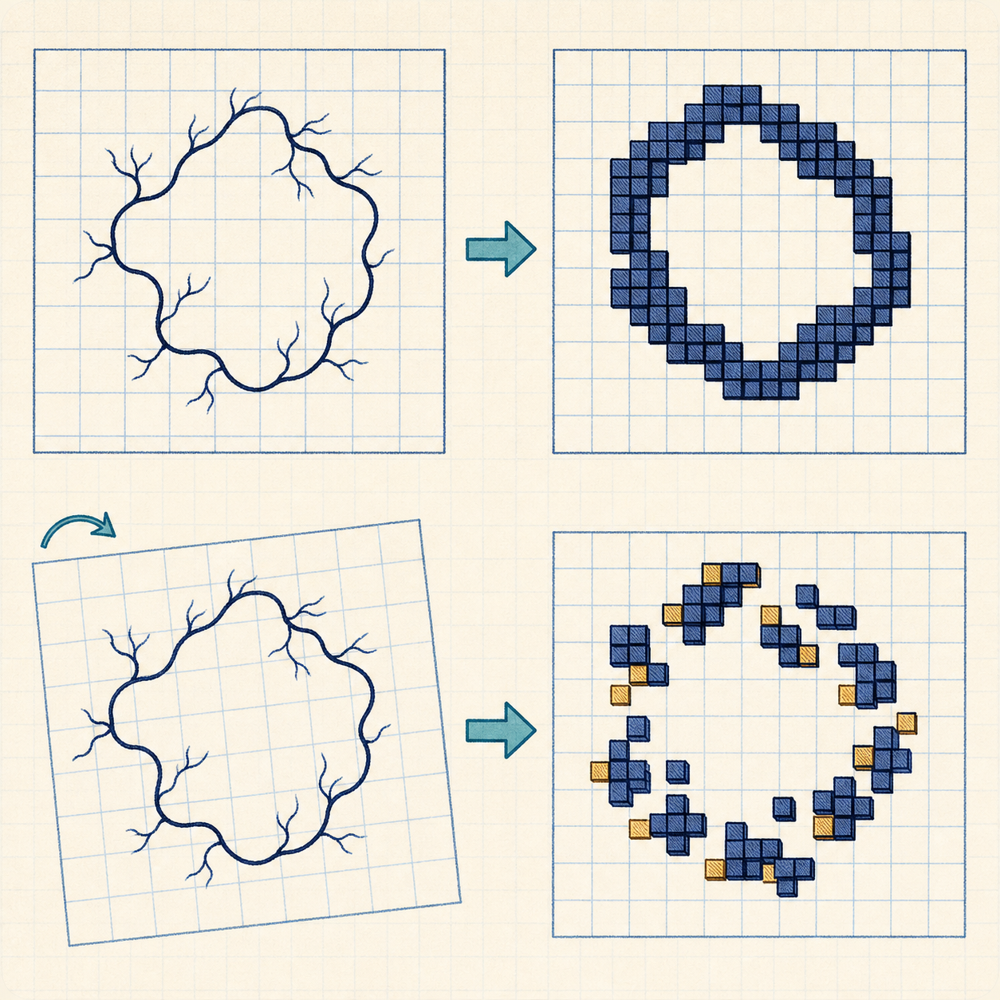{fig-alt="Four-panel schematic of a continuous retinal vascular loop and its sampled pixel representation. When aligned, the sampled pixels retain an intact loop. After a slight rotation and resampling, the same underlying vascular structure becomes fragmented on the pixel grid." width="100%"}

A schematic DR-related vascular loop used to illustrate grid shattering. Above, alignment with the sampling grid preserves one cubical loop. Below, a small rotation followed by resampling fragments the pixel representation and destroys the detected loop, even though the underlying continuous vascular structure has not changed.
:::

Once the ablation tests exposed this limitation, the project changed direction.
Instead of treating the result as an inconvenience to the proposed classifier,
I made it part of the research question and asked whether the contrasting
failure behaviour could itself be useful.

In my thesis experiments, the same topological summaries were comparatively
robust under several photometric changes, including exposure drift and
quantisation, although not under every form of noise. Log-transformed Hu
moments, which are geometric descriptors based on an image's overall shape,
showed a broadly reverse profile: they were comparatively strong under
mechanical transformations but weaker under changes in intensity. Instead of
asking either representation to serve as the classifier by itself, I treated
them as two complementary, or “orthogonal”, controls.

Their contrasting failure profiles became the Differential Failure Matrix. It
was designed to test whether signatures associated with alignment and
resampling could be distinguished from signatures associated with radiometric
degradation. The final project was therefore not the classifier I had
originally planned. It treated an apparent weakness of the cubical-persistence
pipeline as a possible signal for a coarse fault-isolation heuristic. The code
and supporting material are available in the project's [GitHub repository](https://github.com/reyjosephnieto/ph){target="_blank" rel="noopener"}.

### Why I am returning to it

The thesis was completed over four months. That was enough to establish and
test the framework, but not to exhaust the questions it raised. The
decomposition was descriptive and produced a suggestive empirical pattern, but
it was mathematically coarse: its stability bound was conservative, and the
final fault-isolation stage necessarily relied in part on empirical thresholds
and heuristics. Time did not permit a deeper investigation of those mechanisms.

In a biomedical setting, a promising experimental result is not enough. The
intended use, assumptions, limitations, performance, and possible failure
modes of a method must be described and validated. My purpose in returning to
the mathematics is to understand the underlying mechanisms more fully and to
determine whether the heuristic parts of the pipeline can be replaced,
constrained, or justified by stronger mathematical and empirical support. The
longer-term aim is a pipeline whose assumptions and failure modes are more
transparent and therefore easier to examine in technical and regulatory
review. This is not a claim that the present work is a clinically validated or
regulator-approved system.

Retinal imaging remains the immediate problem, and similar acquisition issues
arise in industrial inspection and other computer-vision systems. My earlier
experiments were confined to retinal images, so industrial applications remain
a direction for further work.

From July to December 2026, I am spending 20 weeks developing the mathematical
tools needed to investigate the questions raised by that earlier work. This is
independent study, organised around a research problem rather than a set of
separate textbook courses.

I have found that I learn mathematics most effectively when abstract ideas
serve a concrete task. The programme is designed accordingly: each strand must
help clarify a real problem, sharpen an argument, or show why a proposed
approach cannot work.

## The three cores of the work

The project brings together three complementary cores. Algebraic topology
supplies structural measurements of an image. Category theory provides the
formal connections between stages of the mathematical pipeline. Statistical
machine learning tests whether the resulting measurements remain useful under
controlled changes to the image.

:::: {.study-topic}
::: {.study-topic-image}
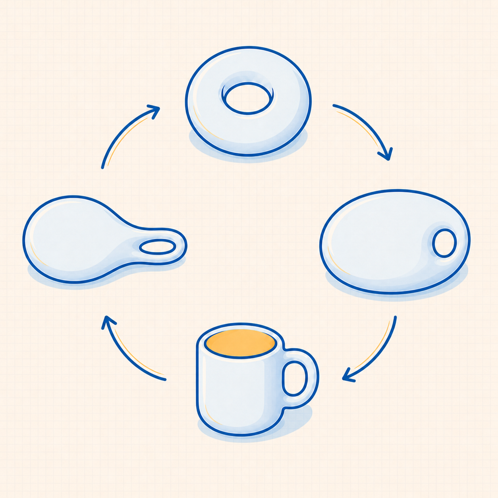{.study-topic-art fig-alt="Four-stage cartoon cycle showing a ring-shaped doughnut being compressed into a coffee mug and stretched back into the original doughnut, with one hole preserved throughout."}
:::
::: {.study-topic-copy}
### Structural Core: Algebraic Topology

Algebraic topology turns questions about shape into algebraic summaries of
features such as connected pieces, loops, and voids. Persistent homology then
records when those features appear, how long they remain, and when they
disappear as an image is examined at different thresholds.

Digital images have a natural cubical structure because pixels and voxels lie
on a regular grid. Cubical and simplicial homology are related ways of
representing the topology of that structure, rather than one being a subset of
the other. Under suitable constructions, a compatible triangulation can
relate the two representations while preserving the topology under study.
:::
::::

:::: {.study-topic}
::: {.study-topic-image}
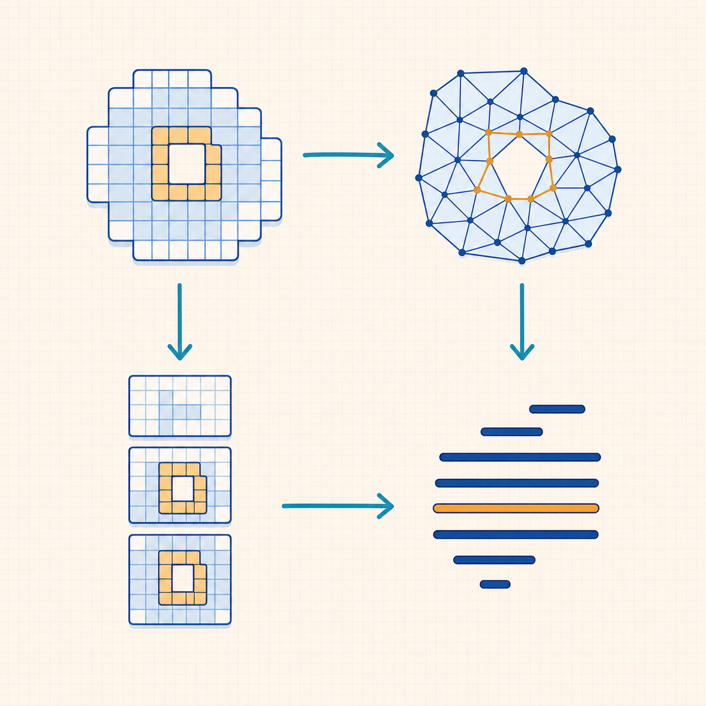{.study-topic-art fig-alt="Commuting-square illustration connecting a cubical grid and its triangulation to a filtered sequence and a persistence barcode, with the same loop preserved along both routes."}
:::
::: {.study-topic-copy}
### Formal Core: Category Theory

Category theory provides a language for mathematical structures and the maps
between them. A filtration is not merely a collection of thresholded images:
inclusion maps connect its stages, and homology carries those relationships
into the linear maps that form a persistence module.

In my thesis, a standard construction called Coxeter--Freudenthal--Kuhn (CFK)
triangulation connected the cubical geometry of pixels to the simplicial
setting used in much of the established theory. Expressing that bridge and the
subsequent operations as functors made it possible to state precisely when
simplicial stability results could be applied in the cubical setting.
:::
::::

:::: {.study-topic}
::: {.study-topic-image}
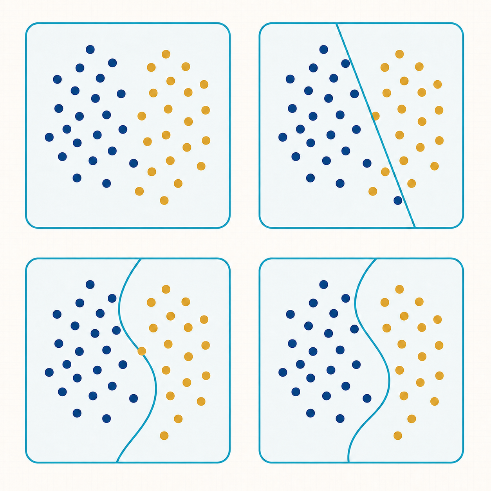{.study-topic-art fig-alt="Four-panel illustration showing a decision boundary developing from no boundary, through a straight line and an initial curve, to a smooth curve separating two groups of points."}
:::
::: {.study-topic-copy}
### Experimental Core: Statistical Machine Learning

Statistical machine learning provides the experimental probes. In my thesis,
simple classifiers were trained on topological or geometric summaries and then
tested on deliberately degraded images. Changes in their performance made the
response of each representation observable.

In this role, a classifier is also a measuring instrument. The immediate aim
is not to claim state-of-the-art diagnostic accuracy, but to compare failure
patterns under stated perturbations.
:::
::::

## The current mathematical question

The immediate question is whether changes introduced by sampling and
resampling can be bounded more precisely when a digital image is treated on
its native cubical grid.

Persistent homology already has a substantial stability theory: in broad
terms, a small change in the function used to examine an image leads to a
controlled change in its persistence diagram. This general result is
important, but it does not by itself explain every practical failure in an
image-analysis pipeline. Existing research has also shown that robustness on
greyscale images depends on the chosen filtration, persistence summary, and
form of disturbance. For example, a broad experimental study by
[Turkeš and colleagues](https://doi.org/10.1371/journal.pone.0257215){target="_blank" rel="noopener"}
examined several filtrations and summaries under affine, photometric, and noise
perturbations on handwritten digits.

That work establishes important context, but it does not derive a tighter bound
for the particular sequence that concerns me: a geometric transformation
represented on a sampled pixel grid, followed by a cubical filtration and its
persistence diagram. The computational bound used in my thesis was deliberately
coarse. Global estimates of displacement and intensity variation can give a
large upper bound even when the measured topological change is small.

I am investigating whether the regular cubical grid, local image structure,
and the properties of a specified sampling or acquisition process can support
tighter or more informative bounds under explicit assumptions. A related
question is whether the contrasting responses of topological and geometric
measurements can identify the likely source of a failure, rather than merely
showing that performance has deteriorated.

A more immediate extension is to replace the signed logarithmic transformation
applied to the Hu moments with a compression that has an explicit Lipschitz
bound. This would not necessarily make the Differential Failure Matrix more
effective. Its value would be cleaner stability accounting: under stated
assumptions, both branches of the pipeline could be analysed using explicit
continuity bounds, making it clearer where empirical thresholds and other
assumptions still enter.

The aim is not to restate the general stability theorem in cubical language,
and I am not claiming that either question is novel before the relevant
literature has been examined in full.

The eventual result may be a theorem with restricted assumptions, an example
showing that a proposed bound cannot hold, a probabilistic reformulation, or a
careful computational study. A negative result is useful if it explains why an
apparently reasonable idea fails.

## The study programme

The three cores define the measurements, formal justification, and experiments.
My July--December 2026 programme extends the mathematical foundation needed to
investigate the unresolved stability problem. At a non-technical level,
dynamical systems describes how disturbances develop, functional analysis
examines how operations change an image, and measure theory and probability
provide ways to reason about random noise and uncertainty.

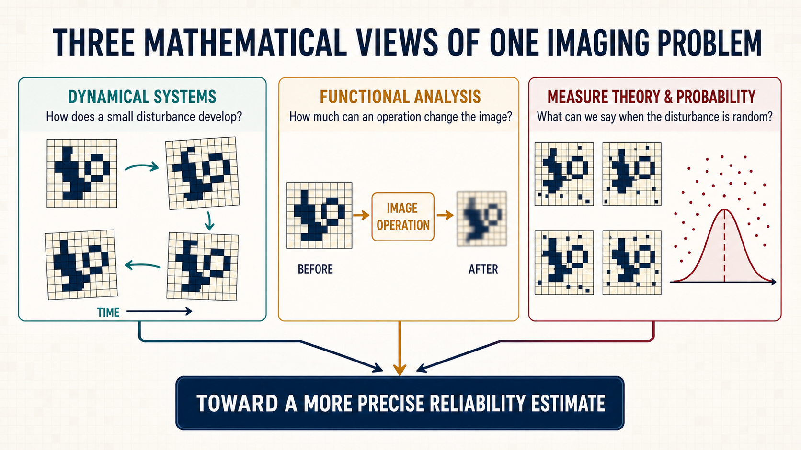{#fig-three-mathematical-views fig-alt="A three-panel illustrated diagram. A pixel-grid shape changes over time under dynamical systems, passes through an image operation under functional analysis, and appears with random variations under measure theory and probability. Arrows from all three panels lead to a more precise reliability estimate." width="100%"}

:::: {.study-topic}
::: {.study-topic-image}
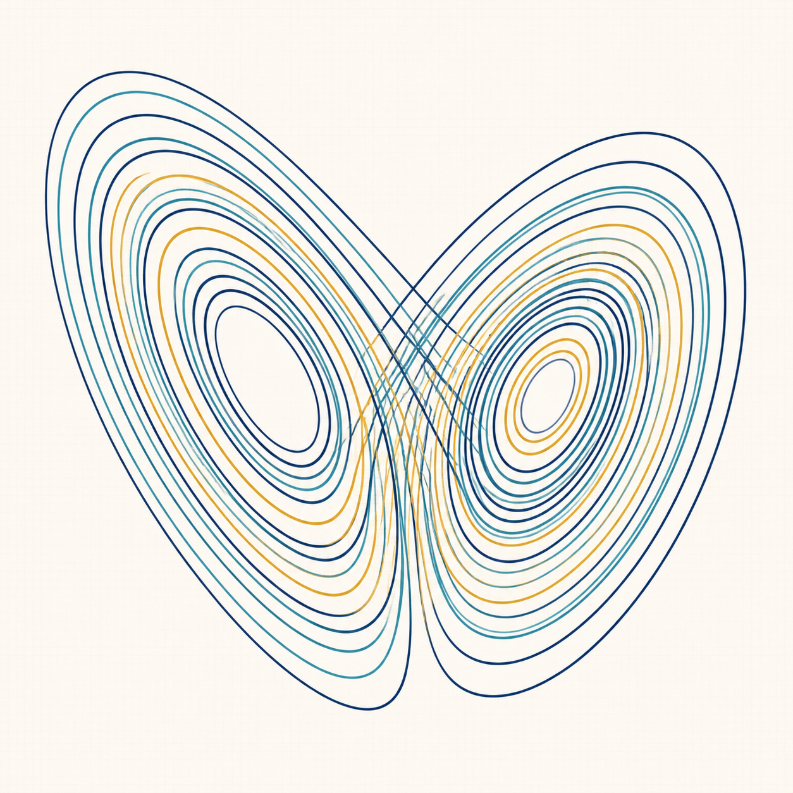{.study-topic-art fig-alt="Abstract illustration of a Lorenz attractor, with nested trajectories forming two lobes."}
:::
::: {.study-topic-copy}
### Dynamical systems

Dynamical systems studies change: how a system evolves, what states remain
steady, and how its behaviour responds to a small disturbance. I am working
through ordinary differential equations, equilibria, linearisation, parameter
dependence, perturbation, and stability.

This subject gives me a firmer language for reasoning about stability. It also
lays groundwork for later study of learning dynamics and state-space models,
although I do not assume that every part of it will be needed for the present
image-analysis problem.
:::
::::

:::: {.study-topic}
::: {.study-topic-image}
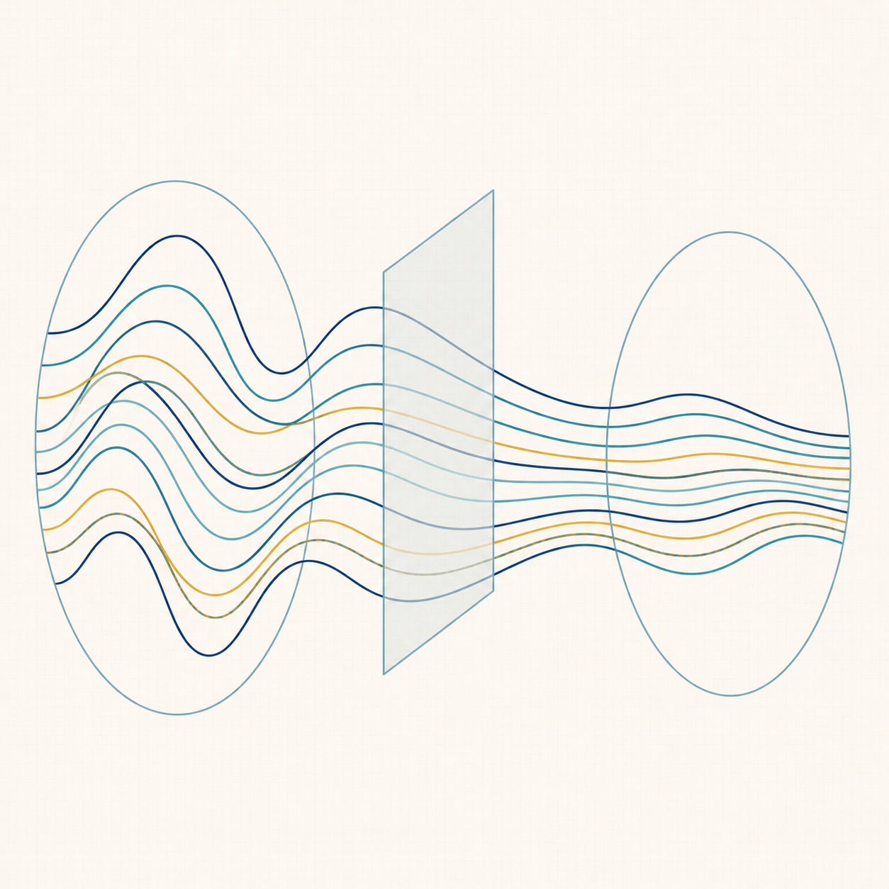{.study-topic-art fig-alt="Abstract illustration of families of curves passing through an operator and emerging smoother."}
:::
::: {.study-topic-copy}
### Functional analysis

Functional analysis studies spaces of functions and the operations that act on
them. This is useful in imaging because blur, filtering, and convolution can be
treated as mathematical operators rather than as a loose collection of
software effects.

My current work includes normed and Banach spaces, bounded linear operators,
operator norms, differentiation, and Hilbert spaces. These ideas help turn
questions such as “How much did this operation change the image?” into
statements that can be defined and tested carefully.
:::
::::

:::: {.study-topic}
::: {.study-topic-image}
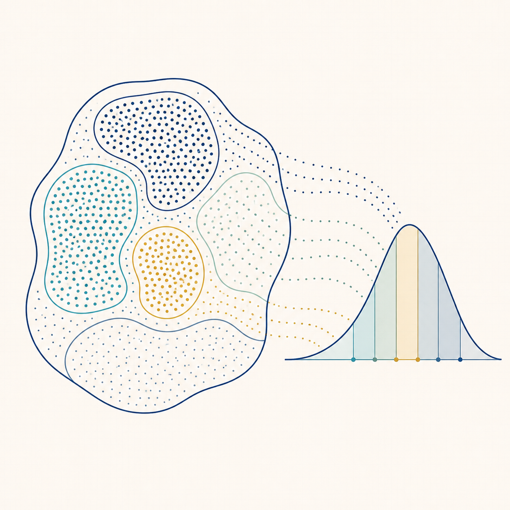{.study-topic-art fig-alt="Abstract illustration of measurable regions, sampled points, and a probability distribution."}
:::
::: {.study-topic-copy}
### Measure theory and probability

Measure theory supplies a rigorous basis for integration, probability, and
different ways of measuring error. I am studying measurable functions,
Lebesgue integration, convergence, expectation, $L^p$ spaces, product measures,
and stochastic models.

This strand matters when degradation is random rather than fixed. It provides
tools for describing sensor noise, combining more than one source of
uncertainty, and asking what can be said on average or with a stated
probability.
:::
::::

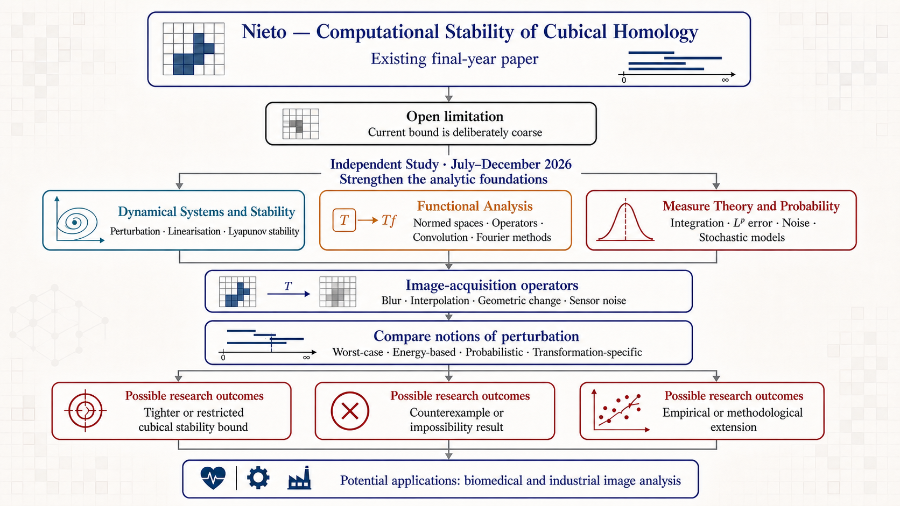{#fig-y4h1-study-flow fig-alt="Flowchart beginning with Nieto — Computational Stability of Cubical Homology and its deliberately coarse bound. It branches into dynamical systems and stability, functional analysis, and measure theory and probability. These strands meet in the study of image-acquisition operators and several notions of perturbation, leading to possible theoretical, negative, or empirical results with applications to biomedical and industrial image analysis." width="100%"}

The project provides the immediate mission, but it does not limit what I may
learn from it. The mathematics may lead into other areas of computer vision,
machine learning, and the use of topological data analysis on non-image data
after it has been given a suitable geometric representation. Any such
embedding would need to preserve the structure relevant to the problem. These
possibilities remain exploratory and are not claims of the present study
programme.

An unexpected experimental result exposed a specific mathematical problem.
The present study programme is my attempt to assemble the tools needed to
investigate it properly. I will add public notes when there is enough material
to be useful to other readers.
