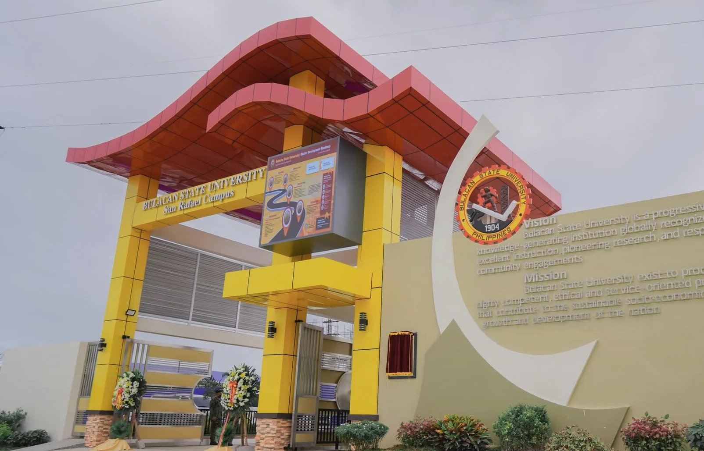

{fig-alt="The entrance gate of Bulacan State University's San Rafael Campus" width=1604 height=1029 style="width:100%"}

I use these materials in my university classes and make them available here so
students can read ahead, revisit a topic, or catch up after an absence.

## Courses

### Mathematics in the Modern World

Lecture notes, examples, exercises, and supplementary materials for
*Mathematics in the Modern World*, developed specifically for biology majors
at Bulacan State University.

[Open the course page](bulsu/math-modern-world/index.qmd){.btn .btn-outline-primary}

### Living in the IT Era

Lecture notes and course materials for *Living in the IT Era*, developed for
first-year biology majors at Bulacan State University. The course provides
practical working knowledge of computers, networks, software, online safety,
digital life, and emerging technologies.

[Open the course page](bulsu/living-it-era/index.qmd){.btn .btn-outline-primary}

These are personal teaching materials, not official publications or policies of
Bulacan State University.
